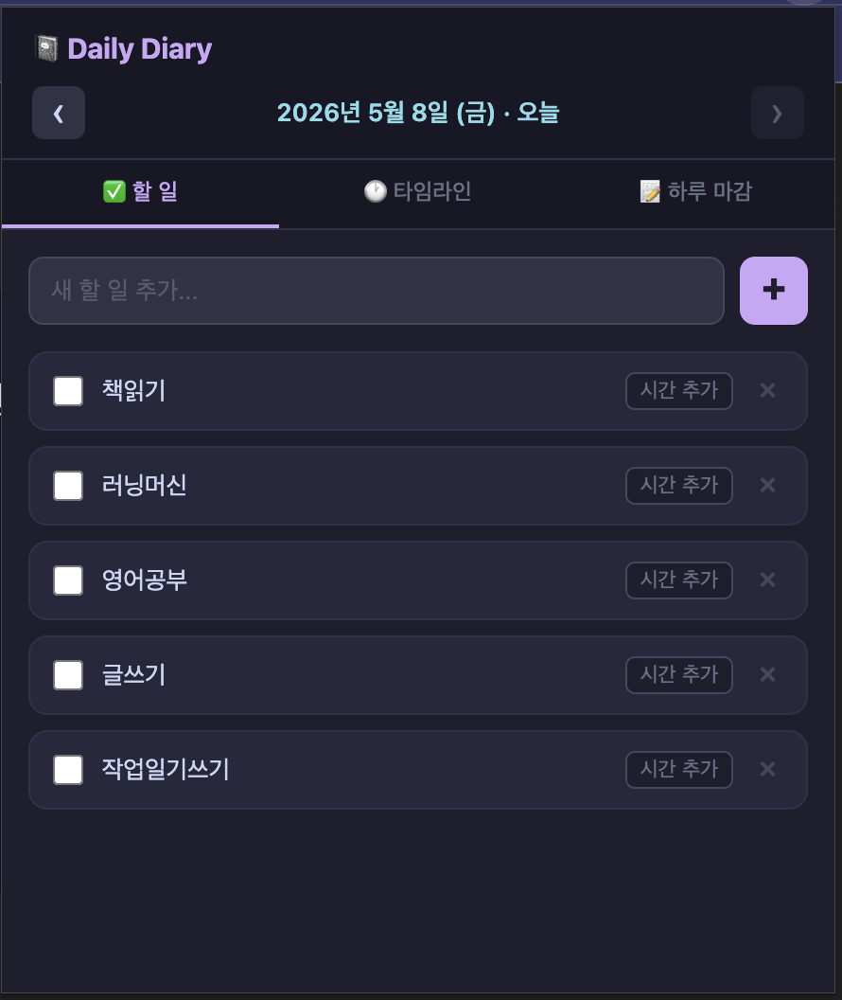

# 1주차 과제 — 석영

## 미션 1: claude code 로 인터뷰스킬 사용해서 인터뷰 까지 진행

### Summay

1. SEO 6시간 강의 영상(무료 1h + 유료 5h)을 만들어야 하는데, 제작 포맷 결정이 안 돼서 전체가 블로킹된 상태였음.
2. 얼굴 비공개 + AI 목소리 + PDF/화면녹화(QuickTime) + Vrew 편집 방향으로 가닥이 잡혔고, 목소리 도구(Vrew 내장 vs ElevenLabs)는 프로토타입 챕터 1개 만들어보고 결정하기로 함.
3. 전체 제작 흐름은 **커리큘럼 설계 → 스크립트 작성 → 녹화 → Vrew 편집 → 배포** 5단계로 정리됐고, 지금은 Claude가 가장 도움될 부품을 고르는 중.

### 최종 구현 결과물

최종 결과물은 아직 안나왔고, 영상 제작에 대한 방향을 결정함. 

### 과정 (타임라인별 + 삽질)

처음 다루는 톨과 용어 때문에 당황했지만, 화면 캡쳐를 이용해 답변을 받으면서 해결했음.

### 공유할만한 인사이트

질문을 했을때 핵심적인 답변만 나오고, 단계별로 진행해서 시간의 낭비를 최소한으로 하기 위해 클로드 프로젝트를 만들었음.

---

## 미션 2: 따라해보고 싶은 개인/업무/삶 OS 따라서 만들어보기 - SNS(유튜브 등) 에서 찾아 벤치마킹 해오기

### Summary
매일 수행해야 하는 일들의 목록을 만들고 매일 체크할 수 있는 Chrome Extension 개발

### 최종 구현 결과물

### 과정 (타임라인별 + 삽질)

 "Chrome Extension 개발"이라는 가장 중요한 키워드를 1주차 강의에서 얻을 수 있어 쉽게 가능했어요. 

### 공유할만한 인사이트

---

## 미션 3: AI 도움 없이 1주차 SNS 글 작성 - 링크드인/인스타그램

### 링크
<!-- 작성한 SNS 글 URL -->

https://www.threads.com/@workwith.ai.kr/post/DYFR8MvgXGD?xmt=AQG0mx-gXsOVZWtGmBPzJIZ7XYGuACCm4MR4BxQK-2v9hIxG41ffxNsJQsXIYetprVUhwLT6&slof=1
