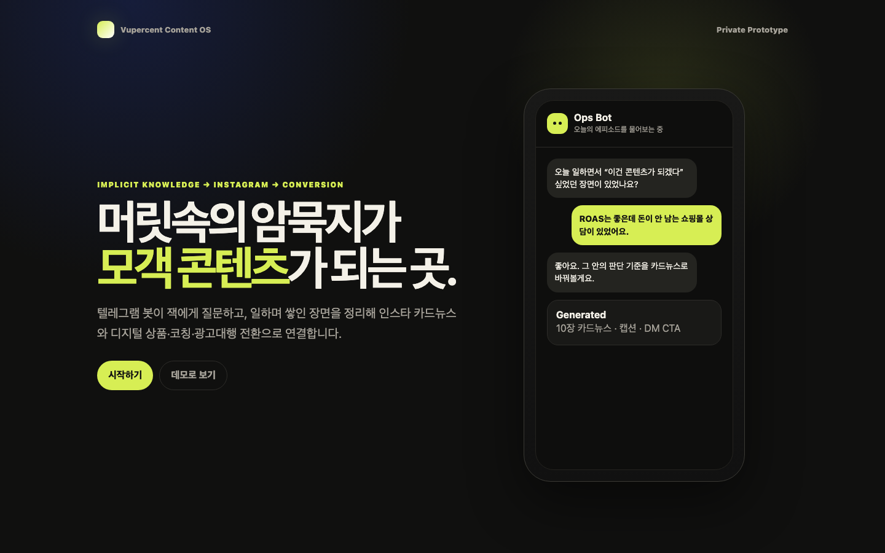
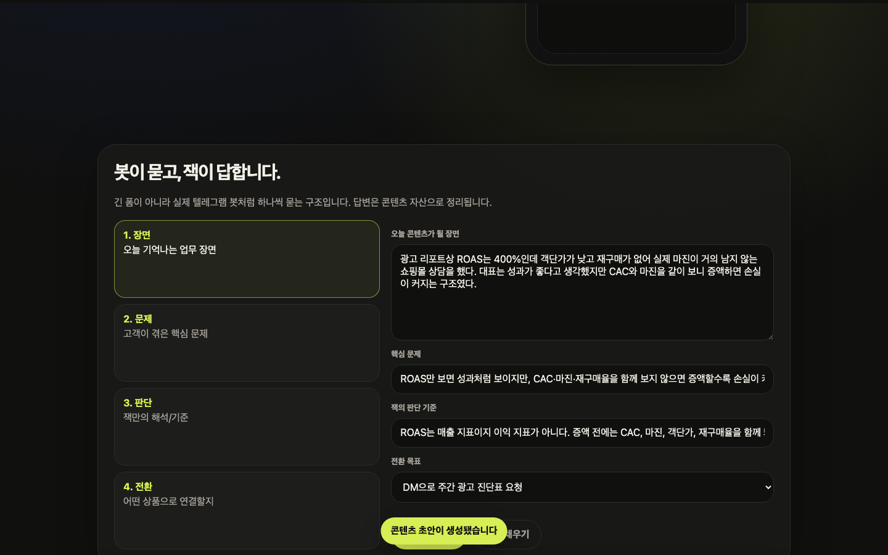
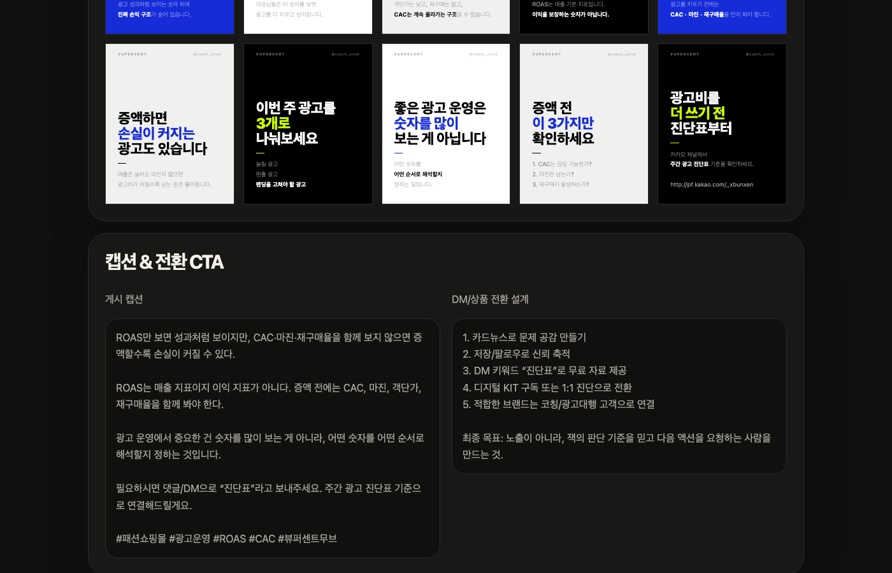

# 2주차 과제 — 잭(유재현)

---

## 미션1: 각자만의 정의로 [운영체제]라고 정의내리는 OS 구현

### Summary

**나의 OS 정의**: 나는 **기획과 판단**만 하고, 나머지(질문으로 암묵지 수집 · 카드뉴스 초안 생성 · 캡션 작성 · 전환 설계)는 OS가 진행해 준다.

진짜 통점은 "콘텐츠 아이디어가 없는 것"이 아니라 **일하며 쌓이는 장면과 판단 기준이 대화 속에 흩어지는 것**이었다. 광고 운영, 코칭, 상담에서 나온 인사이트들이 매번 공기 중에 날아갔다.

그래서 OS의 1차 산물을 **텔레그램 봇이 질문 → 잭의 암묵지 추출 → 인스타 카드뉴스 + 캡션 + CTA 자동 생성**으로 정의하고, 웹 프로토타입으로 구현했다.

- **그릇**: `Vupercent Content OS` — 텔레그램 기반 암묵지 수집 + 카드뉴스 생성 파이프라인
- **첫 부품**: 4개 질문(장면·문제·판단·전환)으로 카드뉴스 10장 + 캡션 + 전환 설계 생성

### 최종 구현 결과물

**1. Vupercent Content OS 웹 프로토타입**
- 배포 URL: https://vupercent-content-os.vercel.app
- 스택: 정적 HTML/CSS/JS, Vercel 배포
- 입력: 4개 질문 (오늘의 장면 · 핵심 문제 · 잭의 판단 기준 · 전환 목표)
- 출력: 카드뉴스 10장 미리보기 + 인스타 캡션 + 전환 설계

**2. OS 청사진 문서**
- `os-blueprint.md` — 풍경/통점/이상향/첫 부품 결정 근거 정리
- PRD(Product Requirements Document) 작성 포함

**3. 카드뉴스 디자인 시스템**
- 뷰퍼센트 1000×1250 (4:5) 고정 포맷
- Blue `#162cd8` / Black / White / BG `#f0f0ee` / Neon `#cbff00`
- Pretendard 폰트, VUPERCENT · @coach_unick 고정 브랜딩

**4. 실제 카드뉴스 산출물 (2주차 과제 기준)**
- `05_카드뉴스/2주차/1조/` — HTML + MD + PNG 8장 제출 완료

**5. 카드뉴스 + 캡션/CTA 자동 생성 결과**

### 과정 (타임라인별 + 삽질)

**① OS 인터뷰 6단계**
- 인터뷰 스킬 돌려 "콘텐츠 부재가 아이디어 문제가 아니라 수집 구조 문제"라는 진단 도출
- 부품 후보 5개 중 **일과 회고 봇 → 카드뉴스 생성**을 첫 부품으로 결정
- 이유: (1) 뷰퍼센트무브 광고 인사이트를 콘텐츠화하는 직접 수익 연결, (2) 기존 Obsidian 메모 흐름과 자연스럽게 연결

**② 첫 프로토타입 — 기능 과다 문제**
- 처음엔 대시보드형 UI로 시작 → 기능이 많고 복잡해서 "쓰고 싶은 느낌"이 없었음
- 잭 피드백: "너무 무겁다, 더 단순하게"
- → **V2로 전면 재설계**: iPhone 온보딩처럼 첫 화면은 한 문장 + 두 버튼만

**③ V2 OS — 질문 흐름 중심 재설계**
- 텔레그램 봇처럼 하나씩 묻는 UX
- 4개 질문 입력 → 즉시 카드뉴스 + 캡션 생성
- 카드뉴스는 실제 뷰퍼센트 디자인 시스템 그대로 적용

**④ 삽질**
- **PNG 렌더링**: Playwright로 HTML → PNG 변환 시 한글 폰트 깨짐 → Pretendard CDN 로드 대기 시간 추가로 해결
- **Vercel 배포**: `prototype/` 하위 폴더가 루트로 안 잡히는 문제 → `vercel.json` rewrites 설정으로 해결
- **카드뉴스 비율**: 1000×1250 (4:5) vs 1080×1080 (1:1) 혼선 → 인스타 캐러셀 기준 4:5로 고정

**⑤ 검증**
- ✅ Vercel 배포 200 OK 확인
- ✅ Playwright e2e 테스트 1 passed
- ✅ 카드뉴스 PNG 8장 생성 및 스폰지클럽 레포 제출 완료

### 공유할만한 인사이트

1. **첫 화면이 전부다.** 기능을 다 넣으면 아무도 안 쓴다. 한 화면에 한 가지만. 나머지는 클릭하고 나서 보여줘도 늦지 않는다.

2. **데모가 있으면 설명이 필요 없다.** "텔레그램 봇이 질문하고 카드뉴스를 만든다"를 설명하는 것보다 URL 하나 보내는 게 100배 빠르다. **OS도 프로토타입이 먼저다.**

3. **전환 목표를 입력값으로 받아라.** 카드뉴스가 아무리 좋아도 마지막 슬라이드의 CTA가 없으면 팔로우에서 끝난다. 전환 설계를 콘텐츠 생성 단계에 함께 넣는 것이 핵심이었다.

---

## 미션2: SNS 작성

https://www.threads.com/@coach_unick/post/DYXMBdOE9W7?xmt=AQG0ZjFSTtsj3_NIQOIdFGiWi7wyPfy9A3MGpYW7kPO6j504s_EmQa4KIjk2HXNA6QCxTt4&slof=1

업로드 완료

https://vupercent-content-os.vercel.app

> 카드뉴스 형태로 업로드 예정 (인스타그램 @coach_unick)
> 2주차 과제로 만든 Vupercent Content OS 프로토타입 — 텔레그램 봇이 묻고, 일하며 쌓인 판단 기준이 카드뉴스가 되는 구조

---

## 미션3: (이번 주 미사용)

### Summary

### 최종 구현 결과물

### 과정 (타임라인별 + 삽질)

### 공유할만한 인사이트
