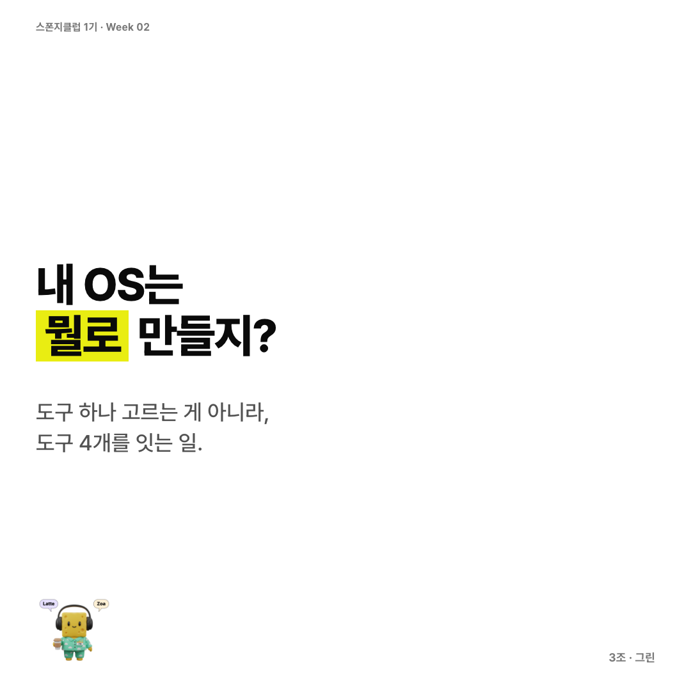
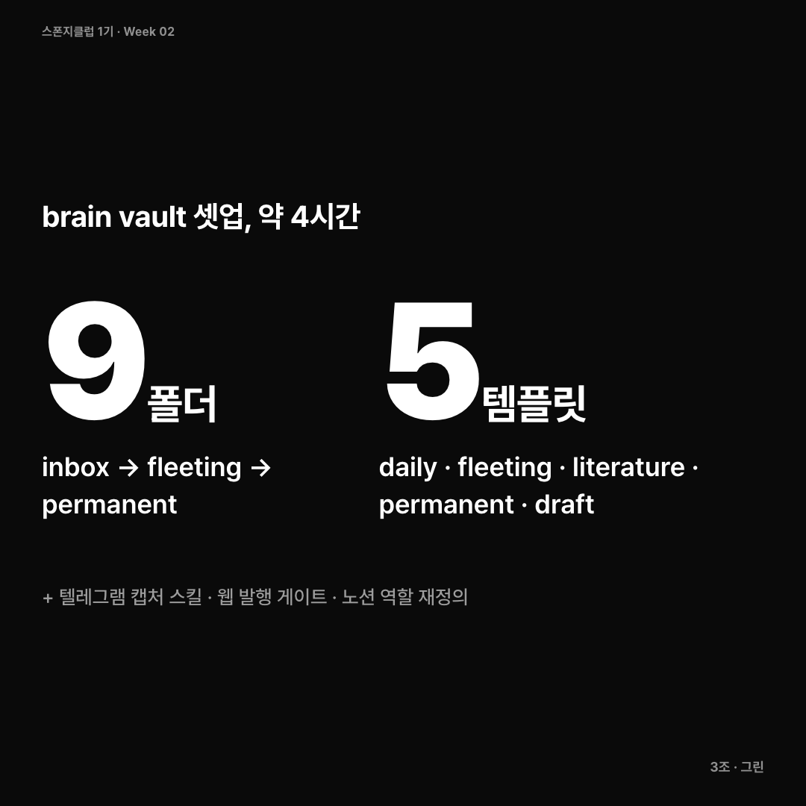
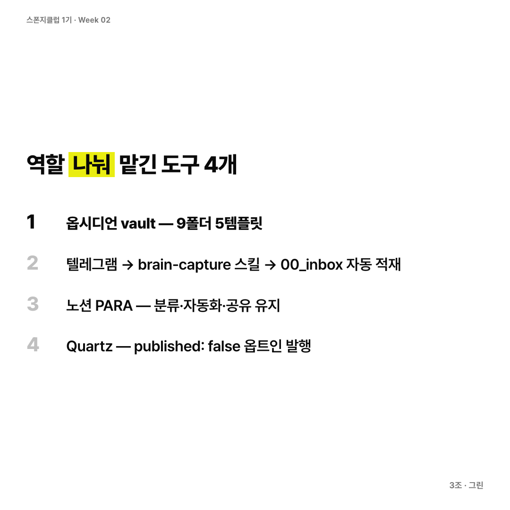
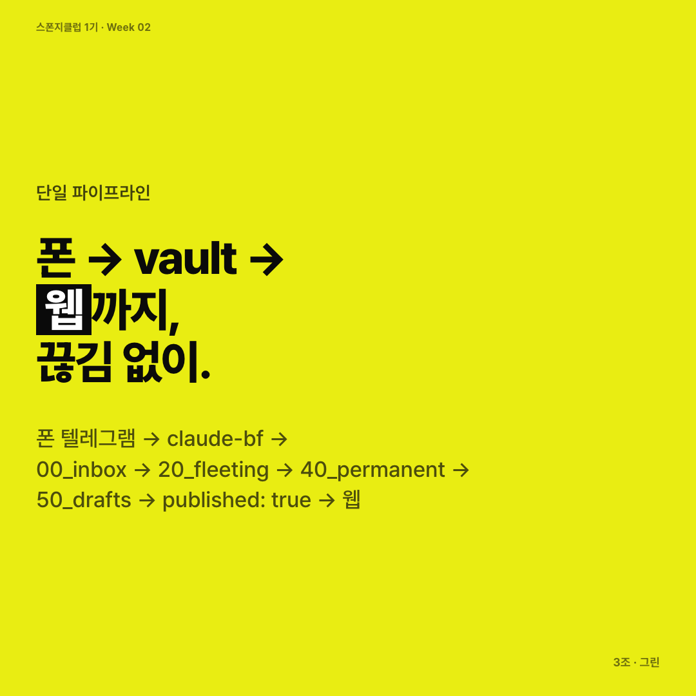
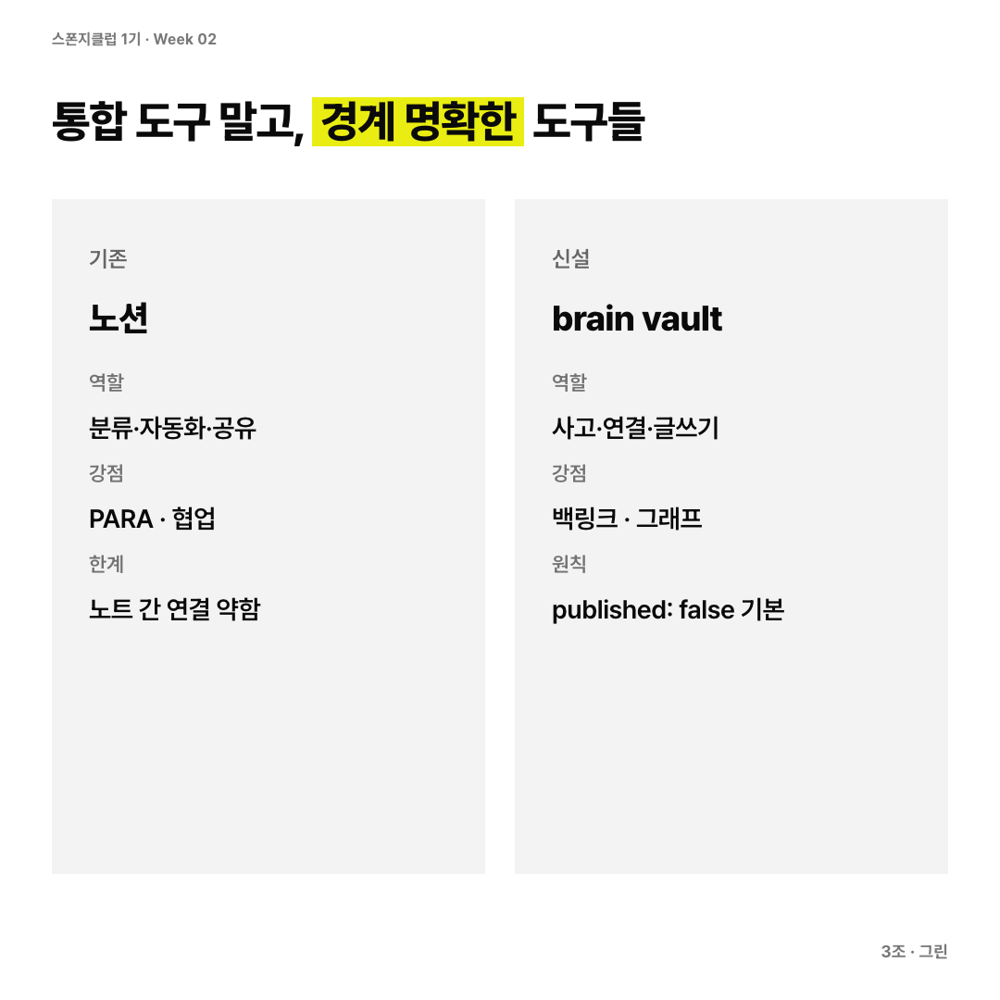
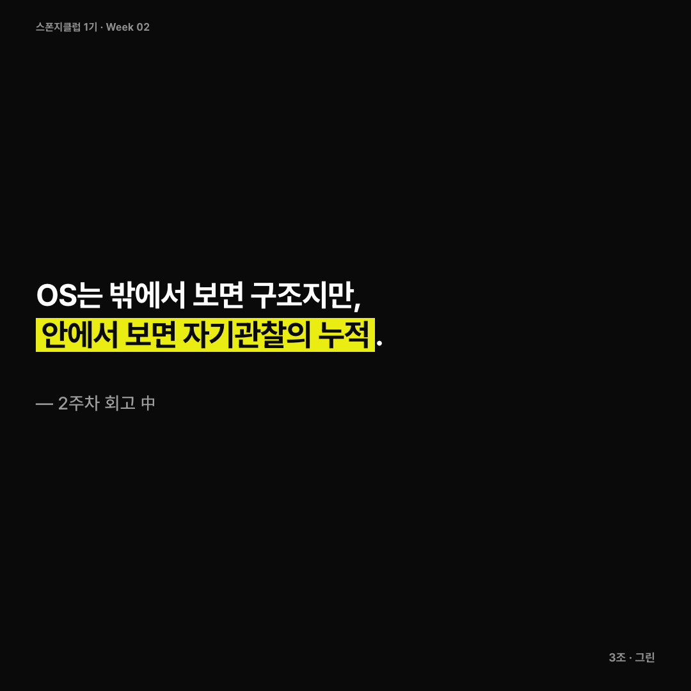
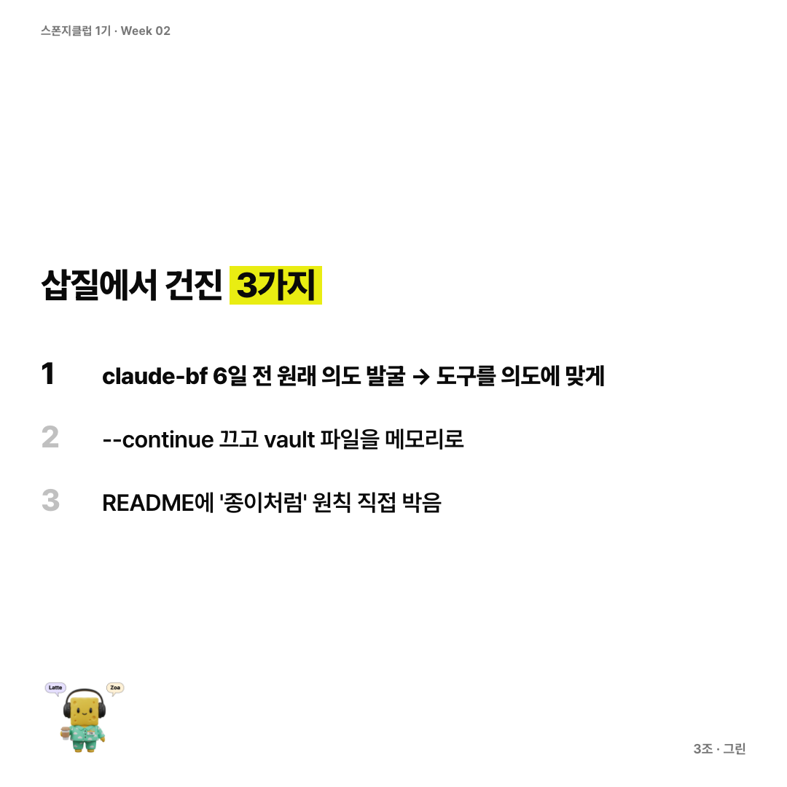
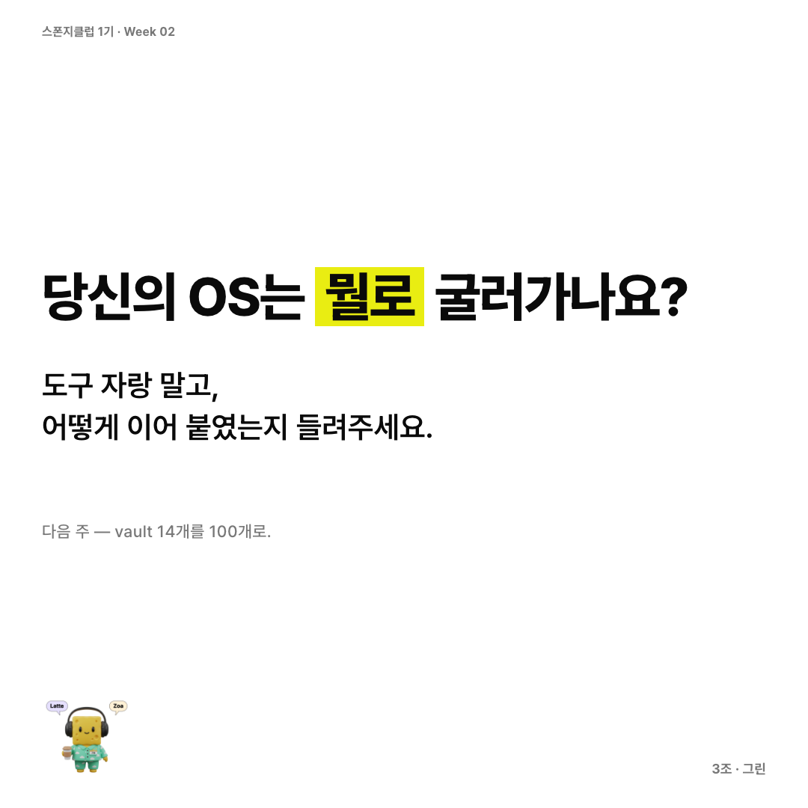

2
# 2주차 과제 — 그린

## 🤖 AI 초안 (개인 참고용)

> [!ai]+ `/draft MMDD-MMDD`로 채우거나, 이 블록을 지우고 직접 작성
> (이 콜아웃은 본인 참고용입니다. 아래 미션 섹션을 다 채우고 나면 통째로 지우거나 접어두세요.)

---

## 미션1: 각자만의 정의로 [운영체제]라고 정의내리는 OS 구현

### Summary

내가 정의하는 OS는 **"매일 떠오르는 생각을 받아 정리하고, 사고로 익히고, 외부로 발산하는 단일 파이프라인"**이다. 도구 한 개가 아니라 입력(텔레그램) → 사유(옵시디언) → 발산(웹)의 흐름이 _역할 분리_된 채로 매끄럽게 연결된 시스템.

오늘은 그 OS의 입력·사유 레이어(brain vault + 텔레그램 캡처)를 완성하고, 발산 레이어(웹)의 _큐레이션 게이트_까지 박았다. 도구 셋업보다 더 큰 수확은 _"왜 디지털 저장소만 보면 정제된 글을 써야 할 것 같은가"_ 라는 내 글쓰기 심리에 대한 메타 인지였다.

---

### 최종 구현 결과물

**1. brain vault** (`~/brain/`)

- 9개 타입 기반 폴더 (`00_inbox` / `10_daily` / `20_fleeting` / `30_literature` / `40_permanent` / `50_drafts` / `90_maps` / `99_meta` / `_attachments`)
- 5종 노트 템플릿 (daily / fleeting / literature / permanent / draft)
- 옵시디언 코어 플러그인 활성화 + 그래프 컬러그룹 설정
- 시드 콘텐츠: 첫 영구노트 1개, MOC 2개, README, 데일리 1개
- git 추적

**2. 텔레그램 캡처 파이프라인**

- `claude-bf` alias (`~/.zshrc`): 텔레그램 채널 + bestfriend 정체성 시스템 프롬프트
- `brain-capture` 스킬 (`~/.claude/skills/brain-capture/`): 텔레그램 메시지 → `00_inbox/`에 자동 적재
- 폰에서 던지면 1초 내에 vault에 안착, 텔레그램으로 회신

**3. 웹 발행 게이트 (Quartz 셋업 전 단계)**

- frontmatter `published: false` 기본값 → 옵트인 방식의 명시적 발행
- stage 라벨 (`thinking` → `workshop` → `shipped`)
- 폴더별 발행 권한 매트릭스 (`00`/`10`/`20`는 원천 차단)
- 발행 대시보드 MOC (`90_maps/MOC — 발행 대시보드.md`)

**4. 노션과의 역할 분리**

- 노션 PARA: 프로젝트·자동화·공유 (유지)
- brain: 사고·연결·글쓰기 (신설)
- 둘 사이 자동 동기화는 없음. 수동 이동만.

**구조도**

```
폰 텔레그램 ─→ claude-bf ─→ ~/brain/00_inbox/   [날것]                                     ↓                              20_fleeting       [며칠 안에 다듬음]                                     ↓                              40_permanent      [원자 1개로 정제 + 백링크]                                     ↓                              50_drafts         [여러 영구노트 엮어 글로]                                     ↓                            published: true ─→ 웹 /workshop                                     ↓                              외부 발행 (블로그·트윗·영상)                                     ↓                            stage: shipped ─→ 웹 /outputs
```

---

### 과정 (타임라인별 + 삽질)

**[1단계] 동기 발굴 — "노션의 뭐가 답답한지" 언어화 (약 20분)**

- 시작은 "노션 말고 옵시디언에 새로 체계 만들고 싶어" 한 줄
- 클로드가 동기를 4지선다로 물음. 처음엔 답하지 않고 회피했지만 결국 _노트 간 연결·백링크 부재_ 가 핵심임을 인정
- 이 _언어화_가 결정적이었음. "그냥 옮기고 싶어"가 아니라 _왜 옮기는지_가 정해져야 이후 결정이 다 따라옴

**[2단계] 무지의 고백 — 개념 부족 인정 (약 15분)**

- 클로드가 "타입 기반 폴더 + MOC 허브" 같은 안을 제시
- 솔직하게 "옵시디언 제대로 써본 적 없어서 MOC, 제텔카스텐 뭔지 몰라" 고백
- 클로드가 원자성·연결 우선·백링크·MOC를 처음부터 설명
- 만약 _모르는 걸 모른다고 말 안 했으면_ 빈 폼만 따라했을 것

**[3단계] 흐민 selforge 참조 (약 10분)**

- 1주 전 selforge URL 보여줬던 기록을 메모리에서 꺼냄
- Raw(130) → Wiki(37) → Assets(21) 3-layer 구조 재확인
- 내 시스템이 selforge와 같은 정신이되 _어휘 차이_임을 확인 (Raw≈fleeting, Wiki≈permanent, Assets≈shipped drafts)
- selforge의 _외부 발산까지 통합된 게_ 차별점 — 이게 나중에 웹 게이트 설계 동기가 됨

**[4단계] 모바일 전략의 발견 — 텔레그램 ≠ iCloud (약 15분)**

- 처음 vault 경로 결정에서 iCloud 옵션을 검토했는데, git 충돌 때문에 망설임
- "텔레그램 봇이랑 연결하면 모바일 문제 해결되는 거 아님?" 질문
- 답: 텔레그램은 _모바일 → vault 캡처_는 완벽히 해결, 다만 _모바일 읽기/편집_은 불가
- 내 패턴은 "모바일=캡처 위주, 읽기=맥" → **iCloud 안 깔고 텔레그램만으로 충분** 이라는 결론
- 도구 선택의 핵심이 _내 사용 패턴_에서 나온다는 걸 체감한 순간

**[5단계] vault 셋업 (약 30분)**

- plan mode에서 디테일 확정 후 ExitPlanMode → 실행
- 폴더 9개 + 템플릿 5종 + .obsidian 설정 + 시드 콘텐츠 + brain-capture 스킬 + git init + 첫 커밋
- 옵시디언 앱에서 vault 열기 → 정상 작동 확인

**[6단계] 삽질 — claude-bf의 정체성 위기 (약 40분)** ⚠️  
가장 시간 많이 쓴 단계.

- 텔레그램 첫 테스트 → brain-capture 스킬이 발동 안 함. 클로드가 "어떤 시스템 테스트인지 옵션 4개로 물어봤어"
- 원인: `claude-bf` alias의 `--continue` 가 _이전 잡담 세션_을 이어받아서 그 세션이 brain-capture 신호를 무시
- 1차 시도: `claude-brain` 별도 alias 추가 (이중 alias). 그런데 _왜 이중이 필요한지_ 의심이 들었음
- **"내가 bf를 처음 만들 때 목적이 뭐였더라?"** 질문 → 6일 전 텔레그램 기록 검색
- 발견: `claude-bf` = "claude **bestfriend**" — _매일 얘기 들어주고 알아서 정리해주길 바라는_ 의도로 만들었던 것. 즉 **brain 역할이 원래 의도였는데 셋업만 안 했던 것**
- 깨달음: 굳이 새 alias 만들 게 아니라 **bf의 원래 의도를 실현하는 게 맞다**
- → `claude-brain` 제거, `claude-bf`에 brain 시스템 프롬프트 박음 (alias 단일화)

**[7단계] 삽질 — `--continue` 에러와 메모리의 재정의 (약 10분)** ⚠️

- 새 vault라 이어받을 세션이 없어 "No conversation found to continue" 에러
- 해결: `--continue` 제거. 대신 시스템 프롬프트에 _"기억은 vault 파일에 살아있다 — 10_daily, 40_permanent, 00_inbox 읽어서 참조하라"_ 추가
- **세션 메모리(클로드 컨텍스트)가 아니라 파일(vault)이 진짜 메모리** — 이게 의외로 큰 통찰

**[8단계] 삽질 — Warp 터미널 캐싱 (약 10분)** ⚠️

- `source ~/.zshrc` 해도 같은 탭에서는 옛 alias 잔존
- 새 탭 열어야 적용됨 (Warp의 캐싱 동작 — 일반 zsh와 다름)
- 새 탭 → `alias claude-bf` 확인 → `--continue` 없는 새 alias 확인 → `claude-bf` 실행
- 폰에서 "brain 테스트 세번째" → `~/brain/00_inbox/2026-05-17_1009_브레인_테스트_세번째.md` 생성 성공 🎉

**[9단계] 입구의 동등성 확인 (약 5분)**

- 갑자기 헷갈림: "텔레그램으로도 옵시디언으로도 기록은 같은거지?"
- 답: 응, **같은 vault 다른 입구**. 둘 다 결국 `~/brain/`의 `.md` 파일을 만드는 행위. 동기화도 별도 DB도 없음 — 파일이 그 자체로 시스템

**[10단계] 웹 발산 레이어 설계 (약 25분)**

- 동기 명확화: 단순 전시장 아닌 **아웃풋 깔때기** — 글·영상·캐러셀로 발산하기 위한 인풋 정리 통로
- Quartz 학습 (옵시디언 → 정적 사이트, 백링크·그래프 살아있음, MIT 라이선스)
- Cloudflare vs Vercel 비교 — 보안 비용 vs 친숙도 트레이드오프
- 결정: **콘텐츠 옵시디언에서 잘 관리되는 게 먼저**. Quartz는 클론만 해두고 npm install은 보류, 발행 게이트(`published` 토글) 시스템부터 구축
- 폴더별 발행 권한 매트릭스, stage 라벨, 발행 대시보드 MOC 작성

**[11단계] 메타 인지의 단계 — 빈 껍데기 느낌 (약 15분)** 💡  
시스템이 다 박힌 뒤 갑자기 _공허감_이 밀려옴.

- "왜 이렇게 빈 껍데기 같은 느낌이 들지?"
- 답: vault 14개 파일 중 _진짜 내 사고_가 담긴 건 1개. 나머지는 다 시스템에 대한 시스템. selforge가 살아 보였던 건 130개 raw 노트가 _피_가 됐기 때문
- "정말 날 것의 생각도 올려도 돼? 디지털 저장소엔 정제된 말 써야 할 것 같은 압박감이 들어"
- 답: 매체(손/디지털)가 아니라 _공개 가능성에 대한 무의식 감각_이 정제 압박을 만든다. brain vault는 `published: false` 기본값이라 _닫힌 공간_. 손글씨 노트북과 동등한 자유도여야 함

**[12단계] 원칙 코드화 — README 직접 수정 (약 5분)** ✍️

- 위 통찰을 그냥 흘려보내지 않고 README에 **"3-1. inbox 운영 원칙: 종이처럼"** 섹션을 _직접_ 추가
- 자기검열 금지, 정제는 옮길 때만, AI도 inbox 내용 정제 시도 금지
- **시스템에 대한 메타 인지가 그 시스템의 운영 원칙으로 codification 된 순간** — OS가 살아 움직이기 시작한 지점

---

### 공유할만한 인사이트

**1. 도구 하나가 OS가 아니다. _역할 분리된 시스템들의 조합_이 OS다.**  
나는 노션을 _버리고_ 옵시디언으로 _이주_하지 않았다. 노션 = 분류·자동화·공유, 옵시디언 = 사고·연결·글쓰기, 텔레그램 = 모바일 입력, Quartz = 외부 발산. 각자가 잘하는 영역에 책임을 나눠준 게 핵심. 통합 도구를 찾는 건 욕심이고, _경계가 명확한 도구들을 매끄럽게 잇는 것_ 이 OS 설계.

**2. 기억은 컨텍스트가 아니라 파일이어야 한다.**  
클로드의 `--continue` (세션 메모리) 대신 vault 파일을 영속 메모리로 두자, 매 세션이 fresh로 시작돼도 어제 무슨 생각했는지 클로드가 _읽어서 회상_할 수 있다. **AI를 갈아끼우든, 도구를 갈아끼우든 기억은 내 디스크에 남는다.** 메모리는 _플랫폼_이 아니라 _내가 통제하는 파일_에 있어야 한다.

**3. 삽질은 _내 의도가 무엇이었나_를 발굴하는 과정이다.**  
`claude-bf`가 작동 안 한 이유를 디버깅하다가, 6일 전 내가 "bestfriend니까 매일 얘기 들어주고 정리해줘" 라는 _원래 의도_로 alias를 만들었던 걸 발견했다. 셋업만 안 했던 거였다. **도구의 기본 동작이 내 의도와 어긋날 때 _도구를 의도에 맞게 다시 박는 것_ 이 OS 만들기.** 정답 같은 명령어를 따라 쓰는 게 아니라.

**4. 빈 껍데기 느낌은 _시스템 문제가 아니라 시간 문제_.**  
도구가 콘텐츠보다 앞서 셋업되면 잠시 공허감이 든다. 이건 시스템 잘못 만든 게 아니라 _그저 콘텐츠가 안 들어와서_. 다만 이 공허감이 길어지면 _vault 무덤_이 되니까, 처음 며칠은 **시스템 더 만지지 말고 그냥 노트 하나 쓰는 것** 이 답.

**5. 디지털 저장소의 정제 압박은 _공개 가능성에 대한 감각_에서 온다.**  
손글씨 노트북엔 의식의 흐름대로 쓰면서 노션·옵시디언만 보면 "정제된 글을 써야 할 것 같은" 압박이 든다. **매체 차이가 아니라 _닫힌 공간 vs 열린 공간 인식_ 의 차이다.** 따라서 디지털 저장소를 _닫힌 공간으로 명시적으로 표시_ 하면 (예: `published: false` 기본값, inbox=종이 원칙 명문화) 손글씨와 동등한 사유 자유도를 회복할 수 있다.

**6. 시스템 만드는 과정의 _내 감정·저항감_도 시스템 안에 캡처해야 시스템이 살아남는다.**  
빈 껍데기 느낌이 들었을 때 그 감정을 _고치고 넘어갈 버그_ 가 아니라 _영구노트 광맥_ 으로 봤다. "디지털엔 정제된 말 써야 할 것 같다"는 의심도 노트가 됐다. 그 통찰을 README에 운영 원칙으로 박았다. **시스템에 대한 메타 인지가 곧 그 시스템의 첫 콘텐츠가 된다.** OS는 _밖에서 보면 구조_지만 _안에서 보면 자기관찰의 누적_.

**7. OS는 _완성_이 아니라 _진행형_ 이다.**  
오늘 박은 것은 시작점일 뿐. brain vault 14개 파일이 100개가 되고, 영구노트들이 백링크로 그래프를 그리고, 그 중 일부가 웹에 발행되고, 그 발행물이 다시 새로운 사유의 입력이 되는 _순환_이 OS의 본질. 도구는 그 순환의 _그릇_이지 _내용물_이 아니다.

---

_Note: 이 과제 글 자체가 첫 fleeting → permanent로 자라날 자료. "오늘 만든 시스템에 대한 메타 인지"가 brain vault 안의 노트들로 분해될 예정._

---

## 미션2: SNS 작성

### Summary

### 최종 구현 결과물
https://www.instagram.com/p/DYbnqcMj1ir/?utm_source=ig_web_copy_link&igsh=MzRlODBiNWFlZA==
## 📸 카드뉴스 (인스타그램 캐러셀)

> 원본 HTML: 같은 폴더의 `3조_그린(이유경)_2주차_cardnews.html` (브라우저로 열어 확인).
> 아래는 8장 PNG 미리보기 (1080×1080, base64 인라인). 인스타 캐러셀 업로드 시 우클릭 → 이미지 저장.










---

## 캡션 (인스타그램 본문용)

"내 OS는 뭘로 만들지?"

도구 하나 고르는 게 아니라, 도구 4개를 잇는 일이었다.
옵시디언(사고) · 텔레그램(캡처) · 노션(공유) · 웹(발산) — 각자 잘하는 영역만 맡김.

가장 큰 깨달음 —
OS는 밖에서 보면 구조지만, 안에서 보면 자기관찰의 누적.

당신의 OS는 뭘로 굴러가나요?

#스폰지클럽 #1기 #2주차 #OS구현 #옵시디언 #브레인볼트 #퍼스널OS #지식관리

---

## 슬라이드 카피 (편집용)

**1. Hero (white)** — 내 OS는 **뭘로** 만들지? / 도구 하나 고르는 게 아니라, 도구 4개를 잇는 일.

**2. Stats (ink)** — brain vault 셋업, 약 4시간 / 9폴더 (inbox → fleeting → permanent) · 5템플릿 (daily · fleeting · literature · permanent · draft) / + 텔레그램 캡처 스킬 · 웹 발행 게이트 · 노션 역할 재정의

**3. List (white)** — 역할 **나눠** 맡긴 도구 4개 / 1) 옵시디언 vault — 9폴더 5템플릿 (active) 2) 텔레그램 → brain-capture 스킬 → 00_inbox 자동 적재 3) 노션 PARA — 분류·자동화·공유 유지 4) Quartz — published: false 옵트인 발행

**4. Hero (yellow)** — 단일 파이프라인 / 폰 → vault → **웹**까지, 끊김 없이 / 폰 텔레그램 → claude-bf → 00_inbox → 20_fleeting → 40_permanent → 50_drafts → published: true → 웹

**5. Split (white)** — 통합 도구 말고, **경계 명확한** 도구들 / 노션: 분류·자동화·공유, PARA·협업, 노트 간 연결 약함 ↔ brain vault: 사고·연결·글쓰기, 백링크·그래프, published:false 기본

**6. Quote (ink)** — "OS는 밖에서 보면 구조지만, **안에서 보면 자기관찰의 누적**." / — 2주차 회고 中

**7. List (white)** — 삽질에서 건진 **3가지** / 1) claude-bf 6일 전 원래 의도 발굴 → 도구를 의도에 맞게 (active) 2) --continue 끄고 vault 파일을 메모리로 3) README에 '종이처럼' 원칙 직접 박음

**8. CTA (white)** — 당신의 OS는 **뭘로** 굴러가나요? / 도구 자랑 말고, 어떻게 이어 붙였는지 들려주세요 / 다음 주 — vault 14개를 100개로

---

## 스토리 흐름

- **1 → 6 회수**: 1번 "내 OS는 뭘로 만들지?" 라는 질문이 6번 Quote에서 "OS는 안에서 보면 자기관찰의 누적" 으로 답을 받는다. 도구 답이 아니라 메타 인지 답으로 비틀어준 게 후킹의 회수 포인트.
- **2 → 4 콜백**: 2번에서 깐 숫자(14노트·12단계)가 4번 옐로우 하이라이트에서 "단일 파이프라인"이라는 한 줄로 압축된다.
- **3 ↔ 5 대조**: 3번에서 도구 4개를 나열한 뒤, 5번에서 그 중 가장 본질적인 분기(노션 vs brain)를 깊게 비교해 "왜 나눠야 하는가" 의 이유를 보강.
- **7 → 8 액션 유도**: 7번에서 3개의 배움으로 닫고, 8번에서 "당신은 어떻게?" 로 시청자에게 공을 넘긴다.

---

## Do/Don't 자체 검수

- [x] 팔레트 3색 (Ink/Paper/Yellow) — 마스코트 외 다른 색 없음
- [x] 옐로우 슬라이드 1장 (slide 4) — 1~2장 룰 준수
- [x] `.hl` 슬라이드당 정확히 1개 — 1·3·4·6·7·8 각 1개, 2·5는 없음
- [x] 페이지 번호·섹션 마커 없음
- [x] 이모지·그라디언트·라운드+컬러바 없음
- [x] 한 슬라이드 한 메시지
- [x] 1번은 질문형 ("뭘로 만들지?")
- [x] 6번 Quote가 1번 질문의 답으로 회수됨
- [x] 톤: 구어체 / 단정형 / 겸양어 없음

---

## 발행 체크리스트

- [ ] (해당 없음) 5번 Split에 다른 멤버 언급 없음 — 양해 구할 사람 없음
- [ ] 본인 인스타 핸들 추가 (캡션 끝에)
- [ ] 해시태그 톤 점검 — `#PKM` 같은 영문 태그 빼고 싶으면 빼기
- [ ] 인스타 캐러셀 업로드 (위 8장 이미지 우클릭 → 저장 → 인스타 업로드)
- [ ] 발행 후 본인 기록처(brain vault 50_drafts 등)에 링크 추가
- [ ] (선택) 마스코트가 sponge-dressup 기본 캐릭터 — 본인 캐릭터 등록하려면 `~/.cardnews-mascots.json` 갱신


### 과정 (타임라인별 + 삽질)

### 공유할만한 인사이트

---


## 미션3: (이번 주 미사용)

### Summary

### 최종 구현 결과물

### 과정 (타임라인별 + 삽질)

### 공유할만한 인사이트
