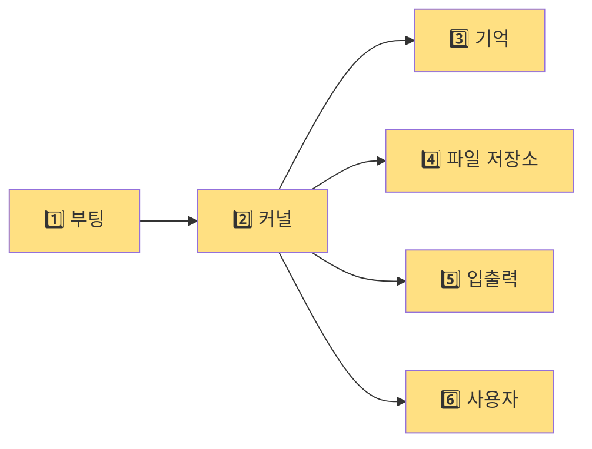
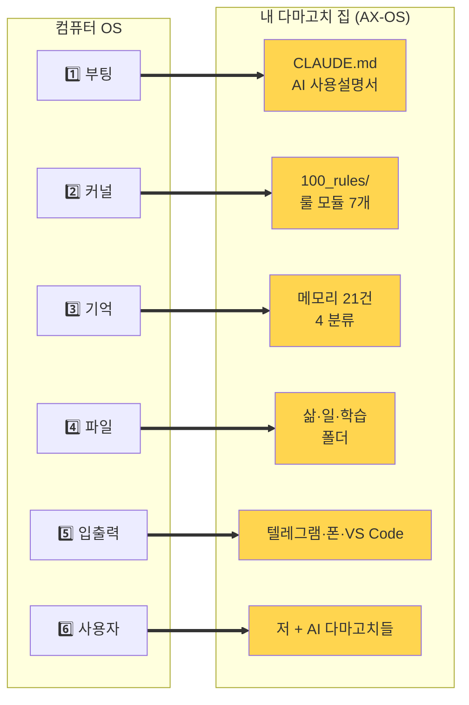
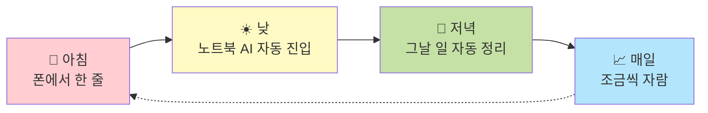
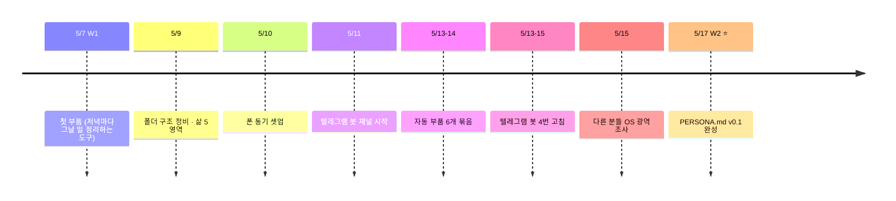

# 2주차 과제 — 먼지민

## 미션1: 각자만의 정의로 [운영체제]라고 정의내리는 OS 구현

### Summary

> **나만의 AI 다마고치를 만들기로 했다.**

AI한테 매번 *"저는 이런 사람이고, 작업은 이렇고, 룰은..."* 다시 설명하지 않아도 되도록. 정체·룰·기억·도구를 한 곳에 모은 디지털 집을 만들었다. 이름은 **AX-OS**.

이번 주에는 이 집의 *"여기는 어떤 곳이고, 누가 사는지"* 를 한 페이지로 정리한 첫 문서 **`PERSONA.md`** 를 완성했다.

---

### 최종 구현 결과물

#### 1. 왜 컴퓨터의 OS를 벤치마킹했나

우리는 AI와 함께 사는 시대를 산다. 사람의 일과 말과 사고가 결국 컴퓨터와 디지털 기반 위에서 흐른다. 그리고 그 디지털 기반의 가장 깊은 뿌리는 — **컴퓨터의 OS가 수십 년 동안 구조화되어 온 방식**이다.

여기서 한 가지 직관을 가져왔다.

> *AI에게 가장 잘 통하는 언어 — 컴퓨터가 가장 잘 알아듣는 구조 — 는 결국 인간이 컴퓨터를 만들어 오며 다듬어 온 ***'컴퓨터 구조론'의 발전과 닿아 있다***고 봤다.*

그래서 그 시스템적 진화를 벤치마킹하기로 했다. *"나만의 OS"* 를 만든다면, 진짜 OS의 구조에서 출발하는 게 가장 자연스러운 길이라고.

---

#### 2. 컴퓨터의 OS는 어떻게 생겼나

엄밀히는 분류에 따라 5~10 부분이지만, 단순하게 **6 부분**으로 본다.

| # | 부분 | 무슨 일을 하나 |
|---|---|---|
| 1️⃣ | **부팅** | 컴퓨터가 켜질 때 처음 실행되는 안내 |
| 2️⃣ | **커널** | 시스템 작동의 핵심 규칙 |
| 3️⃣ | **기억** | RAM·디스크에 데이터 저장 |
| 4️⃣ | **파일 저장소** | 폴더·파일 관리 |
| 5️⃣ | **입출력** | 키보드·화면·외부 기기 연결 |
| 6️⃣ | **사용자** | 명령을 받고 결과를 보여줌 |

---

#### 3. 이 6 부분을 내 시스템에 그대로 맞추니, 빈 칸 없이 자리잡았다

| 컴퓨터 OS | 내 다마고치 집 | 어떻게 적용했나 |
|---|---|---|
| 1️⃣ 부팅 | `CLAUDE.md` | AI가 켜질 때 매번 처음 읽는 *"AI용 사용설명서"* |
| 2️⃣ 커널 | `100_rules/` 모듈 7개 | 폴더 구조·파일명·우선순위 등 작동 규칙 |
| 3️⃣ 기억 | 메모리 21건 (4 분류) | AI가 나를 기억하는 자리 |
| 4️⃣ 파일 저장소 | 삶·일·학습 폴더 | 일상 데이터 분류 보관 |
| 5️⃣ 입출력 | 텔레그램 봇·폰 동기·VS Code | 외부 환경과 연결 |
| 6️⃣ 사용자 | 저 + AI 다마고치들 | 같이 일하는 사람과 AI |

→ 6 부분이 빈 칸 없이 자리잡았다. *"비유"* 가 아니라 ***구조 자체가 같다***.

---

#### 4. 다마고치 집의 평범한 하루

- 🌅 **아침** (폰) — 텔레그램 봇에 *"오늘 뭐 할까?"* 한 줄 → 노트북 AI가 어제까지의 컨텍스트로 답한다
- ☀️ **낮** (노트북) — 새 AI 세션을 켜면 사용설명서를 자동으로 읽고 흡수한다. 매번 다시 설명할 필요가 없다
- 🌙 **저녁** — 자동 도구가 그날 한 일·결정·내일 첫 행동을 정리한다
- 📈 **매일** — 새 결정은 결정 로그에, 새 패턴은 룰에, 새 사실은 메모리에. 다마고치가 매일 조금씩 큰다

---

#### 5. 일상에서 실제로 얻은 것

- ✅ AI한테 매번 컨텍스트 다시 설명하지 않아도 된다
- ✅ 1달 뒤에도 *"그때 왜 그렇게 정했지?"* 곧바로 회수할 수 있다
- ✅ 노트북·데스크탑·iPhone 어디서나 같은 컨텍스트
- ✅ 텔레그램 봇 한 줄로 시스템을 호출할 수 있다

---

#### 6. 이번 주에 새로 만든 것 — `PERSONA.md`

이 다마고치 집의 *"여기는 어떤 곳, 누가 사는지, 어떤 약속이 있는지"* 를 한 페이지로 정리한 **첫 문서**.

들어있는 내용:
- 시스템의 한 줄 정체
- 6 부분이 어떻게 작동하는지
- 사는 동거인들 (저 + AI 다마고치들)
- 6 가지 약속 (예: *"매일 그날 일 정리"*, *"큰 결정은 사유와 함께 기록"*, *"같은 일 3번 반복되면 룰로 승급"*)
- *"매일 자라는 시스템"* 자기 선언

위치: `100_rules/PERSONA.md`. `CLAUDE.md`(시스템 진입점)에 한 줄을 추가해서, 이제 새 AI 세션이 켜지면 자동으로 이 페이지를 읽는다.

> 살아있는 문서다. v0.1로 시작했고, 매일 조금씩 고칠 수 있다. 절대 규칙이 아니다.

---

### 과정 (타임라인별 + 삽질)

#### 11일 동안 다마고치 집을 지은 흐름

→ 11일 동안 만든 작품: ① `CLAUDE.md` ② 룰 모듈 7개 ③ 자동 부품 6개 ④ 메모리 21건 ⑤ 삶 폴더 ⑥ 작업 폴더 ⑦ 결정 로그 + ADR 12건 ⑧ 텔레그램 봇 ⑨ 폰 동기 ⑩ 12개 평행 AI 세션 ⑪ ⭐ **`PERSONA.md` v0.1** (이번 주 신규)

---

#### 다마고치 키우다 한 실수

**🪤 ① 텔레그램 봇이 5분마다 멈추는 사건** (5/14~15 새벽)

폰에서 봇한테 한 줄을 보내면 답이 오지 않는다. 5분 뒤에는 다시 살아난다. 이 패턴이 반복됐다.

원인은 봇의 자동 감시 도구였다. *"비정상 상태"* 를 5분마다 잡아서 봇을 강제로 끄고 있었다. 그런데 그 *"비정상"* 판단 기준이 잘못되어 있었다. 일반 작업 중인 다른 AI 세션을 *"비정상"* 으로 보고, 봇 호스트까지 함께 죽이고 있었다.

네 번 고친 끝에 v7에서 해결했다. *"진짜로 작동 중인 봇 하나만 살리고 나머지는 끄는"* 룰로 바꿔서.

**무엇이 문제였나** — 자동 감시 도구가 자기 시스템을 잡아먹는 함정. 한 번 *"고쳤다"* 고 끝낼 뻔한 것을 폰에서 *"답이 안 오는데?"* 한 번 더 보내서 잡혔다.

---

**🪤 ② OS의 첫 부품을 *"부품을 관리하는 부품"* 으로 만들고 싶었던 함정** (W1)

OS의 첫 부품을 *"부품을 관리하는 부품"* 으로 만들고 싶었다. 멋있어 보였다.

그런데 그게 함정이었다. *"부품이 0개인데 부품 관리 부품을 먼저 만든다"* = 빈 손에 빈 상자를 만드는 일. 결국 *"매일 실제로 마찰이 있는 자리"* 의 부품부터 만들었다. *"저녁마다 그날 일 자동 정리하는 도구"*.

**무엇이 문제였나** — 메타·규칙 부품을 먼저 만들면, 시스템이 자기 자신만 정의하다 시간이 다 간다.

---

### 공유할만한 인사이트

#### 1. AI 다마고치한테도 *진입점* 이 필요하다

매번 AI한테 *"제 작업 환경은 이렇고, 저는 이런 사람이고..."* 다 설명해주면 지친다. AI를 한참 쓰다가 결국 원래 툴로 돌아간 경험, 비슷한 분들이 많을 거다.

`CLAUDE.md`라는 *AI용 사용설명서*를 하나 만들었다. AI 다마고치가 새로 켜질 때마다 이 파일부터 자동으로 읽는다. *"여기는 어떤 곳, 룰은 무엇, 너는 누구"* 가 다 들어있다.

**매번 다시 설명하지 않아도 된다.**

---

#### 2. 다마고치는 한 번에 자라지 않는다 — 매일 조금씩 키운다

> *"옛날로 치면 다마고치를 키우는 느낌이랄까. 제가 만들어낸 AI 계정들이 하나하나 페르소나를 형성해 가는 느낌이었다. GPT는 이런 기능을, 클로드는 저런 기능을 — 직원들을 교육해 온 셈이다."*

매일 조금씩 자란다. 룰은 v0.1 → v0.5로, 부품은 하나씩 추가, 메모리는 갱신, 결정은 쌓인다. ***"완성"이 없다.***

그래서 위의 작품 11개도 ***"이번 주에 새로 만든 것(#11)"*** 과 ***"누적으로 자라온 것(#1~#10)"*** 을 나눠서 정리했다. 매일 자라는 시스템은 *"이번 주의 일"* 을 또렷이 잘라야 외부에서 알아볼 수 있더라.

---

#### 3. 외적 목표가 있어야 다마고치도 살아있다

다마고치 정비만 계속해서는 안 된다. *"누가 보러 와요?"* 가 없으면 집 정리가 무한정 늘어진다.

스폰지클럽 W2 미션 같은 ***외부 마감 덕분에*** *"한 페이지로 정리한 `PERSONA.md`"* 까지 도달했다. 마감이 없었다면 *"내일 더 정비하지"* 하다가 결국 완성되지 않았을 것이다.

→ **다음 주부터는** SC 미션을 받자마자 먼저 끝내고, 남은 시간을 *"7주 후 나에게 무엇이 남을지"* — 외적 결과물을 만드는 데 쓰기로 했다.

---

## 미션2: SNS 작성

### Summary

3채널 발행 (인스타 릴스 / 스레드 / 링크드인) — AI 도움 없이 본인 톤으로.

### 최종 구현 결과물

| 채널 | URL |
|---|---|
| 📷 인스타 | _(발행 후 추가)_ |
| 🧵 스레드 | _(발행 후 추가)_ |
