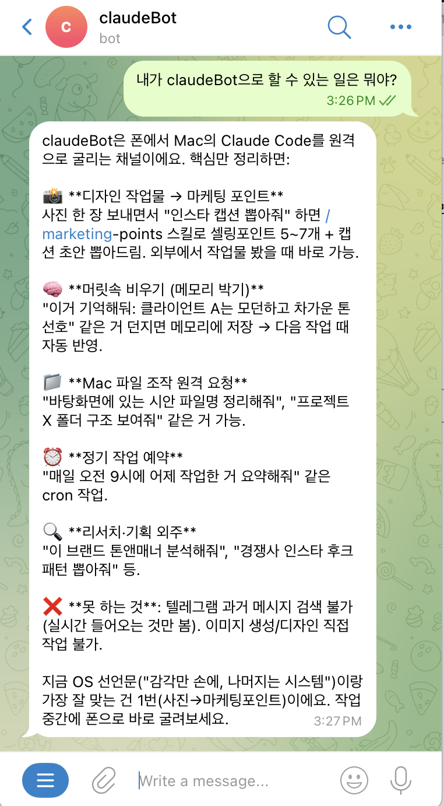
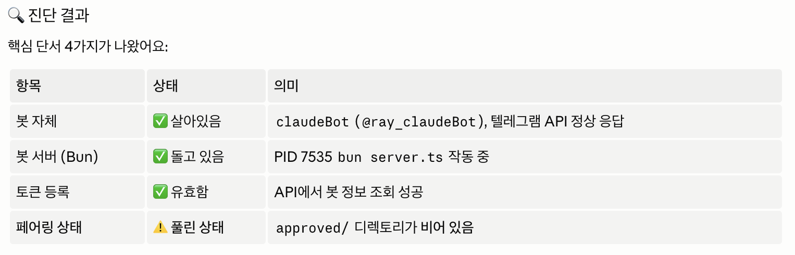
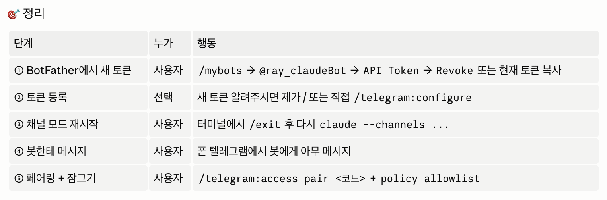
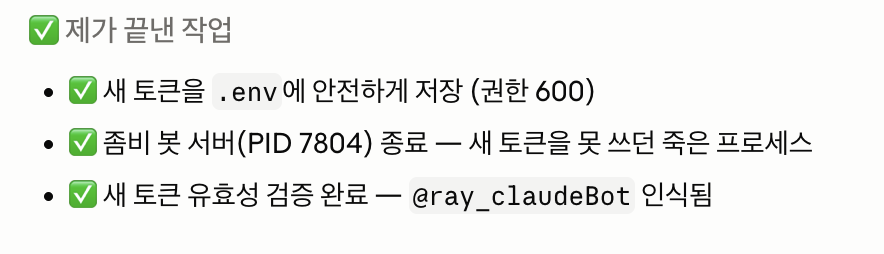
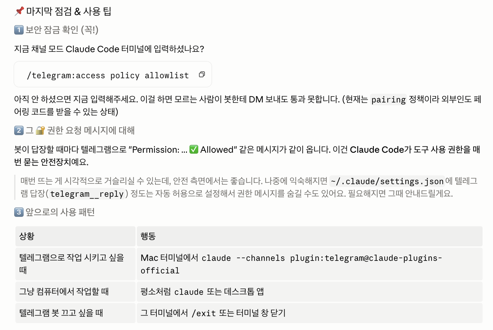
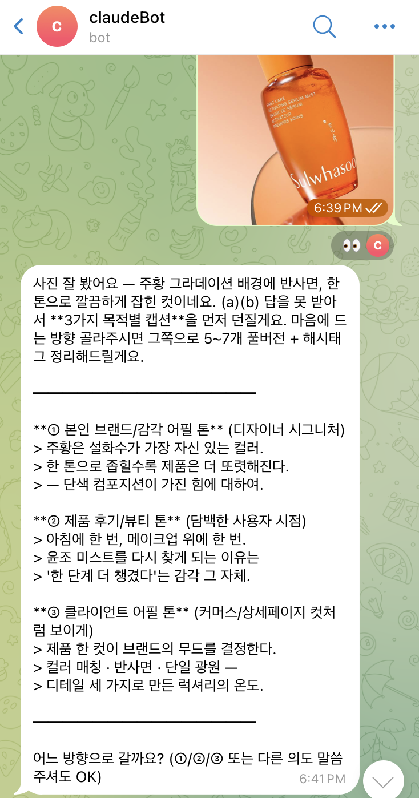
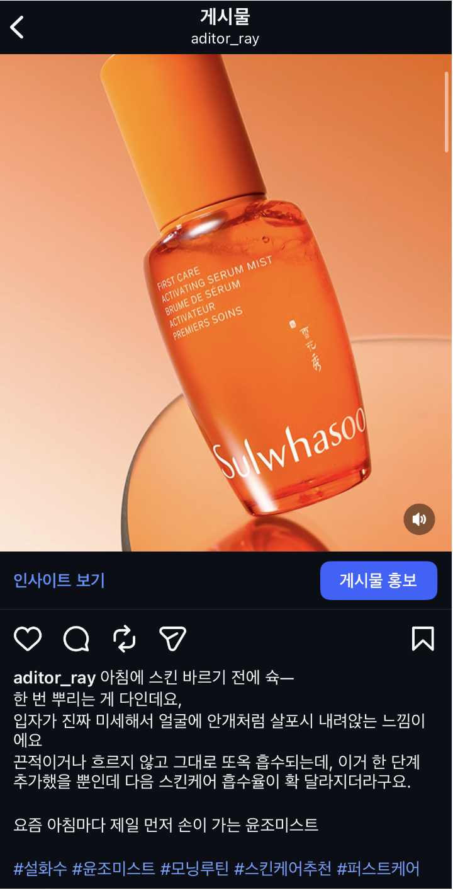
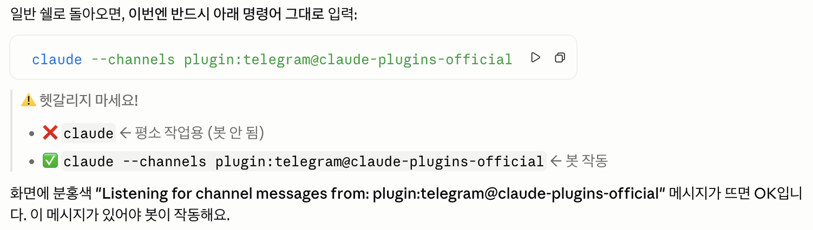
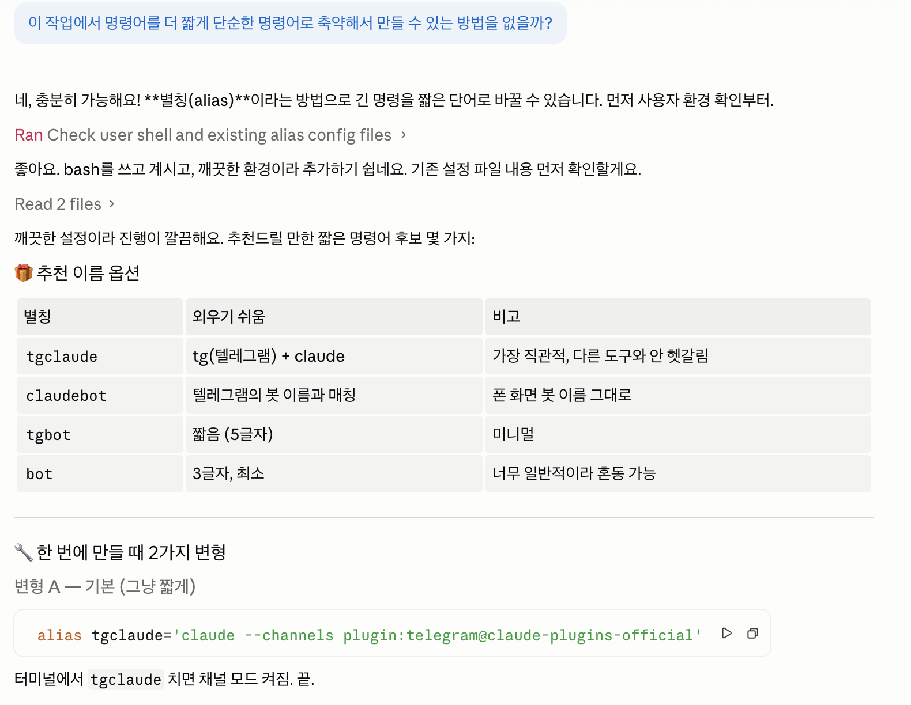
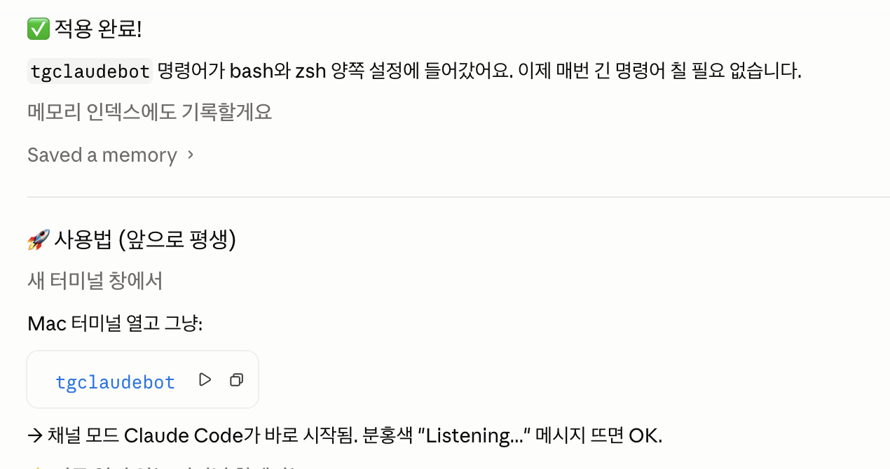

## 미션1: 각자만의 정의로 [운영체제]라고 정의내리는 OS 구현

### Summary
클로드코드로 텔레그램 봇(claudeBot)을 만들어,
1주차 과제로 만든 나만의OS skill로 다음과 같이 활용한다. 
- 업무스케줄 관리 
- 파일 관리 
- 마케팅 포인트 추출

특히, 1주차 과제로 진행했던 OS 스킬을 활용해 인스타 캡션 추출 가능

### 최종 구현 결과물

### 과정 (타임라인별 + 삽질)
공유해주신 과정을 차근차근 따라가서 완성을 했으나
다음 접속 시, 클로드봇이 아무런 반응을 보이지 않고 
휴대폰에 설치한 앱 마저 반응하지 않아 앱을 재설치하고 
클로드코드에게 상황을 알려주니 페어링이 풀렸다는 결론.

물론, 휴먼에러 
텔레그램앱에서 이것저것 눌러보다가 토큰을 리보크 revoke 를 하는 바람에 클로드봇이 작동하지 않음.

클로드코드에게 새 토큰을 알려주고 나머지 프로세스 진행
외부인은 현재 제작한 claudeBot에 페어링코드를 받을 수 없도록 보안작업까지 완료

### 공유할만한 인사이트

- 휴먼에러를 조심하자. - 나로 인한 변수 "토큰 무효화" 
- 클로드코드 덕분에 한참 해맸을 에러상황도 빠르게 해결 가능
- 텔레그램봇을 만들어 1주차 과제로 생성한 나만의 OS skill을 활용해 볼 수 있다.  

---

## 미션2: SNS 작성
https://www.instagram.com/p/DYb3hFMRL0g/?igsh=bmNydnIzNnplMjAz
### Summary
2주차 과제 텔레그램 클로드봇에 1주차 과제 OS skill을 활용하여 인스타 캡션 제작

### 최종 구현 결과물

### 과정 (타임라인별 + 삽질)

작업 중 컴퓨터를 끄거나 터미널 연결이 끊어졌을 때 매번 명령어를 치는 부분이 귀찮아서 클로드에게 축약할 방법을 물어봄

### 공유할만한 인사이트

반복적인 긴 명령어도 간단하게 축약해서 사용할 수 있다

---

## 미션3: (이번 주 미사용)

### Summary

### 최종 구현 결과물

### 과정 (타임라인별 + 삽질)

### 공유할만한 인사이트
