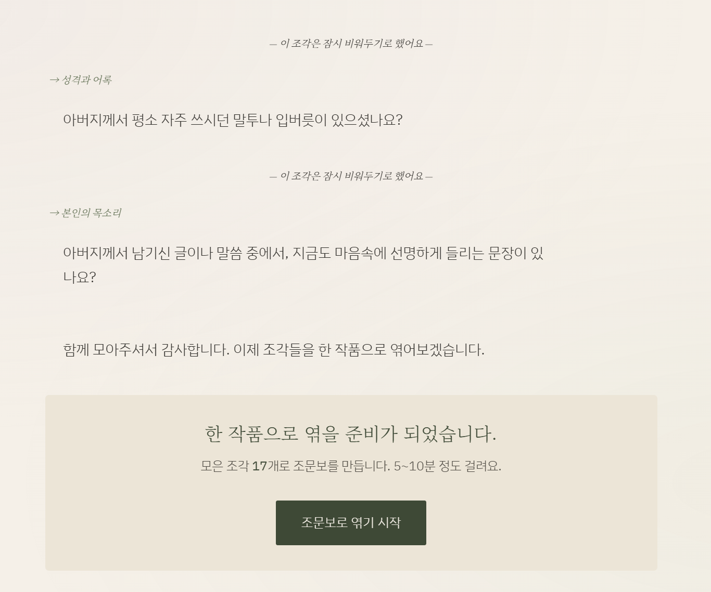
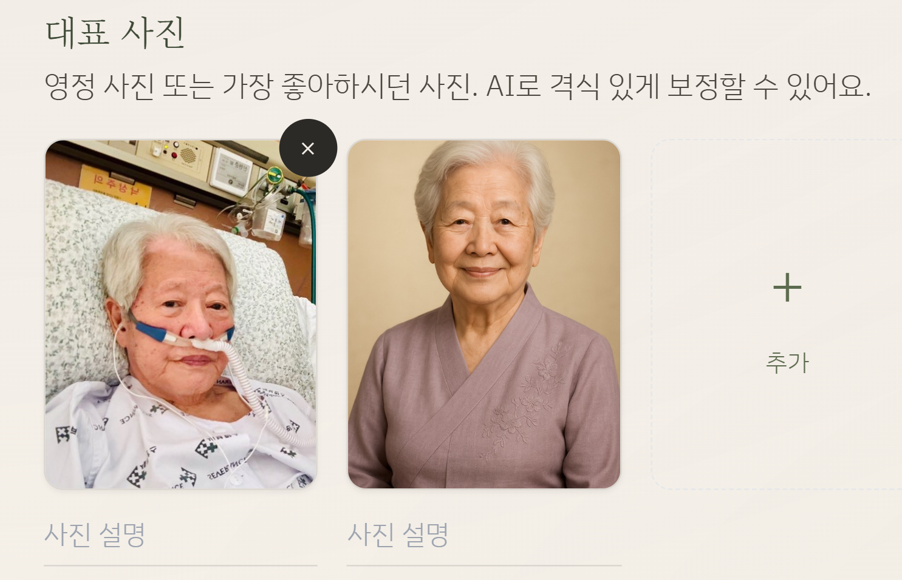
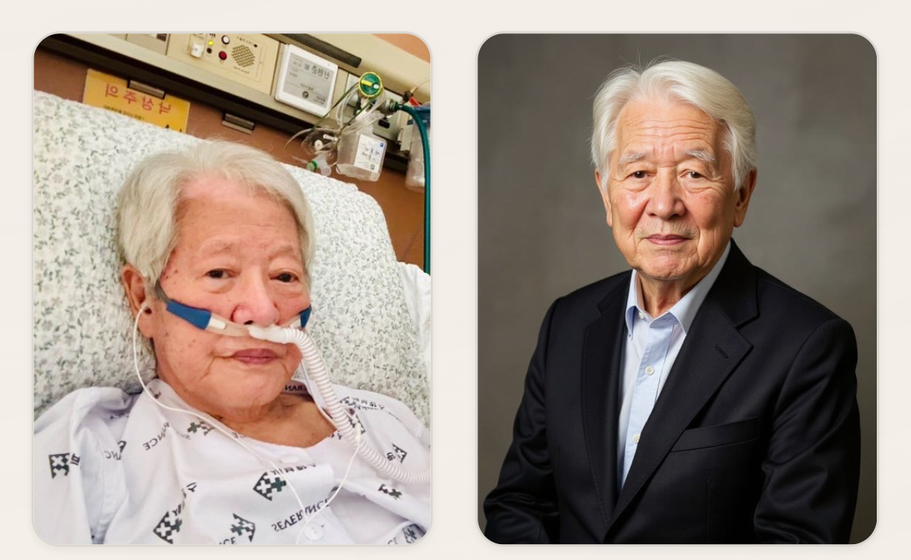

# 3주차 과제 — 찌니

## 🤖 AI 초안 (개인 참고용)

> [!ai]+ `/draft MMDD-MMDD`로 채우거나, 이 블록을 지우고 직접 작성
> (이 콜아웃은 본인 참고용입니다. 아래 미션 섹션을 다 채우고 나면 통째로 지우거나 접어두세요.)

---

## 미션1: 내 고객은 누구고 왜 쓰는가 — 클로드 코드로 프로덕트 구현하기

### Summary
**weeve(위브)** — 디지털 조문보 플랫폼. 가족이 AI 인터뷰를 통해 고인의 이야기를 나누면, 조문객이 읽을 수 있는 디지털 추모 책자를 자동 생성합니다. 영정 사진 보정, 내러티브 생성, 팩트 검증까지 AI 하네스 파이프라인으로 처리.

**고객**: 장례를 준비하는 유가족. 슬픔 속에서 고인의 삶을 정리할 여유가 없는 사람들.  
**왜 쓰는가**: "어떻게 돌아가셨대?"가 아닌 고인의 삶을 회고하는 조문 문화를 만들기 위해.

### 최종 구현 결과물
- **AI 인터뷰** → 가족 대화를 통한 고인 이야기 수집 (초기 대화 방식에서 정해진 항목 fill out 방식으로 변경했음)
- **자동 내러티브** → 팩트 추출 → 서사 생성 → 팩트 검증 → 레이아웃
- **영정 사진 보정** → 병원 사진 → 격식 있는 초상화 (의료장비 제거, 정장 착용, 배경 교체)
- **디지털 조문보** → 조문객이 QR/링크로 접근


### 과정 (타임라인별 + 삽질)

1. 디자인 컨셉 : 핀터레스트  https://kr.pinterest.com/pin/698198748524801924/


2. 브랜딩 / 사업기획서 초안 작성 w/ claude chat


3. 조문보 정보 정리 - claude api 반영 (기존 정보 취합 방식 대화형에서 변경경) 


4. 영정 사진 만들기 삽질!! 이틀내내 소요! 아직도 미완성! 

| 단계      | 시도                                   | 결과                                             |
| ------- | ------------------------------------ | ---------------------------------------------- |
| 1차      | **OpenAI gpt-image-1** (images.edit) | ❌ 얼굴 완전히 다른 사람, 성별 뒤바뀜                         |
| 2차      | OpenAI + **마스크 기반 인페인팅**             | ❌ 가로 사진→세로 캔버스 변환 시 마스크 위치 불일치                 |
| 3차      | **Replicate Flux Kontext Pro**       | △ 몸/배경은 좋으나 얼굴 보존 안 됨                          |
| 4차      | Flux + **Face Swap** 2단계 파이프라인       | △ face-swap 모델 404, 402 에러. 결제 등록 후에도 얼굴 AI스러움 |
| 5차 (현재) | **Google Gemini 2.5 Flash Image**    | ✅ 1단계로 얼굴 보존 + 편집 동시 처리. 가장 자연스러운 결과           |

**핵심 삽질**: 얼굴 동일성 보존이 가장 어려운 문제. 생성(generation) 모델은 얼굴을 새로 만들고, 편집(editing) 모델만이 원본 얼굴을 유지함. → Gemini의 이미지 편집 기능이 정답이었음.

**OpenAI gpt-image-1** (images.edit) - 아빠라고!!!엄마 아니라고!!울아빠 그리 예쁘셔?



*Replicate Flux Kontext Pro** - 없던 주름도 만들어주는 노하우? 누구십니까? 


**Google Gemini 2.5 Flash Image** - 바로 너! 제미나이야!!! 그런데.... 레이아웃은 왜? 


계속 시도 중.... 


### 공유할만한 인사이트

1. **이미지 생성 ≠ 이미지 편집** — 얼굴 보존이 중요하면 반드시 편집(edit) API를 써야 함. 생성 모델에 "얼굴 유지해"라고 아무리 써도 안 됨.
2. **API 3번 갈아탔다** — OpenAI → Replicate → Gemini. 각각 장단점이 달라서 직접 써봐야 안다. 비용도 Gemini가 1/3 수준. 
3. **Claude Code로 API 교체가 빠르다** — 파이프라인 구조를 하네스로 분리해뒀기 때문에, Stage 3(이미지 생성)만 교체하면 나머지(분석, 프롬프트, 검증)는 그대로 재사용.

** 카카오톡 로그인은 API 연결 실패 ** 

---

## 미션2: 내가 정의하고 적용해보고 싶은 하네스 + 오케스트레이션

### Summary
weeve는 **8개 하네스 프롬프트**와 **2개의 오케스트레이션 파이프라인**으로 구성. 모든 AI 출력은 가드 하네스를 통해 검증되며, "사실을 지어내지 않는다"는 원칙을 시스템으로 강제합니다.

### 최종 구현 결과물

**파이프라인 A — 조문보 생성** (5단계)

```
인터뷰 → 팩트 추출 → 내러티브 생성 → 가드 검증 → 레이아웃
```

|하네스|파일|역할|모델|
|---|---|---|---|
|Interview|`interview.md`|적응형 질문으로 가족 인터뷰|Sonnet|
|FactExtract|`factExtract.md`|인터뷰에서 사실만 추출 (추론 금지)|Sonnet (temp 0.3)|
|Narrative|`narrative.md`|사실 → weeve 톤의 서사로 변환|Sonnet (temp 0.6)|
|Guard|`guard.md`|서사 vs 원본 팩트 대조 검증|Haiku 1차 → Sonnet 재검증|
|Layout|`layout.md`|모듈 배치 + 표지 헤드라인|Haiku|

**파이프라인 B — 영정 사진 보정** (4단계)

```
사진 분석 → 프롬프트 생성 → Gemini 이미지 편집 → 가드 검증 (재시도 루프)
```

|하네스|파일|역할|모델|
|---|---|---|---|
|Analysis|`portrait_analysis.md`|Claude Vision으로 사진 분석|Sonnet|
|PromptCraft|`portrait_prompt.md`|분석 → Gemini 편집 프롬프트|Sonnet|
|ImageGen|(코드)|Gemini 2.5 Flash Image 편집|Gemini|
|PortraitGuard|`portrait_guard.md`|원본 vs 결과 비교 (pass/retry/fail)|Sonnet|


### 과정 (타임라인별 + 삽질)

1. **가드 하네스 비용 폭발** → Sonnet으로 모든 검증 → Haiku 1차 + Sonnet 재검증 2티어로 변경 (비용 80% 절감)
2. **성별 뒤바뀜 문제** → 분석 하네스에서 Claude가 추론한 성별 vs 사용자 입력이 충돌 → "사용자 입력 무조건 우선" 로직 추가
3. **가드가 너무 엄격** → 피부 보정(검버섯 제거)을 "fail"로 판단 → 가드 프롬프트에 "피부 정리는 좋은 변화"로 명시
4. **프롬프트 캐싱** → 시스템 프롬프트에 `cache_control: ephemeral` 적용해 토큰 비용 절감

### 공유할만한 인사이트

1. **가드 하네스 = 윤리적 안전장치** — "사실을 지어내지 않는다"를 코드로 강제. 추모 데이터는 가장 사적이므로 AI가 지어낸 이야기가 섞이면 치명적.
2. **2티어 가드 패턴** — Haiku(저렴)로 1차 통과 → 위반 시에만 Sonnet(정확) 재검증. 대부분 1차에서 통과하므로 비용 효율적.
3. **하네스 분리의 위력** — 이미지 API를 3번 교체했지만, 분석/프롬프트/가드 하네스는 그대로 재사용. Stage 3만 갈아끼우면 됨.
4. **오케스트레이터의 재시도 루프** — 가드가 "retry" 판정하면 revision_instruction을 다음 시도에 피드백. 최대 2회 자동 재시도.
---

## 미션3: 스폰지클럽을 하며 남기고 싶은 생각과 고민 SNS 글 작성

### Summary

### 최종 구현 결과물

### 과정 (타임라인별 + 삽질)

### 공유할만한 인사이트
