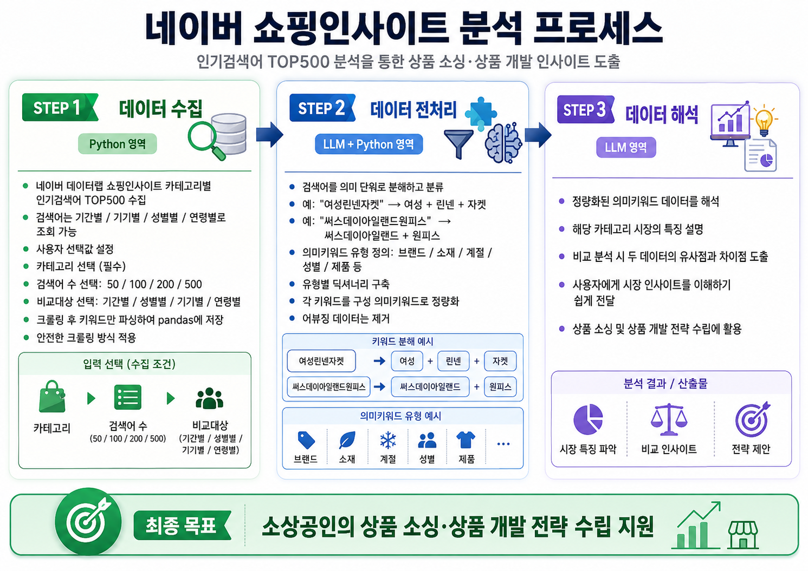
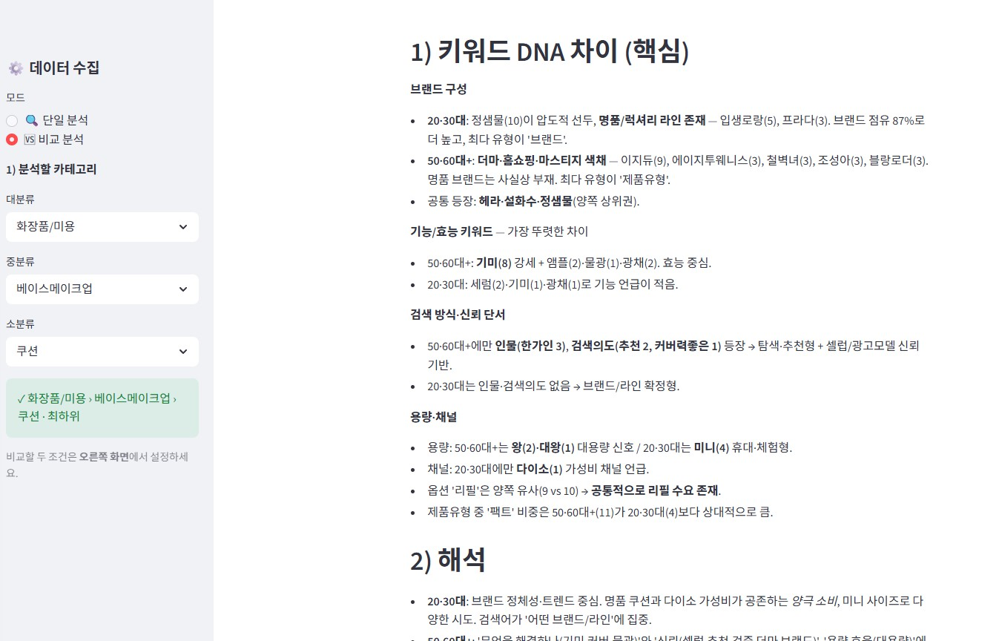

# 3주차 과제 — 거북이의꿈

## 미션1: 내 고객은 누구고 왜 쓰는가 — 클로드 코드로 프로덕트 구현하기

### Summary
- **무엇**: 네이버 쇼핑인사이트의 카테고리별 인기검색어 Top100을 *의미 단위로 분해·정량화*하고, LLM이 시장 해석을 붙여주는 로컬 웹앱(Streamlit).
- **고객**: 상품을 직접 소싱·기획하는 **소상공인 셀러**.
- **왜 쓰는가**: 카테고리마다 "키워드 DNA"가 완전히 다르다(어디는 브랜드 싸움, 어디는 기능 싸움, 어디는 용량·스펙 싸움). 그 성격을 데이터로 빠르게 파악하는 것 자체가 소싱 인사이트가 된다.

### 최종 구현 결과물
- **쇼핑인사이트 키워드 분석기**: 카테고리 선택 → Top100 수집 → (사전/AI) 분해 → **검토 훅(사람 확인)** → 정량화 → **AI 시장 해석** → 옵시디언 저장.
- 개요도

- 화면 예시

---

## 미션2: 내가 정의하고 적용해보고 싶은 하네스 + 오케스트레이션

- **하네스+오케스트레이션**: 내가 다른 일을 하고 있는 순간에도, 나를 대신해, 내 생각에 따라, 나 대신 업무를 수행해 결과를 제공하는 나의 OS
- 슬랙-헤르메스(또는 오픈클로)-Skills-LLM Wiki를 연결한 나의 업무 agent들을 키우는 것
  ex) 클라이언트 미팅을 하는 도중 요청받은 자료나 아이디어를 실시간으로 자료로 만들어 클라이언트에게 제공
  ex) 운전하면서 생각난 상품 아이디어를 실시간으로 기초조사부터 시작해 기획서 초안까지 완성


---

## 미션3: 스폰지클럽을 하며 남기고 싶은 생각과 고민 SNS 글 작성

[ingstgram](https://www.instagram.com/p/DYtmafyiVat/)
[linked-in](https://www.linkedin.com/posts/%EB%B3%91%EC%9A%B0-%EB%82%98-6a4299ba_swmudutfmtmmrvp-aisqktmeuisrxgsqi-tmmrxgrgutgkrgu-activity-7464211997706948608-Mfud?utm_source=share&utm_medium=member_desktop&rcm=ACoAABlQkZwBRkgfpdzT7SvLC8CMy68fZNbn1NE)

```
단발성 업무를 '자산'으로 쌓다..

소상공인으로 일하다 보면, 매번 비슷한 일을 처음부터 다시 한다.
키워드 한 번 뽑고, 엑셀 한 번 돌리고, 그 파일은 어딘가에 묻히고.
다음 달엔 또 처음부터. 🔁

스폰지클럽에서 나만의 'OS'를 만들면서 생각이 바뀌었다.
일을 **'한 번 하고 버리는 것'이 아니라 '시스템에 쌓는 것'**으로.

이번에 만든 네이버 쇼핑인사이트 키워드 분석기가 딱 그 예다.

카테고리 인기검색어를 분석할 때마다,
그 결과가 사라지지 않고 **시점별로 차곡차곡 저장**된다.
지금은 한 장의 분석이지만—

📈 쌓이면 → "이 카테고리, 요즘 브랜드 싸움에서 기능 싸움으로 바뀌고 있네" (트렌드)
🗺️ 모이면 → "내 종목들은 브랜드형? 스펙형?" (카테고리 지형도)
🧠 엮이면 → "이 브랜드가 여기저기 같이 뜨네" (지식 그래프)

데이터가 한 번 쓰고 버려지는 게 아니라,
**쓸수록 똑똑해지는 자산**이 되는 것.

단발적이던 업무들이 OS를 통해 체계화되고 지식화될 때
따라올 생산성을, 이제 막 상상하기 시작했다.
솔직히… 좀 설렌다. 🚀

#스폰지클럽 #AI워크플로우 #클로드코드 #소상공인 #데이터분석 #키워드분석 #나만의OS #생산성 #업무자동화 #지식관리

```

