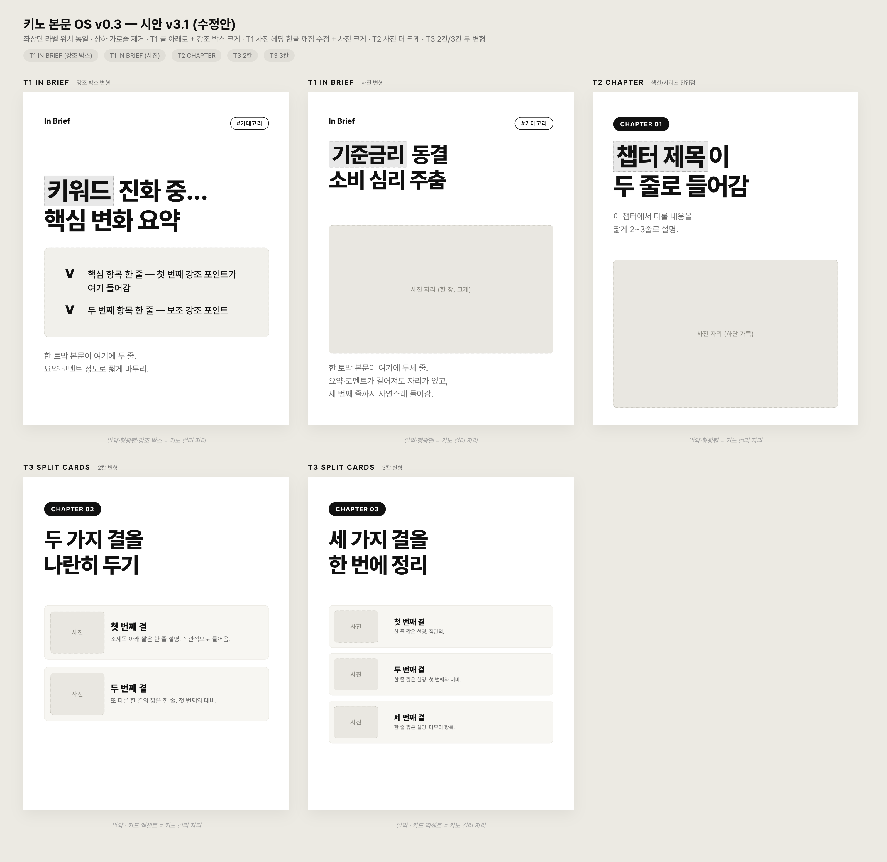
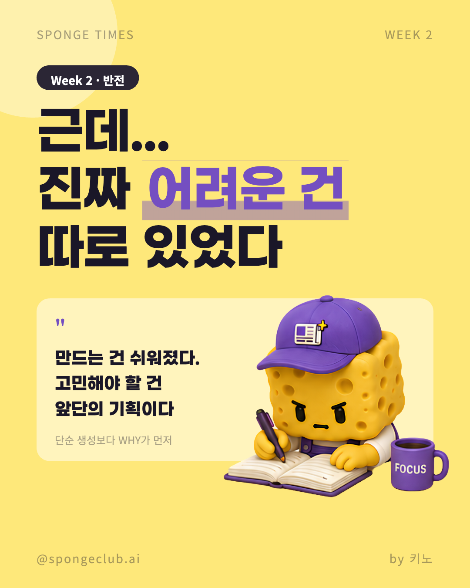
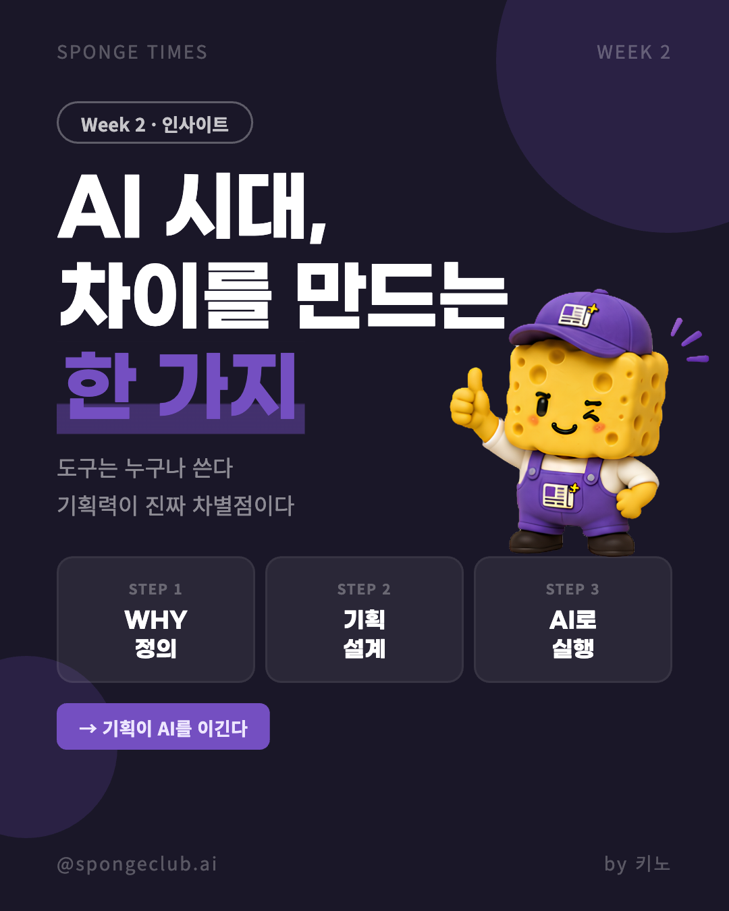
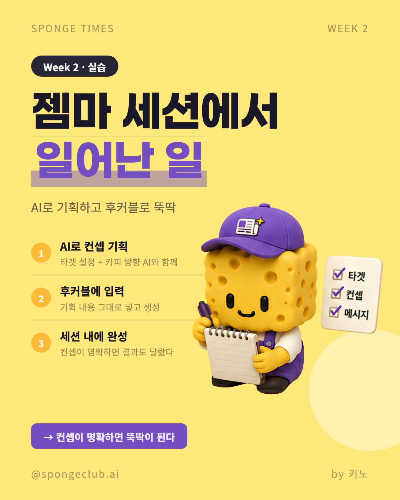

# 3주차 과제 — Keno

## 🤖 AI 초안 (개인 참고용)

> [!ai]+ `/draft MMDD-MMDD`로 채우거나, 이 블록을 지우고 직접 작성
> (이 콜아웃은 본인 참고용입니다. 아래 미션 섹션을 다 채우고 나면 통째로 지우거나 접어두세요.)

---

## 미션1: 내 고객은 누구고 왜 쓰는가 — 클로드 코드로 프로덕트 구현하기

### Summary
카드뉴스를 일관된 템플릿으로 작성하고 배포하고싶은 1인 사업자
스폰지타임즈에서 일관된 템플릿을 활용하여 카드뉴스를 제작하고 싶은 나

왜? - 인스타그램에서 통일감 있는 콘텐츠를 제작하며 사람들이 '오래 머물고 싶은 내용을 만듦'
이걸 어떻게 쉽게 만들 수 있을까 고민
카드뉴스 뿐만 아니라 다양한 플랫폼에 같이 올릴 수 있도록 작업하고 싶음
### 최종 구현 결과물

### 과정 (타임라인별 + 삽질)
01.템플릿 구조화
- 원하는 디자인이 잘 나오지 않아서 이미지를 참고하여 템플릿화 시킴
- 좋아보이는 디자인 레퍼런스를 줌

2. 이 중에서 시각적으로 잘 보이는걸 구조화시킴(색상 빼고)
3. 
03_그다음에 색상을 입혀서 제작

https://www.instagram.com/p/DYs-rhQE3Ws/?utm_source=ig_web_copy_link&igsh=MzRlODBiNWFlZA==

여기서 보실 수 있어요

### 공유할만한 인사이트
디자인 삽질, 템플릿을 어떻게 인식하기 좋게 만들어야 할 것인가?
-> 색상을 자꾸 자기멋대로 바꿔서 템플릿 구조만 확인하도록 만듦
-> 디자인 시스템은 별도로 받아보기

---

## 미션2: 내가 정의하고 적용해보고 싶은 하네스 + 오케스트레이션

### Summary

디자인에 대한 일관성이 중요한 작업들을 굉장히 많이하는데 이것에 대한 하네스를 만들 수 있을까? 고민중.
PPT장표 분석 -> 그 다음엔 내용만 던지면 똑같은 템플릿으로 만들어주게 되는데 어떨때는 잘 안됨
어떻게 하면 강한 하네스를 채울 수 있을까?

### 최종 구현 결과물

### 과정 (타임라인별 + 삽질)

### 공유할만한 인사이트

---

## 미션3: 스폰지클럽을 하며 남기고 싶은 생각과 고민 SNS 글 작성

### Summary

후커블 세션과 전체적인 스폰지 클럽 수업을 들으며 우리가 가장 중요하게 생각하는 'WHY'
찾기가 중요함

어떤 작업에 대한 필요성, 결과물에 대한 상상력이 있어야 원하는 OS를 구현할 수 있음

### 최종 구현 결과물
텔레그램이 연결이 안됨 -> 정말 텔레그램만 써야할까? 내가 할 수 있는 방법은 뭐가있을까?

### 과정 (타임라인별 + 삽질)

1. 텔리그램 연결이 절대절대 안됨 
2. 정말 텔레그램만 써야하나 -> 슬랙 / 디스코드 등 방법은 많았지만..
3. 어쨌든 내가 원하는건 "쓰기 편안함" "언제든 접속 가능한 상태"
4. API를 연결하고 나만의 데이터베이스를 쌓는 툴을 만들자!
5. 홈페이지에서 내 고민상담/ 업무일지를 작성하면 -> 노션에 데이터가 쌓이도록 구성
6. 

### 공유할만한 인사이트
