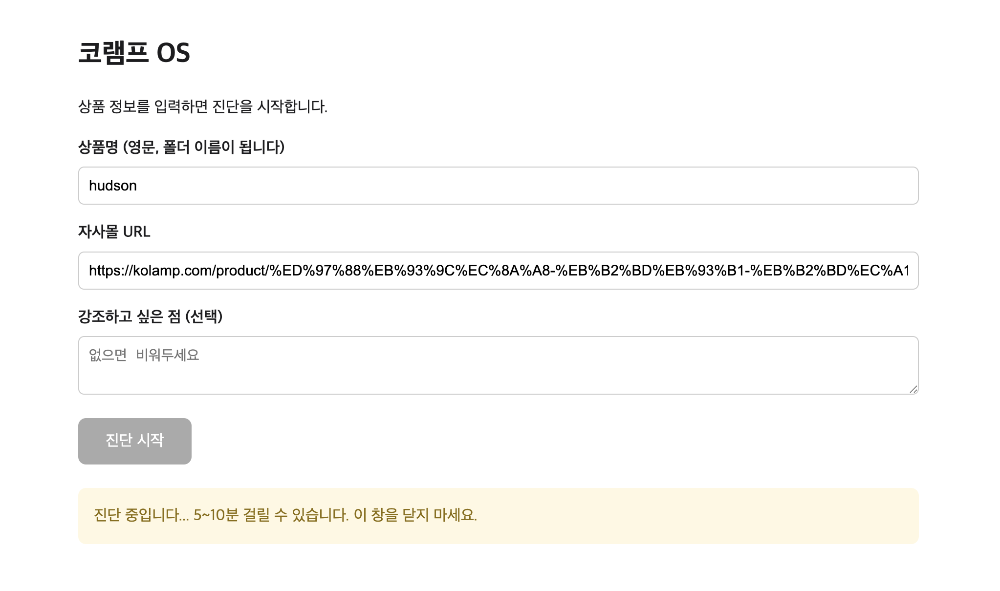
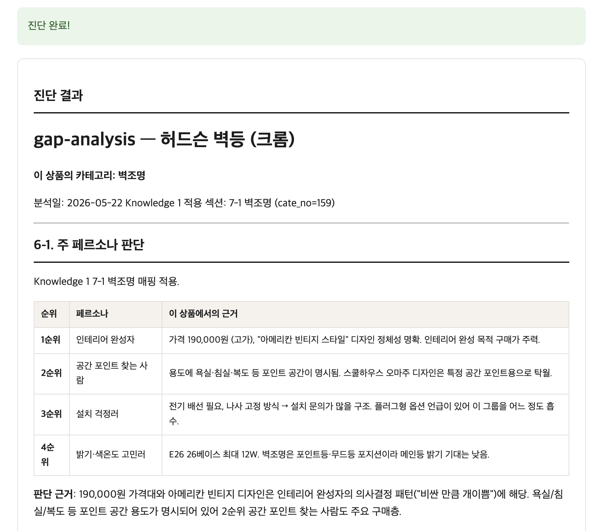
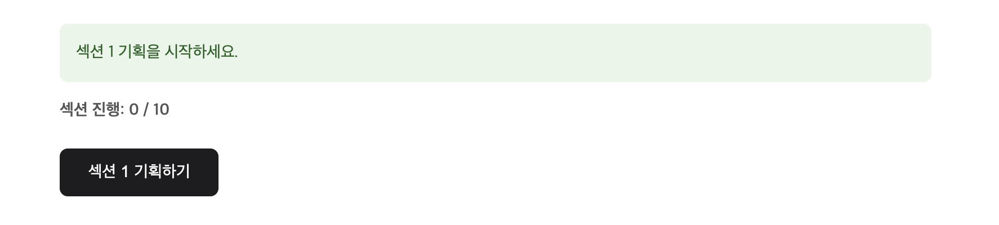
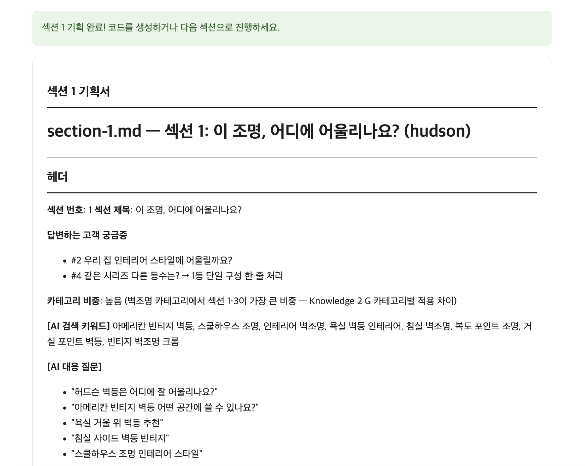
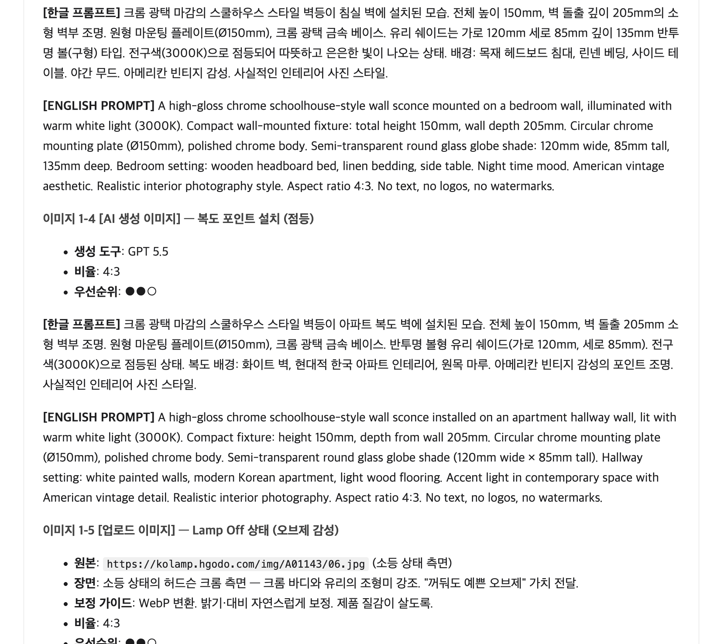
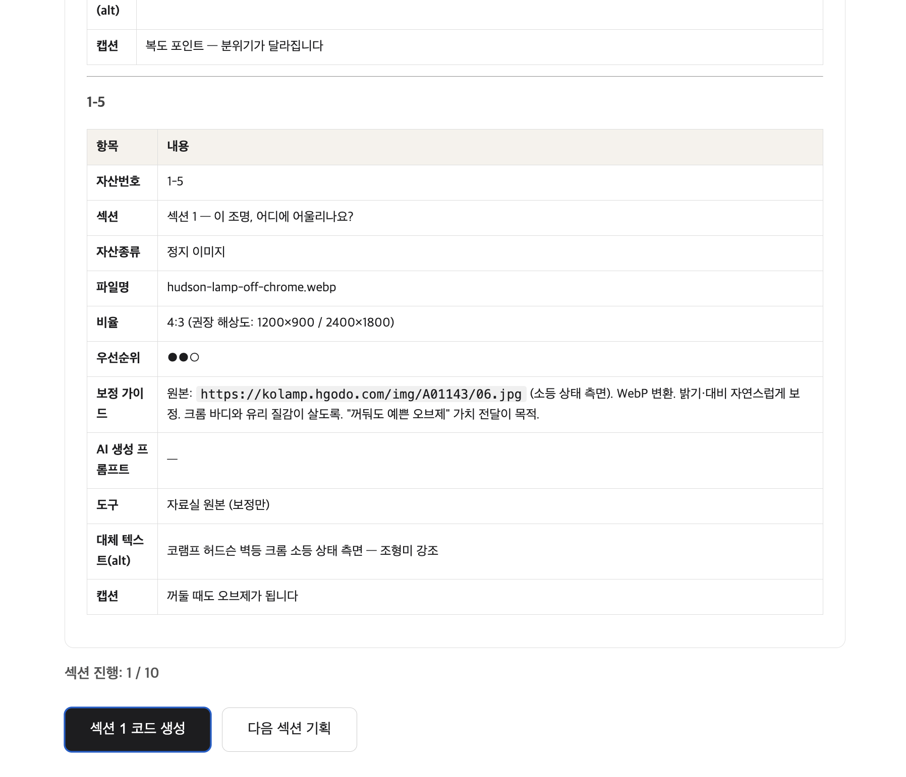
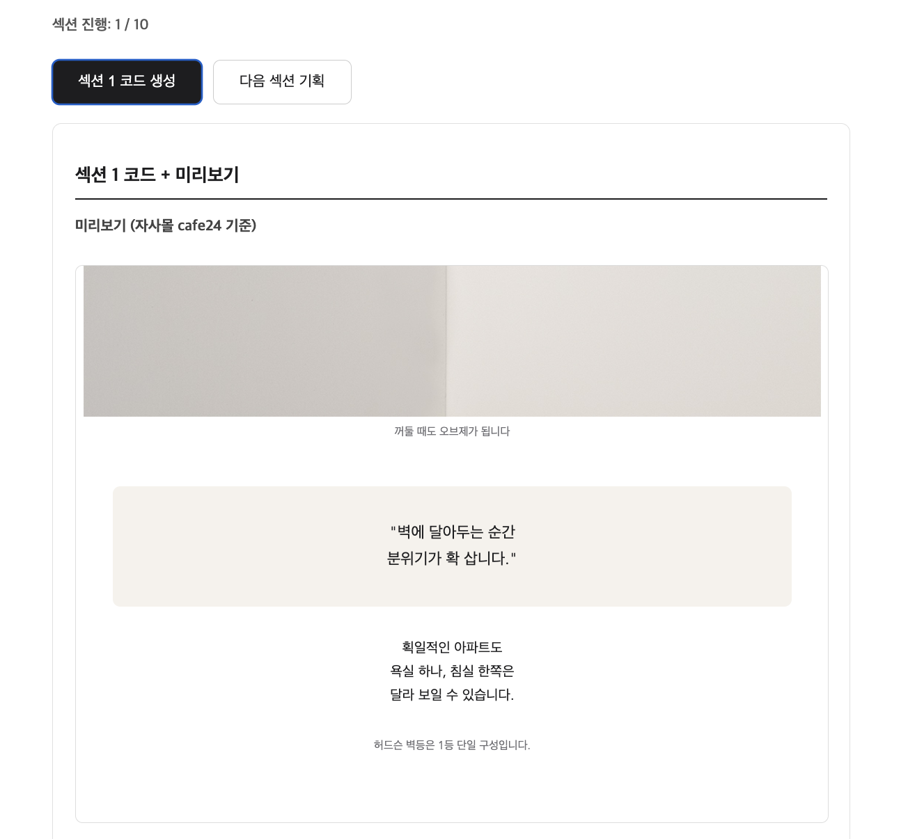
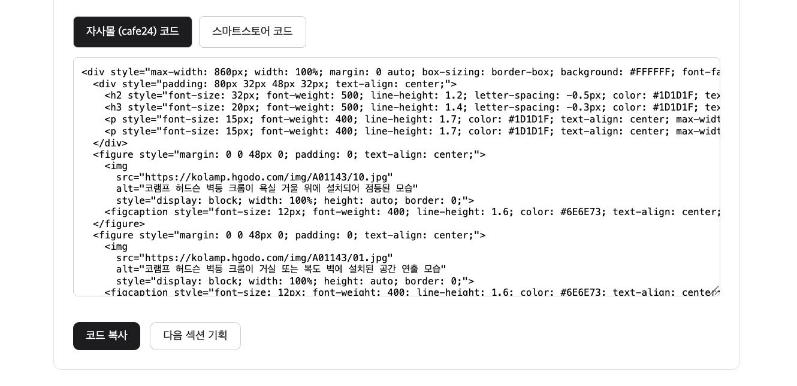

# 3주차 과제 — 석영

## 🤖 AI 초안 (개인 참고용)

> [!ai]+ `/draft MMDD-MMDD`로 채우거나, 이 블록을 지우고 직접 작성
> (이 콜아웃은 본인 참고용입니다. 아래 미션 섹션을 다 채우고 나면 통째로 지우거나 접어두세요.)

---

## 미션1: 내 고객은 누구고 왜 쓰는가 — 클로드 코드로 프로덕트 구현하기

### Summary

자사몰·오픈몰·종합몰에 동시 입점한 쇼핑몰의 가장 큰 병목은 상세페이지 기획·디자인이다. LLM 시대엔 이미지 통짜 상세페이지보다 텍스트화된 상세페이지가 노출·인용에 유리하다고 봤다. 그래서 cafe24와 스마트스토어 양쪽에서 깨지지 않는 코드로 상세페이지를 찍어내는 OS를 만들었다.

- 고객: cafe24 자사몰 + 스마트스토어·쿠팡에 동시 입점한 쇼핑몰 운영사
- 문제: 상품마다 상세페이지를 하나하나 기획·코딩하면 끝이 없다 (예: 조명 판매 쇼핑몰, 상품 400개+)
- 제약: cafe24는 코드 자유도가 높지만 스마트스토어는 매우 제한적 → 둘 다 통하는 스타일이 필요

### 최종 구현 결과물

버튼만 누르면 상세페이지가 나오는 비개발자용 웹앱. Claude Code를 뒤에서 엔진으로 돌린다.

① 상품 정보 입력 → 진단 시작
상품명(폴더명이 됨)과 자사몰 URL을 넣고 "진단 시작"을 누르면 분석이 돌아간다.

② 진단 결과 — 누가 사는지부터 분석
URL을 읽어 카테고리를 판정하고, 페르소나 우선순위와 근거를 표로 뽑는다. (예: 허드슨 벽등 → 벽조명 → 1순위 "인테리어 완성자")

③ 섹션 단위로 기획 시작
진단이 끝나면 섹션별 기획으로 넘어간다. 한 섹션씩 순서대로 진행(0/10 → 1/10 …).

④ 섹션 기획서 자동 생성
섹션마다 제목·답할 고객 궁금증·AI 검색 키워드·대응 질문까지 기획서가 만들어진다. (텍스트 기반이라 AI SEO에 유리)

⑤ 이미지 프롬프트·자산 명세까지
필요한 이미지의 한글/영문 프롬프트, 비율, 우선순위, 파일명, alt 텍스트, 캡션이 자산 명세로 정리된다.

⑥ 코드 + 미리보기
자사몰(cafe24) 기준 미리보기를 보여주고,

cafe24용 / 스마트스토어용 코드를 각각 생성해 복사할 수 있다. (스마트스토어 제약까지 고려한 코드)

### 과정 (타임라인별 + 삽질)

시작점 — 문제
조명 판매 쇼핑몰은 디자인 조명을 파는데 상품이 400개가 넘는다. 상품마다 긴 상세페이지를 만들어야 하는데, 하나씩 기획·코딩하면 한도 끝도 없다. 이걸 자동으로 만들 방법이 필요했다.

1단계 — AI한테 브랜드를 가르치기 (자료 만들기)
매번 "이 쇼핑몰은 이런 브랜드야"를 설명할 순 없으니, 한 번 박아두면 계속 쓰는 자료를 만들었다. 헌법(CLAUDE.md, 기본 규칙), 지식 자료(페르소나·고객 궁금증·카테고리별 특성), 디자인·코딩 규칙. 이게 AI가 일할 환경이다.

2단계 — 작업을 단계로 쪼개기 (커맨드 만들기)
통째로 시키면 엉성해서 순서로 쪼갰다. 진단(부족한 점 찾기) → 섹션 기획(카피·이미지 계획) → 코드 생성(HTML) → (+수정 커맨드). 각 단계를 슬래시 커맨드로 만들어 한 단계 결과가 다음 단계 입력이 되게 이었다.

3단계 — 세 상품으로 검증
카테고리가 다른 상품 셋(벽조명·식탁조명·현관조명)으로 돌려봤다. 니즈가 다른데도 OS가 알아서 다르게 기획·생성하는 걸 확인했다. 특정 상품만 되는 게 아니라 일반적으로 작동한다는 걸 입증했다.

4단계 — 비개발자용 웹앱 만들기
터미널 명령을 쳐야 하던 걸, 대표(비개발자)도 쓰도록 버튼식 웹앱으로 만들었다. (위 "최종 구현 결과물" 참고)

5단계 — 첫 결과 보고 디자인 다듬기 (삽질)
첫 HTML에서 문제 5개가 보였다: 가로 카드 나열 → 세로 흐름, 영문 라벨 제거, 헤드라인 2줄 제한, 시리즈 등수 한 줄로 축소, 활용 사례 크기 조정. 핵심은 상품 하나하나가 아니라 1단계 자료(규칙)를 고쳤다는 점 — 그러니 모든 상품에 자동 적용됐다. 특히 등수는 표면만 고쳐선 안 빠져서 자료 깊은 곳(카테고리 결정 요인)까지 찾아가 고쳤다.

### 공유할만한 인사이트

흩어진 상세페이지 제작을 (1) 규칙을 박고 → (2) 작업을 순서로 엮고 → (3) 검증하고 → (4) 버튼으로 누르게 만들고 → (5) 결과 보며 규칙을 다듬는 하나의 자동화 시스템으로 만들었다. 매번 새로 시키는 게 아니라 한 번 환경을 만들어두면 누가 돌려도 같은 품질로 나오게 한 것. 그래서 OS라고 부른다.

솔직한 회고: 사실 OS가 뭔지, 어떻게 시작할지 몰랐다. Claude에 "OS를 만들고 싶다"고 한 대화를 정리해 프로젝트 지침을 만든 뒤 작업했다. 터미널에 프로젝트가 짜준 코드를 넣어가며 "이 방법이 맞나, AI가 혼자 해도 될 일 아닌가" 의심도 들었다. 내가 결정해야 할 지점도 있었다. 아직 수정할 부분이 많지만 가능성을 확인한 시간이었다.

---

## 미션2: 내가 정의하고 적용해보고 싶은 하네스 + 오케스트레이션

### Summary

이번 작업에서 내가 정의하고 적용한 하네스와 오케스트레이션이 무엇이었는지 정리한다.

### 최종 구현 결과물

하네스 = AI가 일할 고정 환경 (1단계 자료)
- 헌법(CLAUDE.md): 기본 규칙
- 지식 자료: 페르소나, 고객 궁금증, 카테고리별 특성
- 디자인·코딩 규칙: cafe24·스마트스토어 양쪽에서 깨지지 않는 코드 기준 + 브랜드 디자인 스타일

이걸 한 번 박아두니 매번 설명하지 않아도 같은 품질이 나왔다.

오케스트레이션 = 작업을 순서로 엮은 흐름 (2단계 커맨드)
- 진단 → 섹션 기획 → 코드 생성 → (수정)
- 각 단계를 슬래시 커맨드로 만들어, 한 단계 결과(출력)가 다음 단계 입력이 되게 연결

### 과정 (타임라인별 + 삽질)

처음엔 상세페이지 만드는 일을 통째로 시켰는데 결과가 엉성했다. 그래서 일을 진단·기획·코드 단계로 쪼개고 커맨드로 만들어 이었다. 하네스(규칙 자료)와 오케스트레이션(단계 연결)을 나눠두니, 디자인 문제가 생겼을 때도 개별 상품이 아니라 하네스의 규칙만 고쳐서 전체에 반영할 수 있었다.

### 공유할만한 인사이트

하네스(환경)와 오케스트레이션(순서)을 분리한 게 핵심이었다. 품질 문제는 대부분 하네스의 규칙을 고치면 전체에 퍼졌고, 작업 순서 문제는 오케스트레이션(커맨드 연결)을 손보면 됐다. 둘을 섞어두면 매번 개별 상품을 고쳐야 했을 것이다.

---

## 미션3: 스폰지클럽을 하며 남기고 싶은 생각과 고민 SNS 글 작성

### Summary

### 최종 구현 결과물

### 과정 (타임라인별 + 삽질)

### 공유할만한 인사이트

https://www.threads.com/@marke.tingpt/post/DYmcZmGk7w4?xmt=AQG0Xn2ap2RTRf9G27HlzWDfoKII_whwGR61UCAA2hP6eQ
