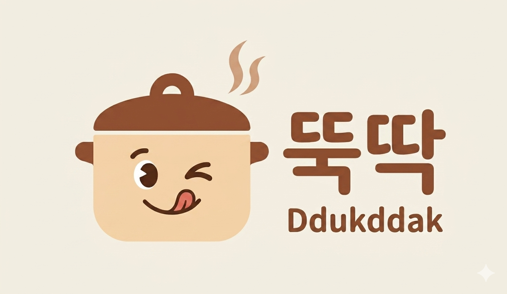

# 4주차 과제 — 신연수

## 🤖 AI 초안 (개인 참고용)

> [!ai]+ `/draft MMDD-MMDD`로 채우거나, 이 블록을 지우고 직접 작성
> (이 콜아웃은 본인 참고용입니다. 아래 미션 섹션을 다 채우고 나면 통째로 지우거나 접어두세요.)

---

## 미션1: 세션 적용 포인트 반영, 내 프로덕트 개선

### Summary 및 결과물
1. 프로젝트 나누기
	1. 1주차 과제인 OS로부터 시작한 블로그 수익화, 이유식 플래너 프로젝트 2개가 한 폴더 내에서 진행되고 있어서 정리해달라고 함.
	2. 폴더를 나눈 후, 아래 worklog스킬을 만듦.
2. worklog 스킬 
	1. 자러 가기 전에 /closing 이라고 치면 클로드가 오늘 한 내용 요약해서 worklog 폴더에 쌓이게 함. 각 프로젝트마다 다른 세션을 쓰고 있는데 각 세션별로 하면 쌓이게끔 함. 
3. 지난 세션 및 브랜딩 공유회 내용 적용 - 디자인 시스템 정립, 핵심가치/페르소나/로고 만들기, 상세페이지 초안
	1. 핵심가치 
		- 시간을 돌려주는 자동화
		- 냉장고가 알아서 말한다
		- 밥솥 하나로 완성되는 레시피
	2. 페르소나
		
		
	3. 서비스명 : 뚝딱
	4. 로고 
	5. 로고 활용 가이드 페이지(로컬 html)
		
	6. 상세페이지 초안
		- 채팅으로 만들어서 앱과 내용이 상이하여 수정 필요
		- https://ddukddak2page.netlify.app/
	7. 웹앱 netlify 배포 
		- 모바일에서 깨지는 부분 발견되어 수정필요
		- https://ddukddak2.netlify.app/
### 과정 (타임라인별 + 삽질)
- pro플랜 사용중인데 모델을 sonnet에서 opus로 바꿔서 그런지 소진이 빨리 되더라구요.... 이전까진 한도 근처에도 안갔었는데 이번주차는 많이 도달해서 중단도 많이 됐어요. 다시 sonnet으로 돌아갈까합니다 ㅠㅠㅠ
- worklog 스킬 잡도리
	- 한 날짜 파일에 기록을 추가하지 않고 이전에 다른 프로젝트에서 썼던 내용을 덮어쓰는 이슈가 있었음. 즉 이전에 썼던 기록을 날려버렸음.
	- 날짜를 확인하지 않고 저장해버리는 이슈
- 로고 만들기
	- Gemini 랑 chat gpt 둘 다 써봤는데 뚝딱 이라는 한글이 들어가다보니 확실히 gemini가 생성을 더 잘해줘서 gemini로 완성했습니다.
	- 근데 원하는 느낌에 가깝게 나올 때 까지 꽤 많이 돌려야 했습니다. 컨셉 3가지를 다 돌려봤는데, 이 때 앞서 나온 걸 잊으라고 해야 완전히 다른 걸 만들어주더라구요. 클로드로 프롬프트 생성 후에 복붙했는데 수정하고싶은 부분이 생겨서 말했더니 완전 산으로 가기도 했습니다. https://gemini.google.com/share/4b1769b991a8

### 공유할만한 인사이트

---

## 미션2: 찐 고객 페르소나에게 피드백 받은 내용

### Summary
추가 예정

---

## 미션3: SNS

[https://www.instagram.com/p/DY2J9qqmgjH/?utm_source=ig_web_copy_link&igsh=MzRlODBiNWFlZA==](https://www.instagram.com/p/DY2J9qqmgjH/?utm_source=ig_web_copy_link&igsh=MzRlODBiNWFlZA==)
