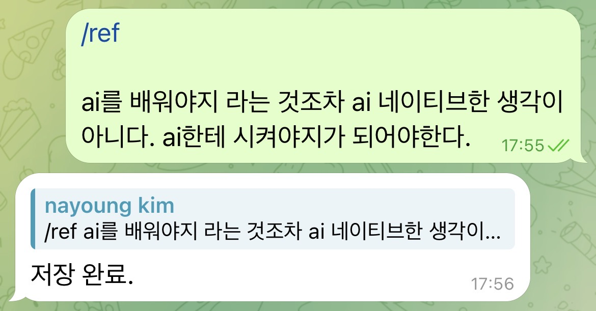

# 4주차 과제 — 치코

## 🤖 AI 초안 (개인 참고용)

> [!ai]+ `/draft MMDD-MMDD`로 채우거나, 이 블록을 지우고 직접 작성
> (이 콜아웃은 본인 참고용입니다. 아래 미션 섹션을 다 채우고 나면 통째로 지우거나 접어두세요.)

---

## 미션1: < 하네스, 오케스트레이션 포인트 반영해서 내 프로덕트 개선하기>

### 개인용 생각정리 봇
- 하나의 컨베이어 벨트 구조
	- 센세 생태계는 네 단계로 이어지는 벨트라고 보면 돼. 왼쪽에서 네 생각이 들어오고, 오른쪽에서 발행할 글이 나와.

#### 에이전트별 역할 분배

### 센세 (sense) — 입구이자 기록원

- **하는 일**: 텔레그램으로 들어온 생각(`/idea`)·자료(`/ref`)·체크인을 받아서 옵시디언 날것 노트에 적는다. 하루 세 번 먼저 말을 걸어 체크인을 받고, 매일·매주·매월 회고를 진행한다.
- **안 하는 일**: 영구적인 해석이나 "이렇게 해라" 식 행동 추천. (대화 중에 잠깐 관점을 던지는 건 되지만, 결론을 박는 건 다음 일꾼들 몫)
- **언제 도나**: 체크인은 매일 아침 10시 30분·오후 3시 30분·밤 10시. 그 외에는 네가 메시지 보낼 때마다.

### BI — 클러스터 만드는 기계

- **하는 일**: 쌓인 회고 노트를 읽어서, 비슷한 주제의 조각들을 숫자 거리(문장을 숫자로 바꿔 가까운 것끼리)로 묶어 무더기(클러스터)를 만든다. 결과를 `graph.json`이라는 한 파일로 떨군다.
- **안 하는 일**: 무더기에 이름표를 붙이거나 뜻을 푸는 일. 그건 해석이라 분석가에게 넘긴다. BI는 "같은 입력이면 항상 같은 결과"가 나오는 단순 기계로만 둔다.
- **위치**: 분석가·라이브러리가 일하기 직전에 재료를 깔아주는 뒷단 엔진이야. 사실상 "에이전트"라기보다 분석가의 눈이라고 보면 돼.

### 분석가 (analyst) — 내 생각을 위키로

- **하는 일**: BI가 만든 무더기 하나를 글 한 편으로 받아, 제목을 붙이고 정리해서 `Self/wiki/`에 "자기이해 위키 글"로 쌓는다. 아직 덜 여문 주제는 글 대신 목차의 "더 모이면 글 될 후보"에만 한 줄로 적어둔다.
- **안 하는 일**: 행동 추천, 콘텐츠 작성, "이거랑 저거 연결되네" 같은 연결 짓기.
- **언제 도나**: 매일 회고가 끝난 직후 자동으로, 또는 네가 `/analyze` 부를 때.

### 라이브러리 (library) — 외부 자료를 위키로

- **하는 일**: 네가 `/ref`로 넣은 외부 자료(링크·책·인용)를 `External/wiki/`에 개념별로 정리한다.
- **안 하는 일**: 자료를 그대로 복사해 붙이기, 네 생각과 외부 자료를 이어 붙이는 연결 작업. (연결은 인사이트로 넘어갔어)
- **언제 도나**: `/ref`가 들어올 때, 또는 직접 부를 때.

### 인사이트 (insight) — 세 갈래를 교차시키는 발견자

- **하는 일**: 네 생각 위키(`Self/wiki`) + 외부 자료 위키(`External/wiki`) + 작업 기록(Work log) 이 **세 갈래를 가로질러** 안 보이던 연결점을 찾아낸다. 결과를 `Editor/insight/`에 적고 텔레그램으로 너에게 보낸다.
- **안 하는 일**: 한 갈래 안에서의 패턴 뽑기(분석가 몫)나 두 갈래만 잇는 일. 반드시 세 갈래가 만나는 지점만 본다.
- **언제 도나**: 매일 새벽 3시.

### 워크인사이트 (work-insight) — 작업 기록 전용 발견자

- **하는 일**: 오직 작업 기록(Work log) 하나만 깊게 파서, 네가 뭔가를 만들어가는 과정에서 드러나는 덜 뻔한 연결을 찾아낸다. `Editor/work-insight/`에 적고 텔레그램으로 보낸다.
- **인사이트와 다른 점**: 인사이트는 세 갈래를 섞고, 워크인사이트는 작업 기록 한 갈래만 본다.
- **언제 도나**: 매일 오전 9시.

### 에디터 (editor) — 발행 글로 빚는 작가

- **하는 일**: 워크인사이트 노트 한 개와 작업 기록을 살로 붙여 링크드인·블로그 초안을 쓴다. `Editor/drafts/`에 넣고 텔레그램으로 보낸다.
- **안 하는 일**: 위키 글을 통째로 베끼기. 반드시 다시 빚는다.
- **언제 도나**: 매일 오전 11시.

- **들어오기 → 묶기 → 해석하기 → 글로 빚기**
	- **들어오기**: 네가 텔레그램에 던진 생각·자료를 센세가 받아서 옵시디언에 날것 그대로 적어둔다.
	- **묶기**: BI가 그 날것들을 기계적으로 비슷한 것끼리 무더기로 묶는다. (의미 해석은 안 함)
	- **해석하기**: 분석가와 라이브러리가 그 무더기에 제목을 붙이고 정리해서 "위키 글"로 만든다.
	- **글로 빚기**: 인사이트·워크인사이트가 연결점을 찾아내고, 에디터가 그걸 링크드인·블로그 초안으로 빚는다.

옵시디언 안의 저장 공간도 이 흐름에 맞춰 세 묶음으로 나뉘어 있음.
개인적 생각은 `Self/`, 외부에서 가져온 자료는 `External/`, 발행용 작업물은 `Editor/`.

**적용한 두 축**
- ==**하네스**== — 개별 에이전트를 *어떤 실행 환경에서 기동하느냐*. 로드할 플러그인·외부 도구·컨텍스트·시작 디렉터리 구성, 그리고 누가 메시지를 접수하느냐.
	- 에이전트를 ==어떻게 깨워서== 일 시키는지. 모든 도구를 챙기고, 어디서 시작하게 할 건지
- ==**오케스트레이션**== — 여러 에이전트를 *어떤 책임·입출력·실행 순서로 조율하느냐*. 각 에이전트가 무엇을 읽고 쓰는지, 어떤 순서로 도는지, 어디서 멈추는지.
	- 여러 에이전트를 ==어떻게 역할분배하고 순서를 짜는지==

### 하네스 (실행 환경 최적화)

**케이스 1 — 답장이 4분 넘게 걸려서 실패** 
	봇이 켜질 때마다 안 쓰는 짐(플러그인 8개, 외부 도구, 기억 복원, 브라우저 등)을 다 들고 와서 느렸음. → 봇 전용 가벼운 설정만 보게 하고, 빈 폴더에서 바로 시작하게 바꿈. 플러그인 8개→3개, 외부 도구도 0개로 줄이니 지연 해결. → **배운 점: 자동 봇은 항상 가볍게 켠다. 답은 더하기가 아니라 빼기였다.**

**케이스 2 — 메시지 보내도 답이 없음** 
	여러 세션이 동시에 봇을 잡으려다 하나만 되고 나머진 조용히 실패. → 메시지 올 때마다 봇을 새로 켜서 하나씩만 처리하게 함. 예약 발송은 봇 안 거치고 따로 보냄. 받는 일과 처리하는 일을 나눔. 
	 **배운 점: 접수와 처리를 따로 떼어놓는다.**

### 오케스트레이션 (역할 설계)

**케이스 3 — 역할 과집중으로 퀄리티 저하** 
	한 봇이 여러 역할을 하니 초점이 흩어짐. → 역할을 셋으로 쪼갬: 분석가(내 생각 정리) / 라이브러리(외부 자료 정리) / 인사이트(둘을 합쳐 겹치는 부분만 뽑기). 세 개가 만나는 지점에서 진짜 글감 나옴.
	 **배운 점: 역할만이 아니라 뭘 넣고 뭘 내고 어떤 순서로 할지까지 나눠야 깔끔하다.**

**케이스 4 — **자동화가 판단까지 넘봄** 
	톤·해석·결론 같은 건 사람이 해야 하는데 자동화가 넘어갈 위험. → 두 군데서 멈추게 함: ① 1단계 만들면 멈추고 사람이 승인해야 다음 진행, ② 봇한테 "해석·결론 하지 말고 자료만 펼쳐라" 명시.
	 **배운 점: 좋은 자동화는 많이 하는 게 아니라 어디서 멈출지 정하는 것.**

# 인사이트/남은 과제

### 1. 한 줄 벨트가 아니라 두 갈래로 쪼개졌다

지금 시스템을 가만히 보면 두 개의 흐름이 따로 돌아.

- **느린 갈래 (나를 이해하기)**: 센세 → BI → 분석가 → `Self` 위키. 이건 날것 생각이 수십 개 쌓여야 비로소 무더기가 생기고 글이 돼. 그래서 본질적으로 느려.
- **빠른 갈래 (내 작업을 글로 팔기)**: 작업 기록 → 워크인사이트 → 에디터 → 초안. 작업 기록은 네가 매일 만드니까, 이 갈래는 매일 돌 수 있어.
- 인사이트 에이전트가 이 둘을 잇는 다리고.

### 2. 일부러 미룬 PM 역할이, 하필 "썩는 걸 막는" 담당이다

PM이 맡기로 한 일은 위키 글마다 "이게 _왜_ 중요했나"를 박아두는 거였어. 안 그러면 한 달만 지나도 그 글이 왜 중요했는지가 증발하니까. 그게 PM의 존재 이유였어.

그런데 빌드 순서에서 계속 뒤로 밀린 게 바로 그 PM이야. 텔레그램으로 눈에 보이는 결과를 주는 일꾼들(에디터·인사이트·워크인사이트)이 먼저 만들어지고, 눈에 안 보이는 위생 담당은 미뤄졌어. 문제는, 그 사이에도 느린 갈래의 위키 글은 "왜 중요했는지"라는 닻 없이 쌓이고 있다는 거야. 지금은 글이 적어서 티가 안 나지만, **PM이 막으려던 바로 그 빚이 지금 조용히 쌓이는 중**이야.

### 3. 고리가 아직 안 닫혀 있다 — 생산만 하고 배우진 않는다

에디터가 초안을 뱉고 published 폴더까지 있는데, "어떤 글이 실제로 반응이 좋았나"가 다시 앞단으로 돌아오는 길이 없어. 그러니까 시스템이 글을 만들기는 하는데, 자기가 만든 결과로부터 배우진 못해.

재밌는 건, 너 이미 post-scorer랑 analytics 같은 도구를 따로 갖고 있잖아. 근데 그게 이 파이프라인이랑 안 연결돼 있어. 그 둘을 잇는 순간, 지금의 일방향 컨베이어 벨트가 "스스로 돌면서 점점 좋아지는 바퀴"로 바뀌어.

---

## 미션2: <피드백>

- 단 2명, 찐 고객 페르소나에게 피드백 받은 내용

## 페르소나 1 — "도윤" (33세, 중견기업 마케팅팀 대리)

ChatGPT로 카피 몇 번 돌려본 게 AI 경험의 전부고, 출퇴근길에 링크드인·인스타를 스크롤하며 "나도 뭔가 해야 하는데" 불안해하는 사람. 에디터가 뱉은 글 한 편뿐이라, 피드백도 거기서만 나와.

**좋았던 것**

- 훅이 진짜 멈춰. "에러가 안 뜨는 버그가 더 무섭다", "10일 동안 같은 문제를 두 번 만났다" — 스크롤하다 멈췄어. AI 슬롭 특유의 "성공하는 사람들의 5가지 습관" 톤이 아니라 1인칭 실패담이라 일단 믿음이 가.
- 포폴 버전의 '일꾼' 비유. 나 cron이 뭔지 몰라도 "비서가 사서함 열쇠 들고 갔는데 다른 비서가 이미 보고 있어서 실패" 이건 바로 그림이 그려졌어.

**걸리는 것 (냉정하게)**

- **중간이 개발자 일기로 빠져.** 링크드인 "조용한 실패" 버전은 훅은 좋은데, 본문에서 "봇 접수권 충돌 / cron / tmux / `ls` 대신 `find`" 나오는 순간 나는 튕겨. 포폴 버전처럼 끝까지 일꾼 비유 안에 머물렀으면 따라갔을 거야. 같은 사건인데 한 버전은 따라가지고 한 버전은 못 따라간다는 게 증거야.
- **"그래서 나랑 무슨 상관?"이 비어 있어.** 이 세 편은 전부 _치코가 봇 만든 이야기_야. 나는 봇 안 만들어, 마케터야. 채널 전략이 약속한 "이게 AI 시대엔 ___라는 뜻" 착지 한 줄이 드래프트엔 거의 없어. 정작 인사이트 노트엔 나랑 상관있는 각도가 이미 있었어 — "AI 불안 해결법은 AI를 덜 쓰는 게 아니라, 내 판단이 어디서 결과를 바꿨는지 보이게 만드는 것"(insight 노트 글 각도 1번). 이게 독자용 훅인데, 에디터는 빌드 무용담 쪽으로 갔어. **재료(인사이트)가 독자를 향했는데, 최종 글(에디터)이 다시 작가 자신을 향해 틀어졌어.**
- **세 편이 결이 너무 비슷해.** "조용한 실패 / 같은 문제 두 번 / 일부러 멈추기" — 셋 다 속뜻이 "한 곳에 다 몰지 마, 멈춰라"야. 한 채널에서 연달아 보면 "이 사람 같은 얘기 또 하네" 싶어.

**도윤의 한마디:** "글 잘 써. 근데 당신 일기지 내 얘기는 아니야. 마지막에 '그래서 나(독자)는 내일 뭘 하면 되는데?' 한 줄만 있었어도 저장했어."

## 페르소나 2 — "지원" (38세, 시니어 PM 겸 인디 빌더)

자기 세컨드브레인과 멀티에이전트 콘텐츠 파이프라인을 직접 굴려봤고, 운영하다 데인 적 있는 사람. 그래서 구조·유지비·함정을 봐. 워크로그를 통째로 읽고 시스템 전체에 말해.

**좋았던 것**

- **책임 분리가 교과서적이야.** 분석가(내 생각) / 라이브러리(외부) / 인사이트(교차)를 역할만이 아니라 _읽는 곳·쓰는 곳·순서까지_ 못 박은 거. 나도 이거 안 하다가 한 에이전트한테 다 시켜서 결과 흐려진 적 있어. 정확한 결정이야.
- **슬림 환경 + spawn-per-message.** 24시간 봇을 풀 환경(플러그인 8개, 외부 연결, 옛 기억)으로 띄우는 실수, 빌더 다 한 번씩 해. 8→3, 빈 폴더 시작 — 진단이 맞아.
- **"틀 바꾸기 > 더 시키기" + 4층 구조.** 프롬프트를 더 조이는 게 아니라 출력 템플릿을 바꿔 품질 잡은 거. 이게 맞는 방향이야.

**냉정한 지적**

- **insight ↔ work-insight는 며칠 더 볼 거 없이 거의 확실히 겹쳐.** 둘 다 "연결 찾기"고 입력 축만 달라(3축 vs 1축). 본인도 워크로그에 "겹치면 합치자"고 적어놨지. 내 경험상 이런 건 99% 합쳐져. work-insight를 insight의 한 모드로 흡수하는 게 나아. 에이전트 수는 유지비가 곱으로 늘어, 더하기가 아니라.
- **confidence가 high만 나오는 건 게이트가 헐겁다는 신호야.** 본인도 의심했더라. 게이트가 항상 통과되면 그건 게이트가 아니라 장식이야. medium/low가 한 번도 안 나오면 그 필드 빼든가, 기준을 빡세게 다시 잡아.
- **운영이 cron·poller·상태파일 더미 위에 얹혀 있어 — 5/29 '검색 0개'가 그 약점의 예고편이야.** 한 군데 조용히 끊겨도 시스템은 멀쩡한 척 그럴듯한 노트를 계속 뱉어. 빌더한테 제일 무서운 종류야. 에이전트마다 "입력 축이 비면 노트를 만들지 말고 비었다고 알려라"는 최소 헬스체크 한 줄이 있어야 해. 지금은 에디터가 부실한 재료로 그럴싸한 글을 써버려서 더 위험해.
- **이게 제일 크다 — build-vs-use 함정에 빠져 있어.** 한 달 산출물이 거의 다 "에이전트 만들기"고 실제 발행은 0건이야. 게다가 에디터 드래프트 3편이 전부 "내가 봇 만든 이야기" — 도구가, 도구 만든 이야기를, 콘텐츠로 재생산하는 자기참조 루프야. 진짜 시험은 **이 시스템이 자기 얘기 말고 바깥 주제(마케팅, 커리어, 업계 사례)로 글을 뽑을 수 있느냐**야. 성공을 에이전트 개수가 아니라 발행 건수로 재.
- **분석가·라이브러리는 독자에게 안 보이는 중간 산출물이야.** 이게 최종 글 품질을 실제로 올리는지 검증된 적이 없어. 한번 둘을 빼고 인사이트를 워크로그+raw만으로 돌려서 결과물이 눈에 띄게 나빠지는지 A/B 해봐. 안 나빠지면 두 에이전트는 유지비만 먹는 거야.

**지원의 한마디:** "설계는 나보다 깔끔해. 근데 너는 지금 '콘텐츠 회사'가 아니라 '콘텐츠 회사를 만드는 회사'를 운영 중이야. 에이전트 하나 더 만들기 전에, 이 시스템으로 _바깥 주제_ 글 한 편 발행하고 반응을 봐."

---

## 미션3: <sns 인증>

https://www.instagram.com/stories/not.geochang/3909081377739649898?utm_source=ig_story_item_share&igsh=MWZibTNyZzJ4YWN1cg==