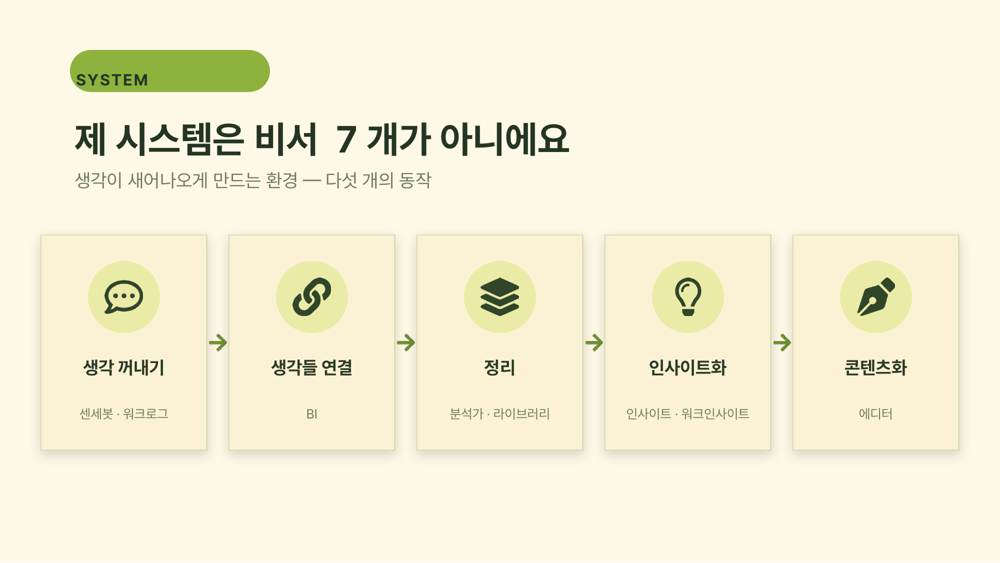
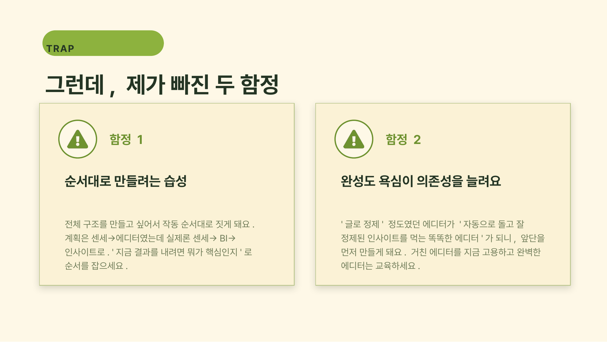
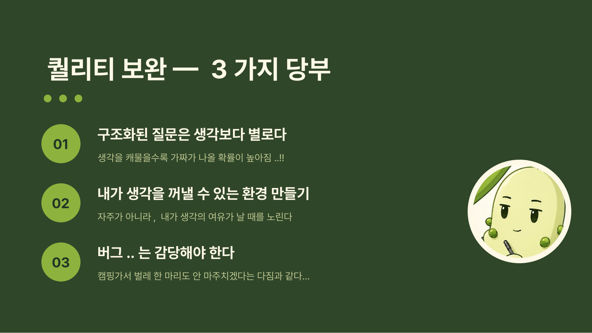
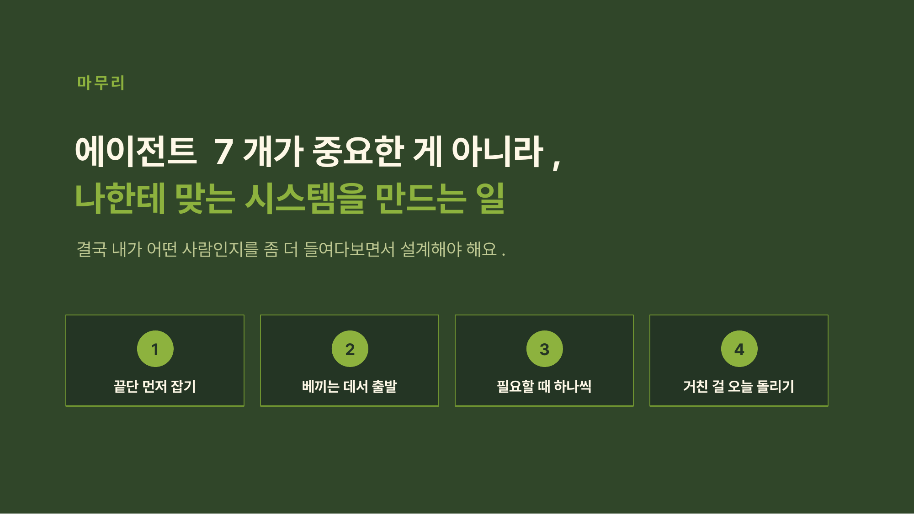

# 5주차 과제 — 치코

## 🤖 AI 초안 (개인 참고용)

> [!ai]+ `/draft MMDD-MMDD`로 채우거나, 이 블록을 지우고 직접 작성
> (이 콜아웃은 본인 참고용입니다. 아래 미션 섹션을 다 채우고 나면 통째로 지우거나 접어두세요.)

---

## 미션1: 이기적 공유 할 프로덕트 마무리

---

## 미션2: <sns인증>

https://www.instagram.com/reel/DZRBmt2z6tk/?igsh=MXVkOTNhd3k5NzNoMA==

---

## 미션3: <제목>

### Summary

### 최종 구현 결과물

### 과정 (타임라인별 + 삽질)

### 공유할만한 인사이트
