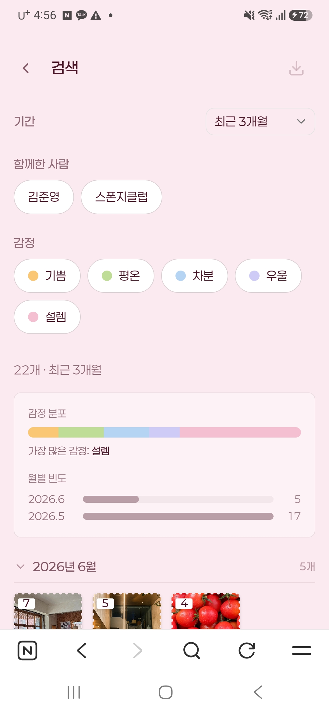
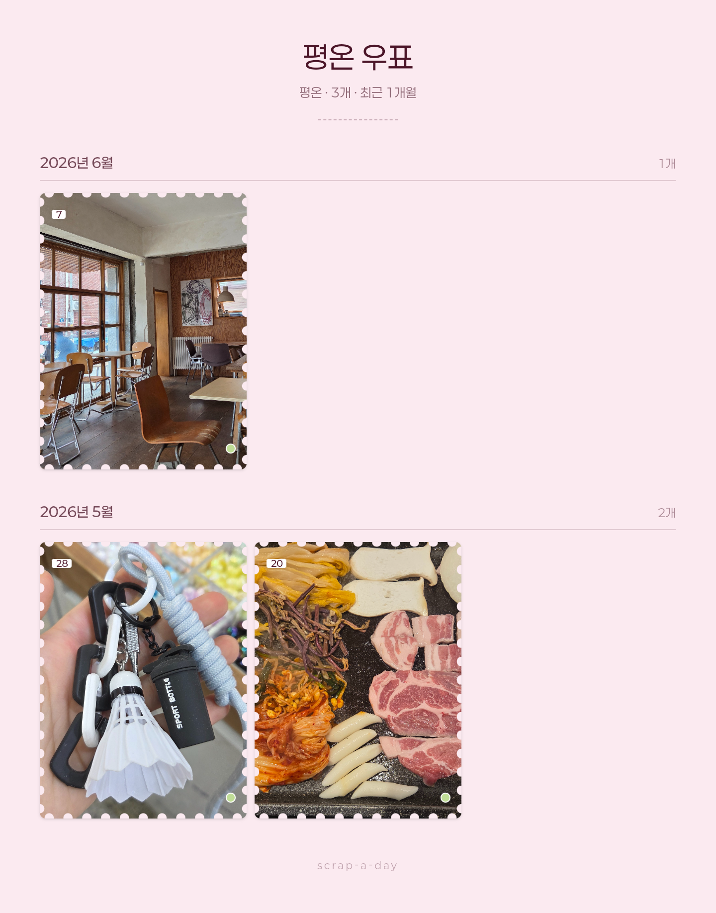
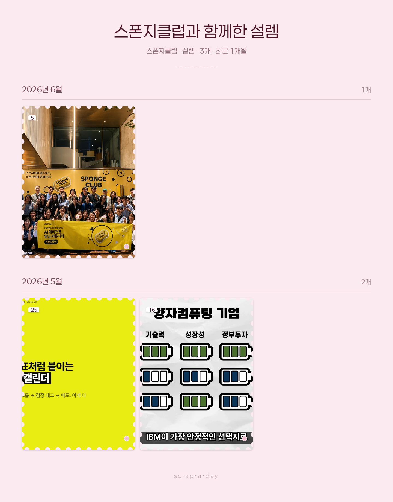
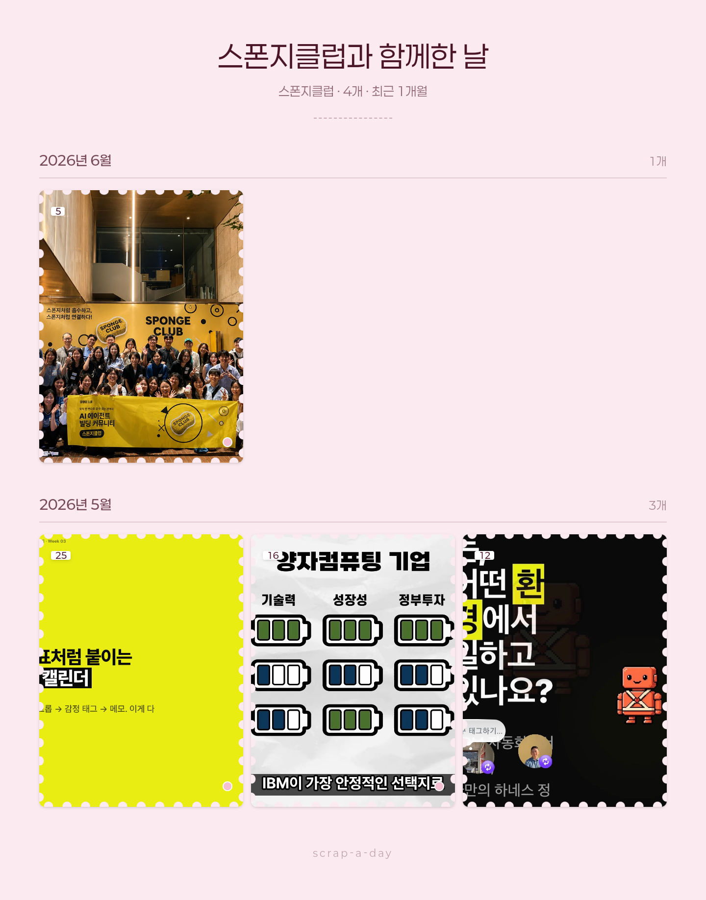

# 5주차 과제 — 리보

## 🤖 AI 초안 (개인 참고용)

> [!ai]+ `/draft MMDD-MMDD`로 채우거나, 이 블록을 지우고 직접 작성
> (이 콜아웃은 본인 참고용입니다. 아래 미션 섹션을 다 채우고 나면 통째로 지우거나 접어두세요.)

---

## 미션1: <스크랩어데이>

### Summary
✅ Post-MVP polish 라운드 완료
   - 특별한 날 17개 + 키치 SVG (발렌타인데이, 화이트데이, 어버이날, 국가공휴일 등 의미있는 날에 어울리는 테마 스티커 반영 및 on,off 기능 적용)
   - per-stamp 스티커 토글
   - 배경 컬러 자유 선택
   - 검색 통계 + 월별 collapse (같이 보낸 사람, 감정 등 각각 검색하면 거기에 맞는 사진 stamp 나오게 검색 및 통계반영)
   - 모바일 overflow 일괄 fix
✅ memory.md + design.md + PRD 동기화 (작업 완료 후, memory와 design.md 파일 생성 및 업데이트 지시함)
✅ 로그인 할때, 메일로 인증 후 사용 기능 부착함(이메일 동기화 > 매직링크, supabase 사용)
### 최종 구현 결과물

### 과정 (타임라인별 + 삽질)
1. 특별한 날 스티커 디자인은 마음처럼 나오지 않아서 이부분은 계속 수정필요함
2.  사용자 통찰 > 디자이너 정답: per-day 토글이 "올해 5/8은 끄겠다 / 켜겠다" 같은 결정이 가능해 보이지만, 사진과의 조합은 그 우표를 만들 때만 결정 가능. 패러다임 자체가 틀린 결정.
"왜 이 위치에 이 기능?" 질문이 중요: 사용자가 "왜 설정에 있어?"라고 물어보지 않았으면 그대로 ship됐을 거. 사용자가 본인 워크플로우를 가장 잘 안다.
3. 17개 SVG 스타일 가이드를 명확히 정해야 일관성 유지: outline 두께 / highlight 위치 / 비율 / drop-shadow 등을 design.md에 박아두면 다음 추가 시 자동으로 일관성 유지.
### 공유할만한 인사이트
1. 화면에 한번에 보이면 좋겠는데 영역을 자꾸 벗어난다거나, 깔끔하게 안되어서 디자인 규칙을 정확하게 명시하니깐 정리가 되었음
2. 폰트 또한 메뉴명, 내용 동 크기가 balance가 맞지 않아서 모든 폰트의 크기, 어떤 폰트사용할지 디자인 규칙 정확하게명시하는게 중요했음
3. 로그인 > 이메일 검증으로 현재 본인의 작업 동기화를 어디에서든 사용할수있게 구현했지만 조금 더 간편한 방법 있는지 고민예정
4. 검색 통계 및 해당 검색에 따른 결과물 다운로드 시, 1년의 경우 data가 많아서 60개까지는 1개로 다운가능, 그 이상은 사용자에게 물어보는걸로 정리했는데 사용자 입장에서의 스터디가 필요할 것 같음
---

## 미션2: <이벤트페이지>

### Summary
이름 변환, 기프트 뽑기, 설문관련해서 data 모두 구글sheet 연동했고, 관련 분석 dashboard 구현까지 완료
이름 변환 > 국적, 단순 생성, sns 공유, 이미지 저장별 data 취합
기프트 뽑기 > 국적, sns 공유, 이미지 저장별 data 취합 (개인정보 동의체크 안받기 위해 id 취합은 안하기로함)
### 최종 구현 결과물

### 과정 (타임라인별 + 삽질)

### 공유할만한 인사이트
1. 중국어 버전에서 SNS 인증(인스타그램)있었는데 카페에서 우연히 만난 중국인에게 전체적인 언어 검수를 부탁하니 중국인들은 인스타그램이 아닌 샤오홍슈를 쓴다고해서 샤오홍슈 계정 개설 및 그와 관련 내용으로 반영 , 그외 어색한 표현도 교정할 수 있음(고객 인터뷰가 중요함을 느꼈음)
---

## 미션3: <오프라인 sns 공유>

### Summary
https://www.instagram.com/p/DZRsU4QP7M6/?igsh=ZzYxcHAzOGdpOGgw
### 최종 구현 결과물

### 과정 (타임라인별 + 삽질)

### 공유할만한 인사이트
