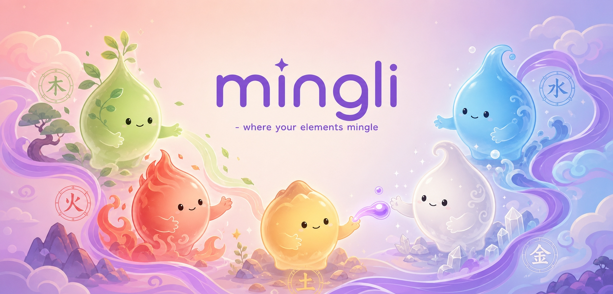

# 6주차 과제 — jinny

## 🤖 AI 초안 (개인 참고용)

> [!ai]+ `/draft MMDD-MMDD`로 채우거나, 이 블록을 지우고 직접 작성
> (이 콜아웃은 본인 참고용입니다. 아래 미션 섹션을 다 채우고 나면 통째로 지우거나 접어두세요.)

---

## 미션1: <온라인 커피챗>

### Summary
- 띵크와의 '대시보드 피드백을 곁들인 pm으로써의 고충' 공유
- 슬로우퀵과의 '마케팅 관점의 초기 서비스 시장 리서치 실무 flow' 공유

앞으로 남은 크루챗
- 에밀리와의 실제 실무에서 활용하고 있는 ai 꿀팁
- 나무와의 총괄 pm으로써의 '너도 그래? 나도야~'

### 최종 구현 결과물
[초반 리서치, 어떻게 시작하는가 — 커피챗](file:///C:/Users/ohrae/Downloads/%EB%A6%AC%EC%84%9C%EC%B9%98_%EB%B0%A9%EB%B2%95%EB%A1%A0_%EC%BB%A4%ED%94%BC%EC%B1%97.html)

### 과정 (타임라인별 + 삽질)
이기적 공유회의 본질 > 설명하면서 나를 채우는 기회
크루챗을 통한 배움의 끝도 없는 유익한 시간
### 공유할만한 인사이트
60%만 알고 이기적 공유를 하면 100%가 될수 있다!

---

## 미션2: <갤러리에 내 최종 산출물 올리기>

### Summary
- https://mingli-peach.vercel.app/ : 사주로 정확하게 나를 알고, 명리학으로 한글이름 작명한다

### *Mingli* — _당신의 요소들이 어우러지는 곳_
전 세계 사용자를 위한 한국 **사주(사주 · 네 기둥)** 해석 및 **한국 이름** 서비스. 생년월일을 입력하면 **16가지 사주 유형 중 하나가** 선택되고 , 사주에 맞는 한국 이름이 추천되며, **공유 가능한 카드도** 제공
### 최종 구현 결과물
- mvp : https://mingli-peach.vercel.app/
- 브랜드 홈페이지 : https://mingli-korean.lovable.app/
	- 외국인 타겟 영문홈페이지
- 브랜드 로고
	-사주로 나를 제대로 알고(i) 명리학으로 한국어 이름을 작명
	
- 캐릭터 (음양오행/일간을 외국인에게 친숙하게 접근 ㅡ오행 정령 어울림 장면 (정서 각인)
	
- 제품 소개
	-Before → After 변환 (가치 이해)
	
- SNS 단컷
	공유 카드 피드 목업 (행동 유도)
	
### 과정 (타임라인별 + 삽질)
 1. 기능 설계
	- **입력** — 단계적 형식 (생년월일 → 성별 → 출생 시간 → 선택 사항인 출생지).
	- **결과 (무료)** — 각 유형별 전통 일러스트가 포함된 16가지 유형의 아이덴티티, 4대 명리 축(음양·신강신약·조후·편중), 사주, 오행의 균형, 궁궐, 숨겨진 자아.
	- **작명 추천** - 차트에 없는 요소(억부용신)를 포함하는 한국 이름을 추천하며, 순수 한국 이름은 툴팁으로 표시됩니다.
	- **공유** — 인스타그램 캐러셀: 팝아트/전통풍 카드 + 족자 이름표, 영어 캡션, 원어민 공유 시트.

2. 로고 생성
	명리학/사주의 정형화된 이론을 기반으로 로고를 만들었더니 딱딱하고 서비스의 톤앤매너에 맞지 않는 형태로 나와서 캐릭터 요소를 추가한 로고버전을 만들어보자는 프롬프트를 다시 생성

	- 이미지 링크 : [https://www.genspark.ai/api/files/s/qgVyqMJb?cache_control=3600](https://www.genspark.ai/api/files/s/qgVyqMJb?cache_control=3600) 젠스파크 링크 : [https://www.genspark.ai/agents?id=51d52c0f-4f9a-4a70-8f79-b4060deea9a4](https://www.genspark.ai/agents?id=51d52c0f-4f9a-4a70-8f79-b4060deea9a4)
    - 초기 로고 이미지
        
        

3. 서비스 상품화
	유저 테스트 위한 추적 가능하게 적용
	
### 공유할만한 인사이트
업무를 위한 ai활용만을 바라보던 시점에서
나를 위한 서비스/ 내가 좋아하는 영역을 구축해봐야겠다는 생각으로 사고의 영역 확대
제일 큰 re:start 포인트 획득

업무 커리어에서는 다각화된 시각을 위해, 삶에서는 평화롭고 나와 나의 사람들을 위한 윤택함을 한스푼 더하여 
결국 인간은 사회적인 동물. 본질은 함께의 힘을 활용하는것으로 귀결.

---

## 미션3: <일주일 미니유닛>

### Summary
블로그 유닛
https://docs.google.com/spreadsheets/d/1QZz70UUq_IiNmjF0s4az5RdNQM1yZUI6Nzyp3x1QfaY/edit?usp=sharing&pli=1&authuser=0
### 최종 구현 결과물
조회수 복구중..!

### 과정 (타임라인별 + 삽질)
1. 네이버 통합검색 로직의 대변화 > 그로 인한 기존 블로그 성과 저조
	이런 어려움을 겪는 분들이 많았음
2. 결국 기회는 타이밍! [미니 유닛]의 장이 열림
	
3. 함께의 힘 ㅡ 나혼자 하면 안했을듯
	트랜드 및 정보 공유, 각자의 액션, 서로 푸시, 의좋은형제(클릭수 높여주기)로 만든 결과
### 공유할만한 인사이트
1. 튼튼한 근거 만들기
	냅다의 영역은 아무래도 기초나 기반이 단단하지 않은 상태이기 때문에
	이 활동을 통해서 만족스러운 결과를 만들기까지의 충분한 기반다지기가 필요하다.
	더 나은 결과를 내기 위해서 구조적인 근거있는 분석을 진행하고,분석한 내용으로 꾸준한 액션을 이행해야 비로소 유의미한 결과가 나온다.
2. 소중한 함께하는 이 사람들
	미니유닛장 [키노]를 비롯해서 서로가 잘되기를 이렇게나 응원하는 사람이 어디있을까
	아무런 계산적인 관계도 기대도 없이 순수한 이런 소중한 관계가 만들어졌다는것이 천운
	스폰지클럽 1기의 종료일은 있지만 이렇게 소중하게 얻은 사람들은 영원히 Forever
	