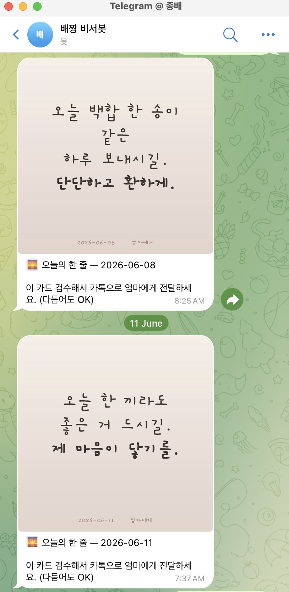
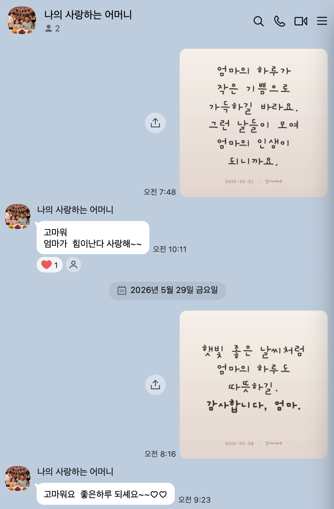

> [!tip] 작성 안내
> - 이 노트 1개 = 산출물 1개입니다.
> - 위 속성에서 **카테고리(OS / 배포사이트 / 기타) 중 해당하는 것 하나만 체크**하세요.
> - **추가 산출물 노트는 옵시디언 터미널에서 Claude Code 실행 후 `/gallery` 로 생성**하세요.
> - 다 채우면 같은 터미널에서 `/submit` 으로 제출합니다.

# ON마음 데일리 비서봇

- **배포 링크**: 로컬 launchd + Telegram Bot (개인 봇이라 공개 URL 없음)

## 📸 캡처 이미지
> 
> 

## 💬 WHY — 왜 만들었나
> ON마음 사이트를 만들었지만, *매일 사이트 열어 카드 만들기*는 또 다른 마찰이었다.
> 진짜 습관이 되려면 *내가 사이트로 가는 게 아니라 카드가 나에게 와야* 했다.
> 텔레그램 봇이 매일 아침 카드를 푸시 → 본인 검수 → 카톡 엄마 전달.
> 이 *반자동 게이트*가 모닝맘의 두 번째 인터페이스가 됐다.

## 📝 한 줄 소개
> 매일 아침 7:30, **카드가 먼저 도착해요** — 본인 검수 후 카톡으로 가족에게 전달하는 *반자동 루프*

## 😣 Before → ✨ After
- **Before**: 매일 사이트 열어서 카드 만들기 (마찰 → 거의 매일 까먹음)
- **After**: 카드가 알아서 옴 → 30초 검수 → 카톡 전달. *한 달 자동 운영 + 엄마 첫 영상편지 응답*

## 🎯 주요 기능 (3~5개)
- **macOS launchd 자동 트리거** — 매일 7:30 AM, 컴퓨터 깨어 있으면 자동 실행
- **메시지 풀 + 날짜 시드 선택** — 10개 메시지 풀에서 `Random(today)`로 *재현 가능 + 중복 방지* (daily-history.json)
- **카드 자동 생성** — `generate.py` + PIL로 손글씨 폰트·테마·테두리 합성
- **텔레그램 봇 푸시** — sendPhoto API로 카드 + 캡션 ("이 카드 검수해서 카톡으로 엄마에게 전달하세요")
- **반자동 게이트** — 본인이 30초 검수 후 카톡 직접 전달. *사람 검수가 마지막 보호장치*

## 🔧 이렇게 만들었어요 (기술 스택)
> Python 3 · macOS launchd plist · Telegram Bot API · PIL(Pillow) · JSON 이력 관리 · Anthropic API(다음 라운드 동적 메시지 생성용)

## 💡 삽질 & 인사이트
> 막혔던 지점, 깨달은 점
- **macOS Sequoia CloudStorage 권한 함정** — `~/Library/CloudStorage/`(Google Drive·iCloud·Dropbox) 안 스크립트는 launchd가 *접근 불가*. GUI 다이얼로그가 없어서 권한 부여 불가능. *일반 홈 디렉토리(`~/morning-mom-bot/`)로 이동*이 유일한 해결책. 다른 자동화 만들 때도 빠질 수 있는 함정이라 메모리에 박아둠.
- **반자동 게이트가 의도된 디자인** — 카카오톡은 개인 자동 전달을 막아둠. *비즈니스 알림톡*은 비용·인증 부담. *사람 검수* 한 번이 오히려 *진정성 보장* + *실수 방지* + *루프 게이트* 역할.
- **메시지 풀 10개 + 날짜 시드** — 매일 다른 메시지지만 같은 날에 두 번 돌려도 같은 결과. 디버깅·재현 쉬움. 다음 라운드는 Anthropic API로 *날씨·시즌·받는 사람 컨텍스트 자동 주입*.
- **첫 영상편지 → 엄마 응답** — 한 달 자동 운영 후, mp4 변환 성공 직후 엄마에게 처음 영상편지 전달. 답장: *"아들 고마워요 고추소독하셨어요,,"*. 4주 동안 만든 도구가 *처음으로 닿아 응답이 돌아온 순간*. 진짜 작동했음의 증거.
- **컨텍스트·루프·관계·양식 + 정체성** — 4주차 셀피쉬클럽 학습한 *LLM 래퍼는 프로덕트가 아니다* 기준에서, 이 봇은 루프(매일 자동)·관계(엄마 검수 게이트)·양식(카드+영상)을 다 갖춘 프로덕트가 됐다.
