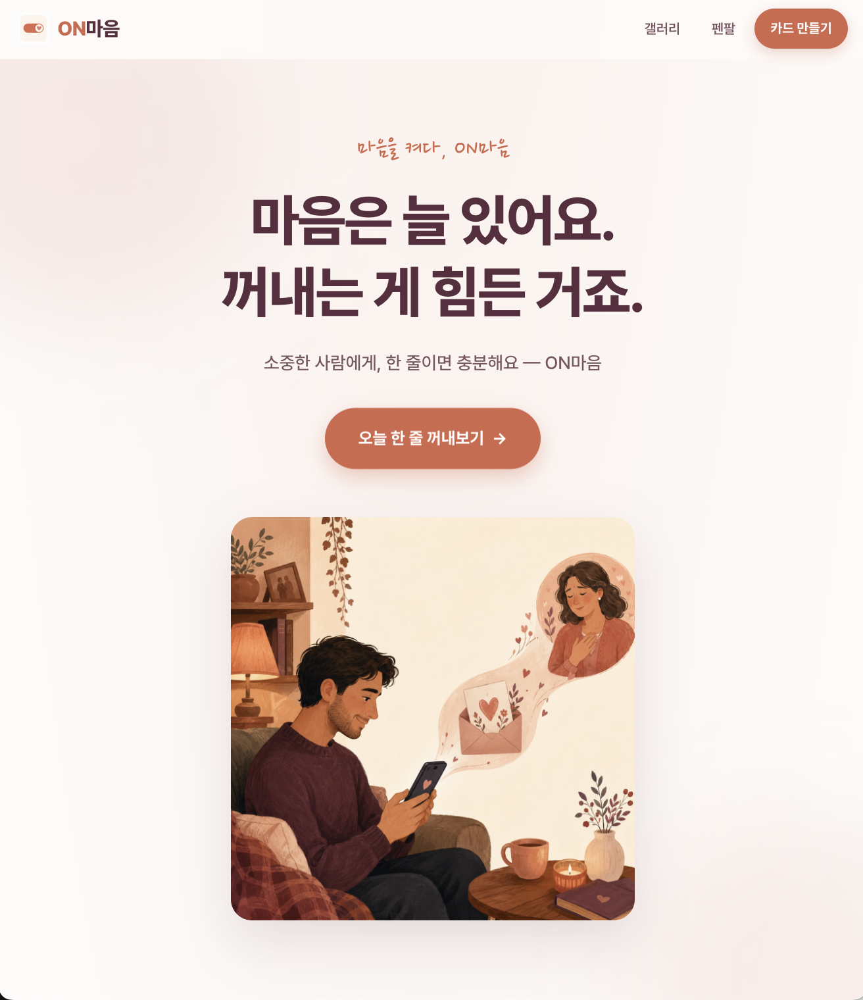
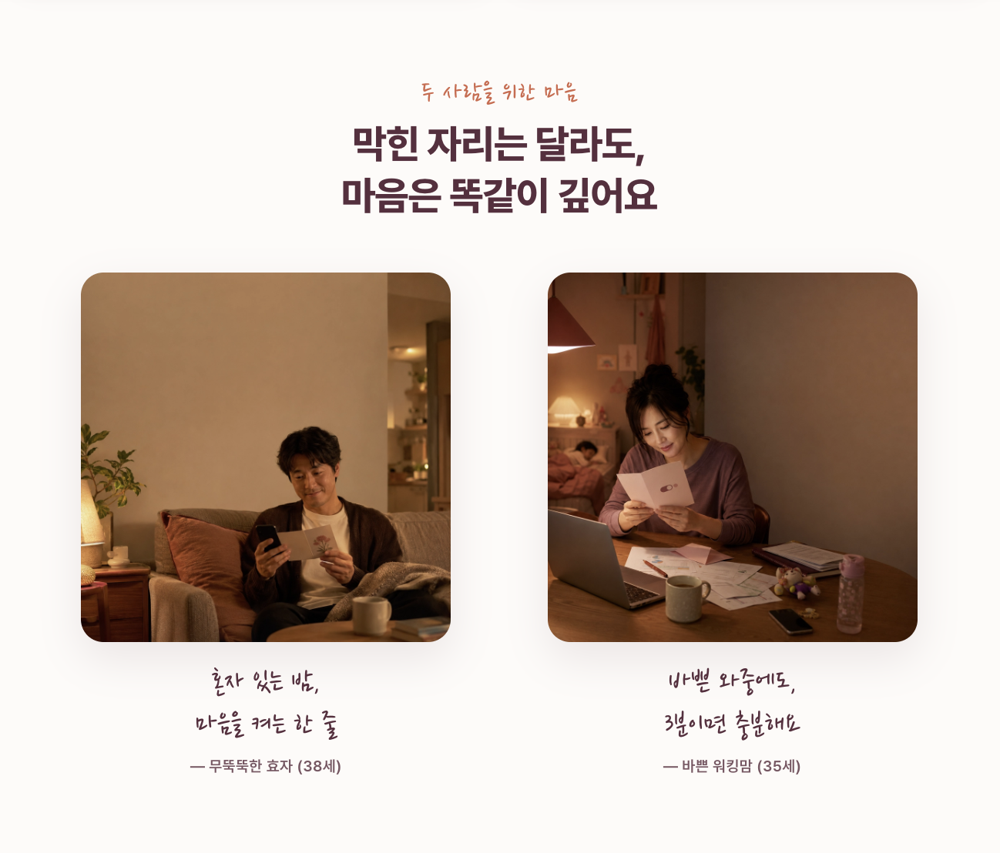
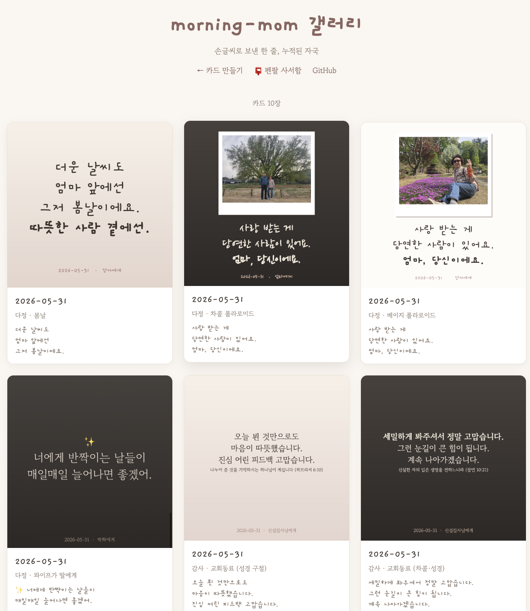

> [!tip] 작성 안내
> - 이 노트 1개 = 산출물 1개입니다.
> - 위 속성에서 **카테고리(OS / 배포사이트 / 기타) 중 해당하는 것 하나만 체크**하세요.
> - **추가 산출물 노트는 옵시디언 터미널에서 Claude Code 실행 후 `/gallery` 로 생성**하세요.
> - 다 채우면 같은 터미널에서 `/submit` 으로 제출합니다.

# ON마음

- **배포 링크**: https://baezzanglion.github.io/morning-mom-web/

## 📸 캡처 이미지
> 
> 
> 

## 💬 WHY — 왜 만들었나
> 시골에 계신 부모님께 매일 안부 한 줄 보내자고 매번 마음먹는데, 막상 못 보냈다.
> 마음은 늘 있는데 *꺼내는 게 힘든* 페인을 직접 풀고 싶었다.
> 4주 동안 본인이 매일 사용하면서 엄마에게 실제 카드를 보냈고,
> 한 달 만에 *엄마의 첫 영상편지 응답*을 받았다. 진정성 자체가 차별점이 됐다.

## 📝 한 줄 소개
> 마음이 없어서가 아니라, 켜는 게 어려웠을 뿐. **한 장이면 충분해요.**

## 😣 Before → ✨ After
- **Before**: 한 달에 한 번 연락드릴까 말까 망설이던 마음
- **After**: 매일 한 줄, 표현이 습관이 됨 (🌱 → 🌿 → 🌸)

## 🎯 주요 기능

### 공감 페이지 (디자인·구조)
- **진정성 직격 Hero + 페르소나 일러스트** — "마음은 늘 있어요, 꺼내는 게 힘든 거죠" + 청년→엄마 한 컷 일러스트 (floaty 애니)
- **페인포인트 → 솔루션 4 카드 + 페르소나 2 카드 (실사)** — ChatGPT 비교 X, *사용자 경험* 직격 + 무뚝뚝한 효자·바쁜 워킹맘 실사 사진
- **식물 성장 3단계 + 폴라로이드 갤러리** — 한 달 → 매일 변화 시각화 + 실제 보낸 카드 6장 (회전+테이프+hover)
- **공감 ↔ 도구 페이지 일관 + 4단계 라이브 보존** — `/` 공감 + `/create.html` 도구 둘 다 ON마음 톤 + `/before-v5·v6·v7/` 옛 버전 라이브 (진화 비교 가능)

### 카드 만들기 도구 (실제 도구 풍부함)
- **카드 양식 다양성** — 배경 6종 (베이지·차콜·핑크·민트·라벤더·밤) + 손글씨 폰트 5종 (개구·고운바탕·나눔펜·나눔붓·하이멜로디) + **성경구절 옵션** (출처 자동 추가, 신앙권 가족·동료용)
- **컨텍스트 자동 주입** — `wttr.in` 날씨 API로 *오늘 서울 기온·날씨* AI 제안에 자동 반영 + 수신자 프로필 LocalStorage 저장 (매번 다시 안 씀)
- **보이스 녹음 → MP4 영상 카드** — 메시지 직접 읽고 녹음 → 카드+보이스 합성 → Vercel Function으로 H.264 mp4 변환 → **카톡에서 inline 자동재생** (엄마 첫 영상편지 응답: *"아들 고마워요"*)

## 🔧 이렇게 만들었어요 (기술 스택)
> Vanilla HTML/CSS/JS · Pretendard + Nanum Pen Script · GitHub Pages · Claude Code · Lovable(브랜드 디자인 레퍼런스) · Vercel Function(mp4 변환)

## 💡 삽질 & 인사이트
> 막혔던 지점, 깨달은 점
- **1-page 기획서를 먼저 손으로** — 쯔니 발표에서 배움. 코드 바로 들어가면 *방향 잃고 잡종 만듦*. 한 페이지 기획서가 14h 작업의 *방향* 결정.
- **ChatGPT 비교 톤 → 사용자 페인 톤** 전환이 결제 동기 직격 — 경쟁자 언급보다 *내 경험과 일치*가 강력.
- **페이지 분리 = 시연 임팩트** — 메인에서 *공감 → CTA 클릭 → 도구로 전환* 모먼트가 외부 공유회 사례화에 효과 큼.
- **`/before-v?/` 라이브 보존 패턴** — Git tag + 폴더 통째 복사 + 같은 GitHub Pages serve. 3단계 진화를 *지금도 비교 가능*. 미래의 자신에게 선물.
- **브랜드 디자인 수업 + Claude Code + Lovable 통합이 완성도 점프 가장 큰 한 방** — 일주일 버닝 마지막에 베이지 단조로움 → 테라코타+플럼 깊이감으로 *프로덕트 톤* 진입.
- **이름이 페인을 풀기도 한다** — "모닝맘"은 *모닝*=아침, *맘*=엄마로 가족 확장과 충돌. "ON마음"은 *마음을 켜다* 메타포라 부부·자녀·친구까지 자연 확장.
- **MP4 변환 = "진짜 닿음"의 게이트** — 카드+보이스 영상을 카톡에서 자동재생시키려고 FFmpeg.wasm 4번 시도·모두 실패 (cross-origin worker 제약). 새벽 마감 30분 전 *서버 변환이 표준*이라 결론 → Vercel Function + ffmpeg-static으로 17초 만에 배포 → 엄마에게 첫 영상편지 전달 → "아들 고마워요" 답장. *클라이언트 만능 아니다, 적절한 게이트를 서버에 두는 게 정답*.
