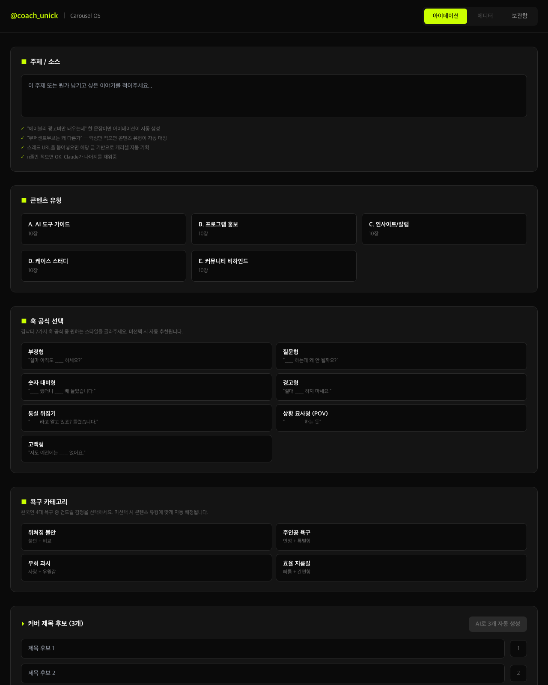

> [!tip] 작성 안내
> - 이 노트 1개 = 산출물 1개입니다.
> - 위 속성에서 **카테고리(OS / 배포사이트 / 기타) 중 해당하는 것 하나만 체크**하세요.
> - **추가 산출물 노트는 옵시디언 터미널에서 Claude Code 실행 후 `/gallery` 로 생성**하세요.
> - 다 채우면 같은 터미널에서 `/submit` 으로 제출합니다.

# 콘텐츠 제작 OS

- **배포 링크**: https://coach-unick-carousel.vercel.app/

## 📸 캡처 이미지

## 💬 WHY — 왜 만들었나
캐러셀 한 세트 만들 때마다 주제 잡고 → 훅 문장 고민하고 → 커버 제목 뽑는 똑같은 과정을 매번 처음부터 반복하는 게 비효율적이었다. 이 반복을 한 번의 흐름으로 시스템화하고 싶었다.

## 📝 한 줄 소개
주제 한 문장만 넣으면 콘텐츠 유형·훅 공식·욕구를 골라 캐러셀 기획부터 커버 제목까지 자동으로 뽑아주는 1인 콘텐츠 제작 OS.

## 😣 Before → ✨ After
- **Before**: 캐러셀 한 편마다 주제·구성·훅·제목을 매번 빈 화면에서 새로 고민 → 발행 전 단계에서 시간이 다 빠짐
- **After**: 주제 한 줄(또는 스레드 URL)만 넣으면 유형 5종 × 훅 7종 × 욕구 4종 조합으로 10장 구성과 커버 제목 후보까지 한 번에 생성

## 🎯 주요 기능 (3~5개)
- **아이데이션 자동 생성**: 한 문장 또는 스레드 URL만 넣으면 캐러셀 기획안 자동 작성 (나머지는 Claude가 채움)
- **콘텐츠 유형 5종 템플릿**: AI 도구 가이드 / 프로그램 홍보 / 인사이트·칼럼 / 케이스 스터디 / 커뮤니티 비하인드 (각 10장)
- **김낙타 7가지 훅 공식**: 부정형·질문형·숫자 대비형·경고형·통설 뒤집기·상황 묘사형(POV)·고백형 중 선택 (미선택 시 자동 추천)
- **한국인 4대 욕구 매칭**: 뒤처짐 불안 / 주인공 욕구 / 우회 과시 / 효율 지름길로 감정 결을 조정
- **커버 제목 3개 자동 생성** + 에디터·보관함으로 작성 → 정리까지 한 흐름

## 🔧 이렇게 만들었어요 (기술 스택)
Next.js, Vercel, Claude API

## 💡 삽질 & 인사이트
- 아직 만들다 만 상태(WIP) — 아이데이션·기획 흐름까지는 잡혔고 에디터/보관함은 다듬는 중.
- "옵션을 다 채우게 하면 안 쓴다"는 걸 느낌. 그래서 **미선택 시 자동 추천**으로 빈칸을 Claude가 메우게 한 게 핵심 결정이었다.
