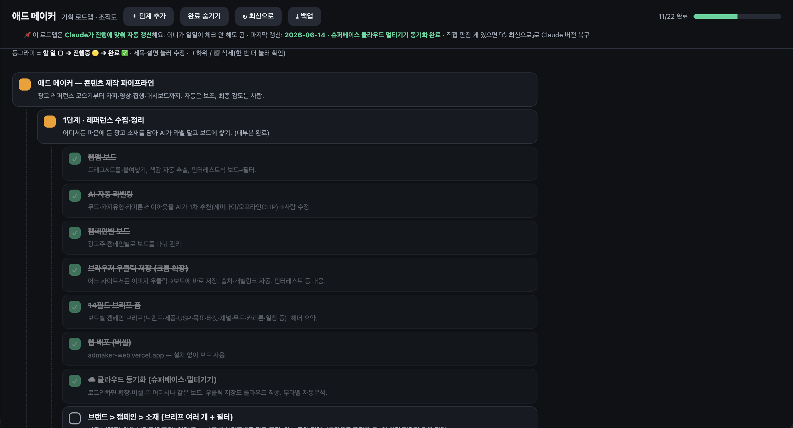
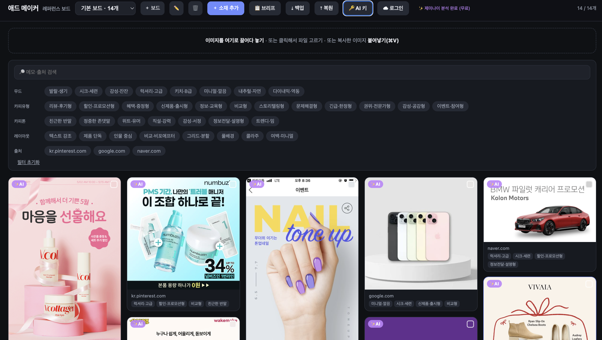
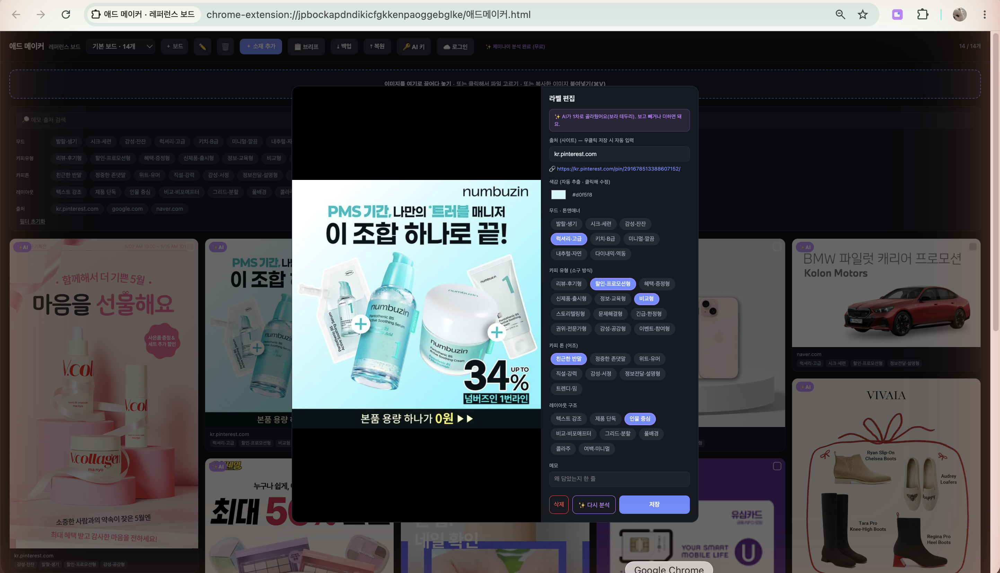

> [!tip] 작성 안내
> - 이 노트 1개 = 산출물 1개입니다.
> - 위 속성에서 카테고리(OS / 배포사이트 / 기타) 중 해당하는 것 하나만 체크하세요.
> - 추가 산출물 노트는 옵시디언 터미널에서 Claude Code 실행 후 `/gallery` 로 생성하세요.
> - 다 채우면 같은 터미널에서 `/submit` 으로 제출합니다.

# 애드 메이커 (레퍼런스 보드)

- 배포 링크 (설치 없이 웹으로): https://admaker-web.vercel.app/
- 🧩 크롬 확장 받기 (우클릭 저장까지): https://naver.me/FKGTdA5w

## 📸 캡처 이미지

> 애드 메이커 = 6단계 파이프라인 전체. 이번에 만든 건 그중 1단계(레퍼런스 수집·정리) — 거의 완성.

> 우클릭으로 담은 레퍼런스 + AI 라벨 + 필터.

> 무드·카피유형·카피톤·레이아웃을 AI가 자동 분류(보라 테두리), 클릭해 수정.

## 💬 WHY — 왜 만들었나
> 광고 콘텐츠 작업은 레퍼런스 찾고 모으는 발품에 시간이 다 샘. 특정 광고주에 안 묶이고 콘텐츠 만드는 전 과정을 직접 굴리는 나만의 파이프라인이 애드 메이커. 이번엔 그 맨 앞 1단계(레퍼런스 수집·정리)를 만듦.

## 📝 한 줄 소개
> 어디서든 광고 이미지를 우클릭 한 번으로 담으면 AI가 무드·카피·레이아웃을 자동 분류해 보드에 쌓아주는 도구. 애드 메이커 파이프라인의 1단계(레퍼런스 수집·정리).

## 🗺 전체 그림 — 애드 메이커는 6단계, 이번엔 1단계
> 애드 메이커 = 광고 콘텐츠를 만드는 전체 파이프라인(6단계). 이번에 만든 건 그 맨 앞 1단계. 자동은 보조, 고르는 감도는 사람 몫.
> 1. 레퍼런스 수집·정리 — 이번에 만든 것
> 2. 인사이트 추출
> 3. 카피·기획
> 4. 영상·이미지 초안
> 5. 광고 집행
> 6. 대시보드

## 😣 Before → ✨ After (1단계)
- Before: 마음에 든 광고를 캡처해 폴더에 쌓아만 둠 → 정작 기획할 땐 못 찾고 분류도 안 됨.
- After: 이미지 우클릭 → 보드에 바로 저장(출처·링크 자동) → AI가 무드·카피유형·톤·레이아웃 라벨링 → 필터로 원하는 결을 바로 꺼냄. 로그인하면 어느 기기서나 같은 보드.

## 🎯 주요 기능 (1단계 · 레퍼런스 수집·정리)
- 어디서든 우클릭 저장 — 크롬 확장으로 아무 사이트 이미지를 우클릭해 보드에 바로 (출처·링크 자동, 핀터레스트처럼 가린 이미지도 대응)
- AI 자동 라벨링 — 무드·카피유형·카피톤·레이아웃을 제미나이가 1차 분류, 사람이 수정
- 캠페인별 보드 + 14필드 브리프 — 광고주·캠페인별로 나눠 관리, 보드마다 브리프(목표·타겟·채널 등) 기록
- 멀티기기 클라우드 동기화 — 로그인하면 확장·웹·폰 어디서나 같은 보드 (Supabase)
- 색감 자동 추출 + 필터 — 카드별 대표 색, 라벨·출처로 핀터레스트식 필터

## 🔧 이렇게 만들었어요 (기술 스택)
- Claude Code, HTML/CSS/JS(단일 파일 앱), Chrome Extension(MV3), IndexedDB, Supabase, Vercel, Google Gemini API

## 💡 삽질 & 인사이트
- 확장 페이지가 클라우드에 직접 못 닿아 로그인이 멈춤. 닿을 수 있는 백그라운드를 경유시켜 해결 — 막힌 길엔 우회로가 있음.
- 크롤링 자동수집은 약관·저작권 회색지대. "사람이 본 걸 우클릭으로 담기"로 바꿔 합법성과 범용성을 둘 다 잡음.
- 비개발자가 직접 쓰려면 팝업·터미널 없이 화면 안에서 끝나야 함. 작은 UI 결정이 "쓸 수 있는가"를 가름.
