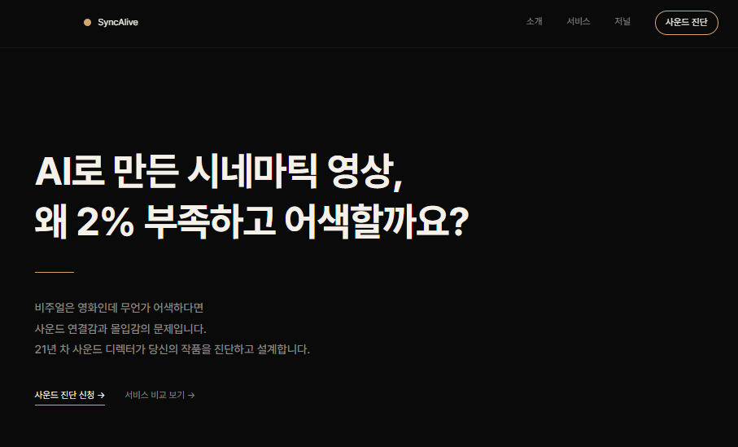
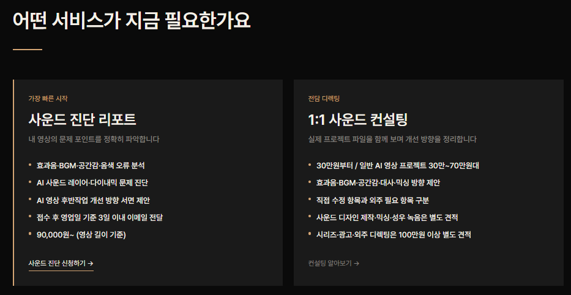
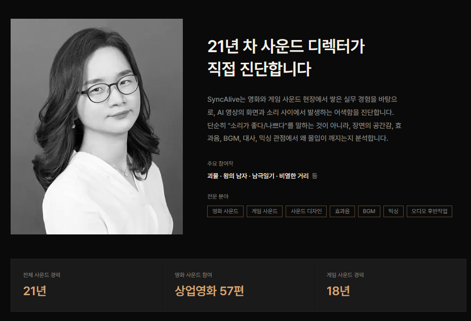

> [!tip] 작성 안내
> - 이 노트 1개 = 산출물 1개입니다.
> - 위 속성에서 **카테고리(OS / 배포사이트 / 기타) 중 해당하는 것 하나만 체크**하세요.
> - **추가 산출물 노트는 옵시디언 터미널에서 Claude Code 실행 후 `/gallery` 로 생성**하세요.
> - 다 채우면 같은 터미널에서 `/submit` 으로 제출합니다.

# syncalive

- **배포 링크**: (https://syncalive.com/)

## 📸 캡처 이미지
> 

## 💬 WHY — 왜 만들었나
> AI 영상은 누구나 만들 수 있게 됐지만, 사운드 때문에 감정과 몰입이 무너지는 순간이 너무 많다. AI 영상 제작자가 자기 작품의 완성도를 포기하지 않도록, 사운드의 문제를 알아보고 고칠 수 있게 돕기 위함.

## 📝 한 줄 소개
> **AI 영상 제작자에게 21년 차 사운드 디렉터의 진단 리포트와 개선 방향을 제공하여, 비주얼만큼 사운드도 완성도 있는 영상을 만들 수 있게 해드립니다.**

## 😣 Before → ✨ After
- **Before**: 
 -AI 영상 제작자는 영상은 평가받지만 사운드는 방치된다.
 -사운드 문제를 발견하기 어렵고 전문가 도움을 받기도 어렵다.
 -결국 감으로 수정하거나 포기한다.
- **After**: 이 도구로 달라진 점
-전문가의 관점으로 작품을 진단받는다.
-사운드 문제를 발견하고 개선 방향을 얻는다.
-영상의 전달력과 몰입도를 높여 작품 경쟁력을 강화한다.

## 🎯 주요 기능 (3~5개)
-진단 신청 폼 및 이메일 수신 자동화
-Google Analytics 4(GA4) 연동
-Google Tag Manager(GTM) 연동
-SEO 최적화 구조 적용
-반응형 웹 구현
-서비스 소개 및 CTA 설계

## 🔧 이렇게 만들었어요 (기술 스택)
>  Next.js, Supabase, Vercel

## 💡 삽질 & 인사이트
> 상품 변경이나 GA4, GTM 연동은 추후에 이루어짐. 물론 클로드코드가 알아서 잘 해줬지만, 처음부터 상품 설계를 확정짓고, 사이트 구축에 필요한 기능이 무엇인지 알았다면 불필요한 시간 낭비는 없었을 듯 

