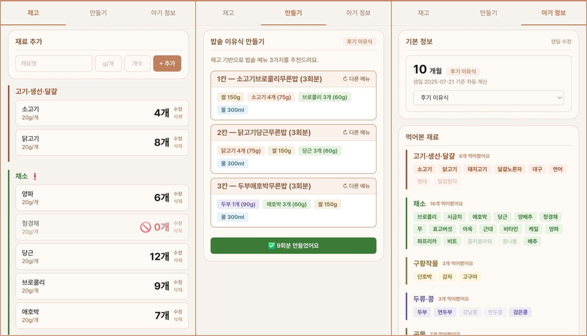

> [!tip] 작성 안내
> - 이 노트 1개 = 산출물 1개입니다.
> - 위 속성에서 **카테고리(OS / 배포사이트 / 기타) 중 해당하는 것 하나만 체크**하세요.
> - **추가 산출물 노트는 옵시디언 터미널에서 Claude Code 실행 후 `/gallery` 로 생성**하세요.
> - 다 채우면 같은 터미널에서 `/submit` 으로 제출합니다.

# 뚝딱(이유식 플래너)

- **배포 링크**: [https://ddukddak2.netlify.app](https://ddukddak2.netlify.app/)
- 소개페이지 링크 : https://ddukddak2page.netlify.app/
## 📸 캡처 이미지
> 스크린샷을 여기에 붙여넣기

## 

## 💬 WHY — 왜 만들었나
> 누구의 어떤 문제를 풀려고 했는지, 한 줄로.
> 예: "혼자 하면 며칠 안에 포기하는 사람도 끝까지 가게 만들고 싶었다."

매끼 이유식을 준비할 때 발생하는 인지 부하 — 어떤 큐브가 몇 개 남았는지, 이번 주에 처음 먹여볼 재료는 뭔지, 재료들간 궁합은 어떤지, 밥솥으로 만들 땐 3칸에 각각 뭘 넣어야 할지 — 를 없애려고 만들었다.
## 📝 한 줄 소개
> 카드에 보일 1~2문장

이유식 먹는 아기 부모를 위한 큐브 재고 관리 + 밥솥 이유식 메뉴 추천 플래너. 
재고 확인 → 추천 → 세팅 → 차감까지 30초.

## 😣 Before → ✨ After
- **Before**: 이 도구가 없을 때의 불편/문제
- **After**: 이 도구로 달라진 점

| Before                    | After                      |
| ------------------------- | -------------------------- |
| 냉동실 열어서 큐브 직접 세기          | 앱에서 재고 탭으로 한눈에 확인          |
| 새재료·알레르기·궁합 고려해서 직접 메뉴 짜기 | 월령·알레르기·먹어본 재료 기반 자동 추천    |
| 어떤 재료 몇 개 남았는지 노트에 수기로 기록 | 밥솥 3칸 세팅 후 "만들었어요" → 자동 차감 |
| 장봐야 할 재료 따로 메모            | 부족 재료 표시                   |

## 🎯 주요 기능 (3~5개)
1. **큐브 재고 관리** — 육류, 채소 등 카테고리화, 수정/삭제, 잔여 개수 표시
2. **밥솥 3칸 메뉴 추천** — 월령(이유식 단계)에 맞는 레시피 필터링, 아직 안 먹어본 재료 포함 메뉴 우선 추천, 알레르기 재료 자동 제외
3. **큐브 차감** — 추천 메뉴 "만들었어요" 클릭 시 사용한 재료 수량 자동 차감
4. **아기 프로필** — 생일·월령 자동계산, 먹어본 재료 누적, 알레르기 목록 관리

## 🔧 이렇게 만들었어요 (기술 스택)
> 사용한 도구·기술을 쉼표로. 예: Next.js, Supabase, Vercel

|항목|선택|
|---|---|
|언어|Vanilla JS, HTML5, CSS3 (프레임워크 없음)|
|상태 관리|localStorage|
|폰트|Pretendard (CDN)|
|배포|Netlify (브랜치 자동 배포)|
|빌드|없음 (파일 직접 서빙)|
|AI 의존|없음 (규칙 기반 추천 로직)|

## 💡 삽질 & 인사이트
> 막혔던 지점, 깨달은 점.
- 기술이슈
	- **PC로 만들다가 모바일 QA 하면서 이슈들이 많이 생김** — Android number input 찌그러지는 이슈, 온보딩을 다시 보기 위해 데이터 리셋하기 어려운 이슈 등. 클로드에게 말하면 수정해주거나 해결 방법을 알려주지만, 처음부터 이런 이슈 없이 만들어주면 얼마나 좋을까? 완벽하지 않다는 걸 새삼 느꼈다. 
	- **기능 수정하면서 잔여 코드가 남아 정리 요청 필요** — 클로드가 수정되어 없어진 예전 기능 기반으로 말할 때가 있어서, 코드에 남아있는게 있다면 정리해달라고 함.
- 제품 관점
	- 처음에는 냉장고 재료를 공유해 어른 식단까지 추천하려 했다가, 범위가 너무 커져서 이유식으로 다시 초점을 좁혔다. **MVP 먼저, 확장은 나중**이 옳았다.
	- Claude Code로 첫 프로덕트를 만들면서 느낀 것: 내가 실제 고객인 앱을 만드는 건 장점이자 함정. 고객으로서 "원하는 것"과 만드는 사람으로서 "지금 당장 가능한 것"을 분리하는 게 생각보다 어려웠다.
