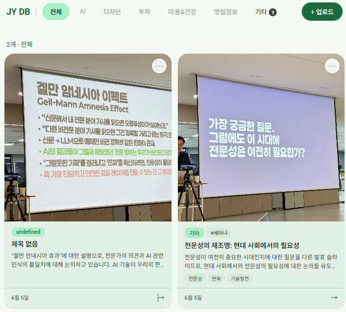
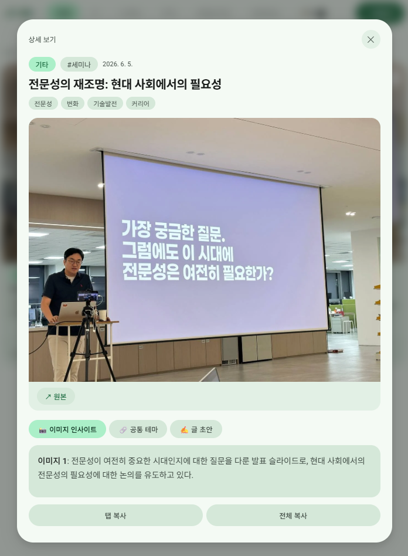

> [!tip] 작성 안내
> - 이 노트 1개 = 산출물 1개입니다.
> - 위 속성에서 **카테고리(OS / 배포사이트 / 기타) 중 해당하는 것 하나만 체크**하세요.
> - **추가 산출물 노트는 옵시디언 터미널에서 Claude Code 실행 후 `/gallery` 로 생성**하세요.
> - 다 채우면 같은 터미널에서 `/submit` 으로 제출합니다.

# JYCREATBOARD

- **배포 링크**: 

## 📸 캡처 이미지
> 

## 💬 WHY — 왜 만들었나
> 세미나에서 열심히 찍은 사진들이 갤러리에 묻혀 결국 한 번도 안 꺼내보게 되는 나 자신을 위해.

## 📝 한 줄 소개
> 텔레그램으로 사진 보내면 AI가 알아서 분석·분류해서 쌓아주는, 나만의 인사이트 캡처 DB.

## 😣 Before → ✨ After
- **Before**: 세미나·강연에서 슬라이드 사진을 잔뜩 찍어도 갤러리에 묻혀버림. 나중에 찾으려면 스크롤 고행이고, 결국 "어디 있더라?" 하다 포기.
- **After**: 찍자마자 텔레그램으로 전송 → AI가 내용 분석 + 카테고리 분류 + 자동 저장. 나중에 웹에서 탭별로 바로 꺼내볼 수 있음.

## 🎯 주요 기능 (3~5개)
-텔레그램에 사진 보내면 GPT-4o mini가 자동 분석·요약
-투자 / 세미나 / 기타 카테고리 자동 분류
-웹 뷰어에서 탭별로 캡처 모아보기
-웹에서 직접 업로드도 가능 → GitHub에 자동 저장
-이미지 512px 압축으로 AI 비용 최소

## 🔧 이렇게 만들었어요 (기술 스택)
> Vanilla JS + HTML (프론트, 단일 파일), Vercel Serverless Functions (백엔드), GPT-4o mini (이미지 분석 AI), GitHub API (이미지 저장소), Telegram Bot API (입력 채널), sharp (이미지 압축)

## 💡 삽질 & 인사이트
> 텔레그램에서 사진 여러 장을 한 번에 보내면 Vercel 함수가 장마다 따로 실행돼서 "누가 대표로 처리할지"를 정하는 게 진짜 어려웠음. GitHub 락 파일, TTL 락, JSON 원자적 업데이트까지 4가지 방법을 다 써봤는데 전부 실패. 결국 깨달은 건 서버리스 환경에서는 인스턴스 간 공유 상태를 GitHub 파일로 흉내내는 데 한계가 있다는 것. 진짜 원자적 조작이 필요하면 Vercel KV(Redis) 같은 걸 써야 한다.
