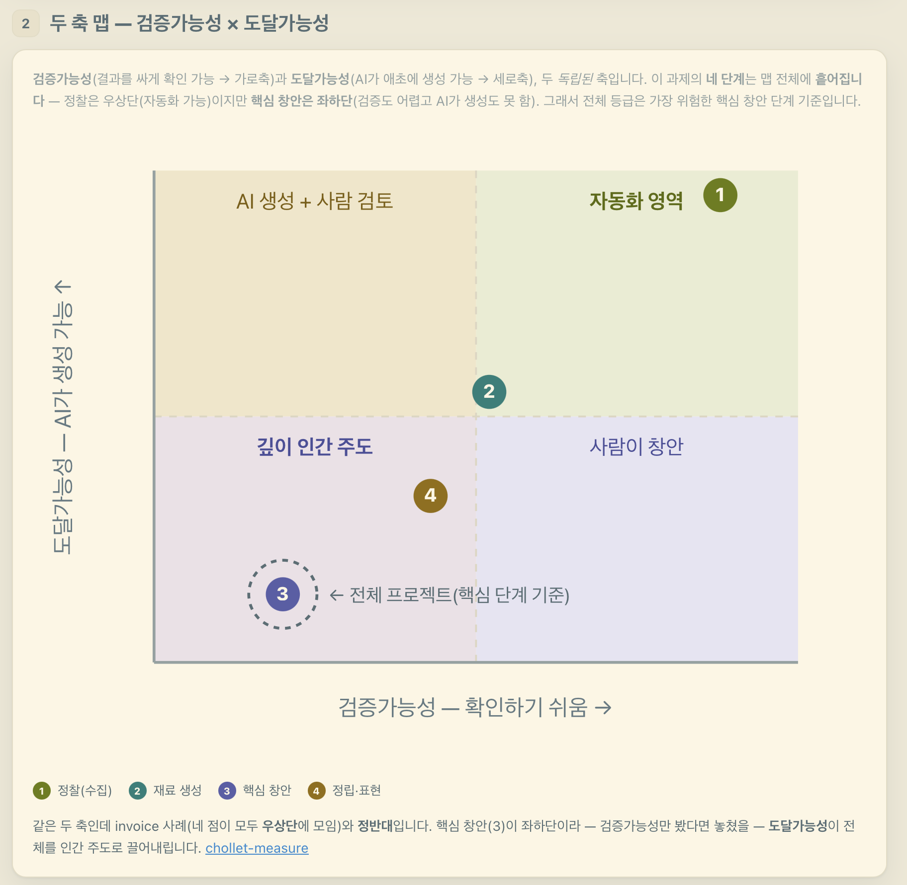

> [!tip] 작성 안내
> - 이 노트 1개 = 산출물 1개입니다.
> - 위 속성에서 **카테고리(OS / 배포사이트 / 기타) 중 해당하는 것 하나만 체크**하세요.
> - **추가 산출물 노트는 옵시디언 터미널에서 Claude Code 실행 후 `/gallery` 로 생성**하세요.
> - 다 채우면 같은 터미널에서 `/submit` 으로 제출합니다.

# Automation Level Advisor

- **배포 링크**: https://github.com/MinwooPark2026/automation-level-advisor.git

## 📸 캡처 이미지
> 

## 💬 WHY — 왜 만들었나
AI로 자동화하기전에 자동화가 가능한 문제인지, 어느정도까지 가능한지 체크하기 위해

## 📝 한 줄 소개
일상 언어로 작업을 설명하면, 짧은 인터뷰로 "AI 혼자 vs 사람 개입" 수준을 진단하고 바로 쓸 계획서와 리포트를 만들어 주는 비개발자용 AI 자동화 컨설턴트 Skill.

## 😣 Before → ✨ After
- **Before**: 자동화가 안되는 문제인지 모르고 자동화 시도하다 고생하고 실패함
- **After**: 사전진단

## 🎯 주요 기능 (3~5개)
- 일상 언어로 작업 설명 → 짧은 인터뷰로 자동화 가능성·필요한 사람 개입 수준 진단
- ROI가 아니라 **감독/개입 수준(oversight)** 축으로 판단 — "AI 혼자" ~ "사람 주도" 스펙트럼에서 위치 잡기
- **검증 가능성(verifiability) + 도달 가능성(reachability)** 2축 — AI가 애초에 만들어 낼 수 있는 답인지까지 진단
- 바로 쓸 수 있는 실행 계획 + 프로젝트 시작용 리포트 2종 자동 생성
- 비개발자 친화: 전문용어는 1줄 설명, 못 하는 건 솔직하게. Claude Code·OpenAI Codex 양쪽 동작

## 🔧 이렇게 만들었어요 (기술 스택)
Claude Code / OpenAI Codex **Skill**(`SKILL.md` + `agents/openai.yaml`), Markdown 기반. 별도 서버·프레임워크 없이 AI 에이전트가 읽어 실행.

## 💡 삽질 & 인사이트
- 자동화 판단의 진짜 축은 "비용 대비 가치(ROI)"가 아니라 **"사람이 어디까지 개입해야 하는가"**였다.
- AI가 못 푸는 문제는 따로 있다 — 학습 데이터 **밖**의 답은 재조합이 아니라 외삽이 필요해 프롬프트를 아무리 다듬어도 닿지 못한다(**reachability**). 그런 건 사람이 먼저 만들어야 한다.
