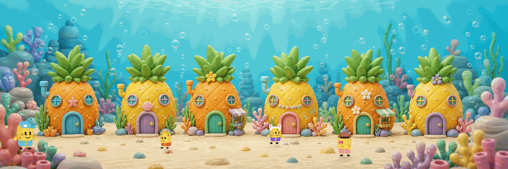

# GIF 클릭/호버 인터랙션 구현 메모

## 목표

`side walking sponges.gif` 장면을 그대로 기준 이미지로 쓰고, 기존 Sponge Village 사이트에서 의도했던 두 동작을 얹는다.

- hover/focus: 해당 파인애플 집만 강조된다.
- click/tap: 해당 조 상세 페이지로 넘어간다.

## 산출물

- HTML: `gif-click-hover-demo.html`
- 기준 이미지: `assets/side-walking-sponges.gif`
- 경량 배경 fallback: `assets/side-walking-sponges.webp`

## 구현 방식

GIF를 실제 ``로 렌더링하고, 그 위에 6개의 투명 `<a>` 영역을 절대 좌표로 올렸다.

이 방식의 장점은 원본 GIF의 움직임과 질감을 그대로 보존하면서도, 링크와 hover/focus 접근성을 HTML 레벨에서 처리할 수 있다는 점이다.

```html
<div class="village-frame">
  
  <a class="hotspot" href="?team=1" aria-label="1조 상세 페이지로 이동"></a>
  <a class="hotspot" href="?team=2" aria-label="2조 상세 페이지로 이동"></a>
</div>
```

## 클릭 이동

데모 파일에서는 정적 HTML 하나만으로 이동이 보이도록 `?team=1`부터 `?team=6`까지 URL query를 사용했다.

실제 사이트에 붙일 때는 각 링크만 서비스 경로로 바꾸면 된다.

```html
<a class="hotspot" href="/teams/1" aria-label="1조 상세 페이지로 이동"></a>
```

React/Next.js 컴포넌트에서는 기존 데이터의 `href`를 그대로 넣으면 된다.

```tsx
const teams = [
  { name: "1조", href: "/teams/1" },
  { name: "2조", href: "/teams/2" },
  { name: "3조", href: "/teams/3" },
  { name: "4조", href: "/teams/4" },
  { name: "5조", href: "/teams/5" },
  { name: "6조", href: "/teams/6" },
];
```

## 호버 강조

집 이미지 자체를 확대하지 않고, 투명 링크 영역의 `::before`와 `::after`만 켠다.

- `::before`: 밝은 radial overlay, 컬러 ring, glow
- `::after`: 바닥 그림자
- `:hover`: 마우스 사용자
- `:focus-visible`: 키보드 사용자

```css
.hotspot:hover::before,
.hotspot:hover::after,
.hotspot:focus-visible::before,
.hotspot:focus-visible::after {
  opacity: 1;
  transform: scale(1.01);
}
```

## 좌표

좌표는 1440 x 480 GIF 기준의 비율 값이다. 그래서 화면 크기가 바뀌어도 클릭 영역이 이미지와 함께 비례해서 줄어든다.

| 조 | left | top | width | height |
|---:|---:|---:|---:|---:|
| 1조 | 5.35% | 18.6% | 12.45% | 62.8% |
| 2조 | 24.55% | 18.7% | 12% | 62.8% |
| 3조 | 38.7% | 18.3% | 12.05% | 63.2% |
| 4조 | 52.95% | 18.8% | 12% | 62.7% |
| 5조 | 67.2% | 18.6% | 12.05% | 62.9% |
| 6조 | 82.35% | 18.3% | 12.15% | 63.2% |

## 붙일 때 체크할 것

- `href`를 실제 조 상세 URL로 교체한다.
- 팀 수가 6개보다 달라지면 hotspot 좌표를 다시 잡는다.
- GIF를 그대로 쓰면 파일이 약 9.5MB라서 운영 환경에서는 webp/mp4 변환도 검토한다.
- 단순 장식 이미지이므로 GIF ``의 `alt`는 비워두고, 각 링크의 `aria-label`에 이동 목적을 넣는다.
