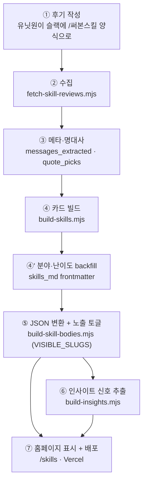

# 01 · 파이프라인 — 후기가 카드가 되기까지

> [정본 표지로](README.md)

슬랙 후기 한 건이 홈페이지 카드와 인사이트가 되는 전체 경로다. 각 단계가 무슨 일을 하고, 결과물이 무엇이며, 자동인지 수동인지 정리한다.

---

## 단계별 흐름

| 단계 | 무슨 일 | 결과물 |
|------|---------|--------|
| ① 후기 작성 | 유닛원이 슬랙에 `/써본스킬` 양식으로 후기를 올린다 | 슬랙 메시지 |
| ② 수집 | 스크립트가 슬랙 채널을 통째로 긁어 `raw_data.md`에 채운다 | 원본 데이터(박제) |
| ③ 메타·명대사 | 후기에서 카드용 정보(작성자·스킬명)와 명대사를 정리한다 | messages_extracted / quote_picks |
| ④ 카드 빌드 | 원본을 합쳐 카드별 문서를 만든다 | `skills_md/{슬러그}.md` |
| ④' 분야·난이도 | 새 카드의 분야·난이도 칸을 채운다(안 채우면 필터에서 빠짐) | 보강된 카드 문서 |
| ⑤ JSON 변환·노출 | 카드 문서를 홈페이지용 JSON으로 바꾸고, "보일 카드"만 표시 | `skills.generated.json` 외 |
| ⑥ 인사이트 | 카드를 가로질러 신호(최다 사용·분야 분포·솔직 후기)를 뽑아 문장으로 다듬는다 | `insights.generated.json` |
| ⑦ 배포 | main에 합치면 Vercel이 홈페이지를 다시 빌드해 올린다 | `/skills/` 페이지 |

---

## 무엇이 자동이고 무엇이 수동인가

| 작업 | 누가 | 자동? |
|------|------|:----:|
| 슬랙에서 후기 긁어 raw_data에 넣기 | GitHub Action(매일) | 완전 자동 |
| 명대사 고르기 (quote_picks) | AI 후보 → 운영자 확인 | 반자동 |
| 작성자·스킬명 메타 정리 | AI/사람 | 반자동 |
| 카드 문서 만들기 (build-skills) | 운영자 명령 1회 | 트리거만 수동 |
| 분야·난이도 채우기 | AI 후보 → 운영자 확인 | 반자동 |
| **화면에 보일지 결정 (VISIBLE_SLUGS)** | **운영자 직접** | 수동 |
| JSON 변환 (build-skill-bodies) | 빌드가 자동 | 완전 자동 |
| 인사이트 신호 뽑기 (build-insights) | 스크립트가 숫자·분포만 출력 | 완전 자동 |
| 인사이트 문장 쓰기 | AI가 신호로 2~3문장 → 운영자 확인 | 반자동 |
| 홈페이지 빌드·배포 | Vercel | 완전 자동 |

---

## 조용한 누락 — 가장 흔한 실패

자동인 건 ②수집까지다. ③메타·명대사(messages_extracted·quote_picks)는 **사람·AI가 손으로** 채운다. 여기서 한 건을 빠뜨려도 **빌드는 멀쩡히 성공한다** — 그 후기만 카드에서 조용히 빠질 뿐 아무 경고가 없다. "잘 도는 줄 알았는데 비어 있더라"의 정체가 이것이다.

그래서 `check-gaps.mjs`가 그 신호 역할을 한다(빠진 곳을 종료코드 1로 알림). 세 가지를 본다:

| 점검 | 무엇을 잡나 | 흔한 원인 |
|------|-----------|----------|
| ① 미반영 후기 | 매핑된 **최신 ts 이후** 들어온 raw_data 후기인데 messages_extracted에 없음 | ③ 수동 backfill을 빠뜨림 |
| ② 카드 미생성 | messages_extracted '써본스킬' slug인데 quote_picks에 인용 없음 | 명대사 선정을 빠뜨림 |
| ③ 빈 카드 | visible인데 본문(`## 주요 내용`)이 빔 | raw_data 마커가 비표준(`:label:`·`:test_tube:` 등)이라 본문이 안 잡힘 |

> ①이 역대 전체가 아니라 "최신 ts 이후"만 보는 이유: raw_data엔 후기/공유 구분 플래그가 없어(구분은 사람이 messages_extracted에서 한다), 역대 미매핑엔 의도적으로 제외한 공유·공지가 섞인다. 매핑 최신 ts를 기준선으로 삼아야 "이번에 새로 긁혀 들어왔는데 빠뜨린 것"만 정확히 잡힌다. 사용법은 [03-operations](03-operations.md) 운영자 절.

---

## 데이터 출처 원칙

- **데이터 출처는 `web` 한 곳.** 홈페이지(`_site`)는 `web`이 만든 JSON을 읽어 쓴다. 화면을 바꾸려면 `web`에서 빌드해 JSON을 갱신하고 커밋해야 한다.
- **흐름(flow) 정의는 단일 소스.** `web/src/data/skill-flow.json` 한 파일을 web 카드·`_site` 카드·인사이트 신호가 공용으로 읽는다. 흐름 문구를 고치려면 이 파일 하나만 수정한다.

---

## 관련 파일 위치

| 구분 | 경로 |
|------|------|
| 슬랙 수집 스크립트 | `06_unit/데굴데굴/web/scripts/fetch-skill-reviews.mjs` |
| 카드 빌드 스크립트 | `06_unit/데굴데굴/web/scripts/build-skills.mjs` |
| 누락 점검 스크립트 | `06_unit/데굴데굴/web/scripts/check-gaps.mjs` |
| JSON 변환 스크립트 | `06_unit/데굴데굴/web/scripts/build-skill-bodies.mjs` |
| 인사이트 신호 스크립트 | `06_unit/데굴데굴/web/scripts/build-insights.mjs` |
| 원본 데이터 | `06_unit/데굴데굴/스킬인사이트/{raw_data, messages_extracted, quote_picks}.md` |
| 카드 문서 | `06_unit/데굴데굴/스킬인사이트/skills_md/` |
| 생성 JSON | `06_unit/데굴데굴/web/src/data/{skills, skill-bodies, insights}.generated.json` |
| 흐름 데이터(단일 소스) | `06_unit/데굴데굴/web/src/data/skill-flow.json` |
| 빌드 명령어(슬래시) | `.claude/commands/build-skills.md` |
| 자동 수집 워크플로우 | `.github/workflows/fetch-skill-reviews.yml` |
| 홈페이지 화면 | `_site/src/pages/skills.astro` + `_site/src/lib/skills-generated.ts` |
