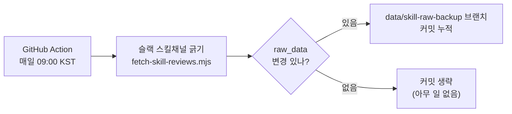

# 03 · 운영 — 사용법과 자동화

> [정본 표지로](README.md)

누가 무엇을 하면 되는지, 그리고 자동화가 어떻게 도는지 정리한다.

---

## 유닛원 (후기 쓰는 사람)

슬랙 채널에 **`/써본스킬`** 양식대로 후기만 올리면 끝. 나머지는 운영이 처리한다.

- `:pushpin:` 한줄 요약
- `:mag:` 주요 내용
- `:briefcase:` 내가 써본 상황 + 결과
- `:link:` 링크 / 스크린샷

> 양식(마커)을 지켜야 카드 본문이 제대로 만들어진다. 채널 상단 고정 템플릿 참고.

---

## 운영자

1. **수집** — 자동(아래 자동화 참조). 수동으로 즉시 긁으려면 `web`에서 `node scripts/fetch-skill-reviews.mjs`.
2. **명대사·메타 정리** — 새 후기의 명대사를 `quote_picks.md`에 추가한다. **quote_picks에 없는 스킬은 카드가 안 생긴다.**
3. **빌드~검증~노출~인사이트** — `/build-skills` 한 번이면 ① 마커 검증 → ② 미리보기 승인 → ③ 빌드 → ④ 분야·난이도 backfill → ⑤ 노출 토글 → ⑥ 검증 → ⑦ 인사이트 블록 생성까지 순서대로 안내된다. (판정 기준은 [02-rules](02-rules.md), 정확한 명령 스펙은 `.claude/commands/build-skills.md`)
4. **제출** — 브랜치 → PR → 스쿼시 머지. **main 직접 push 금지.**

### 꼭 기억할 규칙
- **카드는 `quote_picks.md`에 명대사가 있어야 생긴다.** 후기만 있고 명대사 없으면 카드 없음.
- **노출/숨김은 완전 가역.** `VISIBLE_SLUGS`에서 빼면 데이터는 남고 화면에서만 사라진다.
- **분야 4개·난이도 3개 고정** (필터·칩이 이 값만 인식). 값은 [02-rules](02-rules.md) ③④ 참조.

---

## 자동화 — 매일 무인 수집

슬랙 무료 플랜은 약 90일이 지나면 옛 메시지를 가린다. 그 전에 긁어 git에 박제하면 후기가 영구 보존된다. 이걸 **매일** 자동으로 돈다.

| 항목 | 값 |
|------|-----|
| 워크플로우 | `.github/workflows/fetch-skill-reviews.yml` |
| 일정 | 매일 09:00 KST (`cron: 0 0 * * *`, UTC 00:00) |
| 수동 실행 | GitHub Actions 탭 → `Fetch skill reviews` → Run workflow |
| 슬랙 토큰 | 데이터수집봇 토큰을 레포 Secret `SLACK_BOT_TOKEN_1`로 등록(채널 읽기 권한 `channels:history` 필요) |
| 저장 위치 | `data/skill-raw-backup` 브랜치에 커밋 누적 |

> **왜 매일인가:** 알림을 후기마다 보내면 피로하다. 대신 매일 긁어두면 운영자가 세션을 열 때 항상 최신(길어야 하루 묵음) raw_data로 바로 작업할 수 있다. 후기가 없던 날은 변경이 없어 커밋을 생략하므로(`git diff --cached --quiet`), 매일 돌아도 히스토리가 더러워지지 않는다.
>
> **왜 main이 아니라 별도 브랜치인가:** main은 보호 브랜치라 봇이 직접 push할 수 없다(PR 필수). 백업이 목적이므로 보호 없는 전용 브랜치에 쌓아 무인으로 작동시킨다. 카드 빌드 때 이 브랜치에서 `raw_data.md`를 가져와 쓴다.
>
> **토큰 주의:** 레포에는 슬랙 토큰이 여럿이다 — 알림봇용 `SLACK_BOT_TOKEN`은 `chat:write`만 있어 채널을 못 읽는다. 수집은 반드시 채널 읽기 권한이 있는 `SLACK_BOT_TOKEN_1`을 쓴다.

---

## 왜 "다 자동"이 아닌가

무인으로 도는 건 **수집(슬랙→raw_data 백업)뿐**이다. 그 뒤 가공은 사람·AI가 개입한다.

| 단계 | 자동? | 누가 |
|------|:----:|------|
| 슬랙 수집 → raw_data 백업 | 무인 | GitHub Action(매일) |
| 명대사 선정·메타 정리·분류·인사이트 문장 | 아니오 | **Claude 세션에서 AI가 생성**(운영자가 세션을 열어 트리거) |
| 카드 노출(published) | 아니오 | **운영자가 PR 승인으로 게이트** |

> cron 안에는 AI가 없어 명대사·분류·인사이트 같은 **판단**을 대신할 수 없다. 그래서 외부 API 연동을 일부러 두지 않고(운영 단순화·비용 회피), 그 판단은 Claude 세션에서 처리한다. 즉 "수집은 무인, 가공은 세션, 노출은 PR 승인"이 이 시스템의 설계 선택이다.
