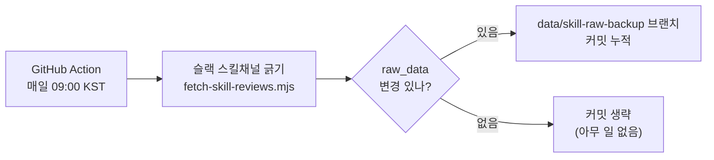
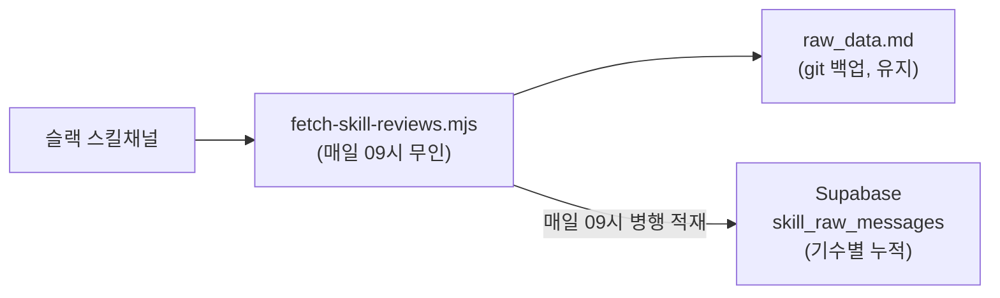

# 03 · 운영 — 사용법과 자동화

> [정본 표지로](README.md)

누가 무엇을 하면 되는지, 그리고 자동화가 어떻게 도는지 정리한다.

---

## 유닛원 (후기 쓰는 사람)

슬랙 채널에 **`/써본스킬`** 양식대로 후기만 올리면 끝. 나머지는 운영이 처리한다.

- `:pushpin:` 한줄 요약
- `:mag:` 주요 내용
- `:briefcase:` 내가 써본 상황 + 결과
- `:link:` 링크 / 스크린샷

> 양식(마커)을 지켜야 카드 본문이 제대로 만들어진다. 채널 상단 고정 템플릿 참고.

---

## 운영자

0. **점검(세션 열면 먼저)** — `web`에서 `node scripts/check-gaps.mjs`. 지난 세션 이후 빠진 게 있나 먼저 본다(미반영 후기·카드 미생성·빈 카드). 빠짐의 정체와 원리는 [01-pipeline](01-pipeline.md) "조용한 누락".
1. **수집** — 자동(아래 자동화 참조). 수동으로 즉시 긁으려면 `web`에서 `node scripts/fetch-skill-reviews.mjs`.
2. **명대사·메타 정리** — 새 후기의 명대사를 `quote_picks.md`에 추가한다. **quote_picks에 없는 스킬은 카드가 안 생긴다.**
3. **빌드~검증~노출~인사이트** — `/build-skills` 한 번이면 ⓪ 누락 점검 → ① 마커 검증 → ② 미리보기 승인 → ③ 빌드 → ④ 분야·난이도 backfill → ⑤ 노출 토글 → ⑥ 검증 → ⑦ 인사이트 블록 생성까지 순서대로 안내된다. (판정 기준은 [02-rules](02-rules.md), 정확한 명령 스펙은 `.claude/commands/build-skills.md`)
4. **제출** — 브랜치 → PR → 스쿼시 머지. **main 직접 push 금지.** 커밋 직전 `check-gaps`를 한 번 더 돌려 **합계 0건**을 확인한다.

### 꼭 기억할 규칙
- **세션의 처음과 끝에 `check-gaps`를 돌린다.** 수동 backfill 누락은 빌드가 성공해도 조용히 카드를 빠뜨린다 — 이 점검이 유일한 신호다.
- **카드는 `quote_picks.md`에 명대사가 있어야 생긴다.** 후기만 있고 명대사 없으면 카드 없음.
- **노출/숨김은 완전 가역.** `VISIBLE_SLUGS`에서 빼면 데이터는 남고 화면에서만 사라진다.
- **분야 4개·난이도 3개 고정** (필터·칩이 이 값만 인식). 값은 [02-rules](02-rules.md) ③④ 참조.

---

## 자동화 — 매일 무인 수집

슬랙 무료 플랜은 약 90일이 지나면 옛 메시지를 가린다. 그 전에 긁어 git에 박제하면 후기가 영구 보존된다. 이걸 **매일** 자동으로 돈다.



| 항목 | 값 |
|------|-----|
| 워크플로우 | `.github/workflows/fetch-skill-reviews.yml` |
| 일정 | 매일 09:00 KST (`cron: 0 0 * * *`, UTC 00:00) |
| 수동 실행 | GitHub Actions 탭 → `Fetch skill reviews` → Run workflow |
| 슬랙 토큰 | 데이터수집봇 토큰을 레포 Secret `SLACK_BOT_TOKEN_1`로 등록(채널 읽기 권한 `channels:history` 필요) |
| 저장 위치 | `data/skill-raw-backup` 브랜치에 커밋 누적 |

> **왜 매일인가:** 알림을 후기마다 보내면 피로하다. 대신 매일 긁어두면 운영자가 세션을 열 때 항상 최신(길어야 하루 묵음) raw_data로 바로 작업할 수 있다. 후기가 없던 날은 변경이 없어 커밋을 생략하므로(`git diff --cached --quiet`), 매일 돌아도 히스토리가 더러워지지 않는다.
>
> **왜 main이 아니라 별도 브랜치인가:** main은 보호 브랜치라 봇이 직접 push할 수 없다(PR 필수). 백업이 목적이므로 보호 없는 전용 브랜치에 쌓아 무인으로 작동시킨다. 카드 빌드 때 이 브랜치에서 `raw_data.md`를 가져와 쓴다.
>
> **토큰 주의:** 레포에는 슬랙 토큰이 여럿이다 — 알림봇용 `SLACK_BOT_TOKEN`은 `chat:write`만 있어 채널을 못 읽는다. 수집은 반드시 채널 읽기 권한이 있는 `SLACK_BOT_TOKEN_1`을 쓴다.

---

## 왜 "다 자동"이 아닌가

무인으로 도는 건 **수집(슬랙→raw_data 백업)뿐**이다. 그 뒤 가공은 사람·AI가 개입한다.

| 단계 | 자동? | 누가 |
|------|:----:|------|
| 슬랙 수집 → raw_data 백업 | 무인 | GitHub Action(매일) |
| 명대사 선정·메타 정리·분류·인사이트 문장 | 아니오 | **Claude 세션에서 AI가 생성**(운영자가 세션을 열어 트리거) |
| 카드 노출(published) | 아니오 | **운영자가 PR 승인으로 게이트** |

> cron 안에는 AI가 없어 명대사·분류·인사이트 같은 **판단**을 대신할 수 없다. 그래서 외부 API 연동을 일부러 두지 않고(운영 단순화·비용 회피), 그 판단은 Claude 세션에서 처리한다. 즉 "수집은 무인, 가공은 세션, 노출은 PR 승인"이 이 시스템의 설계 선택이다.

---

## 기수 인수인계 — Supabase 적재 (운영)

> **상태: 운영.** 테이블·RLS·키(①②③)와 코드 연결(④)이 모두 붙었다 — fetch가 `raw_data.md` 백업과 **병행**해 매일 09시 슬랙 원본을 `skill_raw_messages`에 기수별 upsert한다(`slack_ts` 자연키라 재수집해도 중복 없음). 아래는 1기 메인테이너가 빠진 뒤 운영진이 자력으로 재현·승계할 수 있게 남긴 절차다. **남은 수동 작업은 ⑤(봇 토큰 승계)뿐.**

### 한눈에 — 어떻게 쌓이나

- **슬랙 스킬 채널에 글을 올리면 → 매일 아침 09:00(KST)에 자동으로** Supabase `skill_raw_messages`에 원본이 누적된다.
- ⏰ **실시간이 아니다.** 오늘 올린 글은 다음 09시 실행 때 반영된다. 급하면 수동 실행: GitHub → Actions → `Fetch skill reviews` → **Run workflow**.
- 같은 수집이 `raw_data.md`(git 백업)와 Supabase **양쪽에 동시에** 들어간다 — 둘 다 유지.
- `/써본스킬` 후기만이 아니라 **채널의 모든 메시지·스레드 답글**이 마커 포함 원문 그대로 박제된다.
- 글을 고쳐도 다음 실행 때 `slack_ts` 기준 upsert로 **본문이 갱신**된다(중복 안 쌓임).
- 어느 기수 데이터인지는 `cohort` 컬럼으로 구분된다(현재 `2026-1기` = Variable `SLACK_SKILL_COHORT` 값).

### 왜 Supabase인가

지금 원본은 `raw_data.md` **한 파일**이다(백업은 `data/skill-raw-backup` 브랜치). 기수가 바뀌면 이 파일을 덮어쓰거나 이어붙여야 해서 **기수별 누적·조회가 어렵다.** 2기에도 이 시스템을 그대로 가져가려면, 원본을 운영진 소유 **Supabase 테이블에 기수(cohort)별로 누적**하는 게 낫다. raw_data.md 백업은 검증된 흐름이라 **당분간 병행 유지**한다.



### 누가 무엇을 — 권한 경계

- **Supabase 권한은 운영진에게만 있다.** 테이블 생성·RLS·키 발급은 운영진이 한다(메인테이너는 권한이 없어 못 한다).
- **코드는 전부 레포 안에 있다.** 코드 연결(아래)은 운영진 Claude 세션으로 실행 가능하다 — 메인테이너 전용 코드는 없다.

### ① 운영진이 만들 테이블 (SQL)

슬랙 원본을 기수별로 누적하는 박제 테이블. `slack_ts`가 자연키라 매일 재수집해도 upsert로 중복이 안 쌓인다.

```sql
create table if not exists skill_raw_messages (
  slack_ts         text primary key,        -- 슬랙 메시지 고유 ts
  cohort           text not null,           -- 기수 (예: '2026-1기')
  channel_id       text not null,
  user_id          text,                    -- m.user 또는 bot_id
  body             text,                    -- 메시지 원문 (마커 포함 그대로)
  thread_parent_ts text,                    -- 스레드 부모 ts (최상위면 null)
  posted_at        timestamptz,             -- ts에서 변환
  fetched_at       timestamptz default now()
);
create index if not exists idx_skill_raw_cohort on skill_raw_messages (cohort);
```

### ② 접근 정책 (RLS)

공개 접근은 전부 차단하고 봇(service_role)만 쓴다. 홈페이지는 지금처럼 빌드된 JSON을 읽으므로 공개 읽기는 열지 않아도 된다.

```sql
alter table skill_raw_messages enable row level security;
-- service_role 키는 RLS를 우회하므로 별도 정책 없이 적재 가능.
-- anon/authenticated에는 정책을 만들지 않음 = 기본 deny(차단).
```

### ③ 키 등록 (레포)

| 항목 | 값 | 위치 |
|------|-----|------|
| Project URL | `https://jflweygjzxvbolybctka.supabase.co` (skill-insight 전용 프로젝트) | 레포 `spongeclub/spongeclub_1` **Variable** `SUPABASE_URL` |
| service_role 키 | 적재용(쓰기) | 레포 **Secret** `SUPABASE_SERVICE_KEY` (외부 노출 금지) |
| cohort | `2026-1기` | 레포 **Variable** `SLACK_SKILL_COHORT` |

> **적재처: skill-insight 전용 신규 Supabase 프로젝트(`jflweygjzxvbolybctka`).** 사이트/미션/공지용 Supabase와는 별개다 — 섞지 않는다.
> URL/키를 바꾸면 이 표도 함께 갱신한다. SQL(①)은 어느 프로젝트든 동일하고 URL/키만 달라진다.

### ④ 코드 연결 (완료)

- `web/scripts/fetch-skill-reviews.mjs` — `writeFile` 옆에서 `@supabase/supabase-js`로 `skill_raw_messages` upsert(`onConflict: slack_ts`). `withReplies`의 부모·답글을 평면 배열로 펴 매핑한다: `slack_ts`·`cohort`·`channel_id`·`user_id`(`m.user ?? m.bot_id`)·`body`(마커 원문)·`thread_parent_ts`(부모는 null, 답글은 부모 ts)·`posted_at`(ts→ISO). `fetched_at`은 테이블 default에 맡긴다. **`SUPABASE_URL`/`SUPABASE_SERVICE_KEY`가 없으면 적재를 건너뛰어**(로컬 fetch는 `raw_data.md`만 갱신) 기존 흐름과 충돌하지 않는다.
- `.github/workflows/fetch-skill-reviews.yml` — fetch 스텝 `env`에 `SUPABASE_URL`·`SUPABASE_SERVICE_KEY`·`SLACK_SKILL_COHORT` 세 줄 추가(cohort 컬럼이 not null이라 cohort까지 넘긴다).
- raw_data.md 백업 스텝은 **그대로 둔다**(병행 유지).

### ⑤ 메인테이너 이탈 대비 — 슬랙 봇 승계 (중요)

지금 매일 수집은 데이터수집봇 토큰(`SLACK_BOT_TOKEN_1`, 권한 `channels:history`)을 쓴다. 이 봇 앱이 **이탈하는 메인테이너 개인 슬랙 계정에 설치돼 있으면**, 그가 워크스페이스에서 빠지는 순간 토큰이 죽을 수 있다. 더 위험한 건 **죽어도 cron은 조용하다**는 것(→ "조용한 누락"과 같은 무신호 실패). 그래서 이탈 전에:

- 봇 앱을 **운영진/조직 계정 소유로 재발급**하고 새 토큰을 레포 Secret `SLACK_BOT_TOKEN_1`에 덮어쓴다.
- 새 봇을 스킬 채널에 **다시 초대**한다(초대 안 하면 못 읽음).

### ⑥ 2기 전환 시

채널이 바뀌므로 레포 Variable만 새 값으로 바꾼다. 코드 수정은 없다.

| Variable | 예시 |
|----------|------|
| `SLACK_SKILL_CHANNEL` | 2기 채널 ID |
| `SLACK_SKILL_CHANNEL_NAME` | 2기 채널명 |
| `SLACK_SKILL_COHORT` | `2026-2기` (cohort 컬럼에 들어갈 라벨) |
