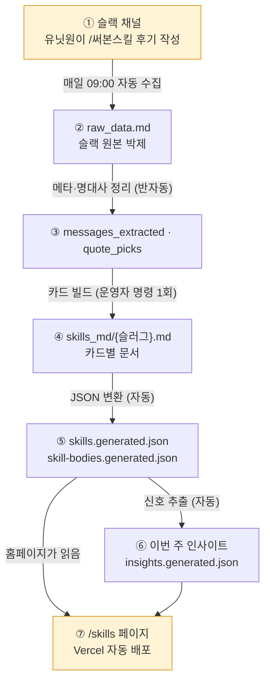

# 스킬&인사이트 시스템 정본

> 슬랙에 올라온 "써본 스킬 후기"가 어떻게 홈페이지 `/skills/` 카드와 "이번 주 인사이트"가 되는지 정리한 정본(SSOT). 이 문서 묶음만 보면 시스템 전체를 이해할 수 있다.

- **한 줄 정의:** 슬랙 후기 → 자동 수집 → 카드·인사이트 빌드 → 홈페이지 `/skills/` 자동 배포
- **상태:** 운영 중. 수집은 매일 무인 자동, 카드·인사이트 빌드는 반자동(운영자 명령 1회)
- **마지막 갱신:** 2026-06-12

---

## 목차

| 장 | 내용 | 한 줄 질문 |
|----|------|-----------|
| [01-pipeline](01-pipeline.md) | 전체 흐름·자동/수동 구분·파일 위치 | "후기가 어떻게 카드가 되나?" |
| [02-rules](02-rules.md) | 카드화 판정 기준 7축 + 인사이트 톤 규칙 | "이 후기를 어느 분야·난이도로? 인용·톤은?" |
| [03-operations](03-operations.md) | 유닛원·운영자 사용법 + 자동화(스케줄·백업 브랜치) + 기수 인수인계(Supabase 적재 운영 중, 봇 승계는 수동) | "나는 뭘 하면 되나? 자동화는 어떻게 도나? 다음 기수로 어떻게 넘기나?" |
| [04-changelog](04-changelog.md) | 변경이력 | "왜·언제 이렇게 바뀌었나?" |

---

## 전체 구조 한눈에

> 핵심: **사람이 꼭 판단하는 건 "이 카드를 화면에 보일까 말까"(노출 토글) 정도.** 명대사·분야·난이도·인사이트 문장은 AI가 후보를 만들고 운영자가 한 번 봐주면 된다.

---

## 이 정본을 고칠 때

- 시스템이 바뀌면 → 해당 장만 최소 수정 + [04-changelog](04-changelog.md)에 한 줄 추가 + (상태가 바뀌었으면) 이 표지의 상태·갱신일 수정.
- 변경이력은 04장에만 쌓는다(나머지 장은 짧게 유지).
- 도식은 Mermaid로. 외부 이미지·외부 문서 링크로 설명을 대체하지 않는다(자기완결).

> **정본 범위:** 이 `docs/` 묶음이 정본의 전부다. 같은 폴더의 활성 데이터(`raw_data.md`·`messages_extracted.md`·`quote_picks.md`·`skills_md/`)는 파이프라인 입력이고, `운영가이드.md`·`카드화규칙.md`는 이 정본으로 가는 포인터다. 옛 설계 초안·중간 작업물은 폴더에 남기지 않는다(필요하면 git 커밋 이력에서 복구).
